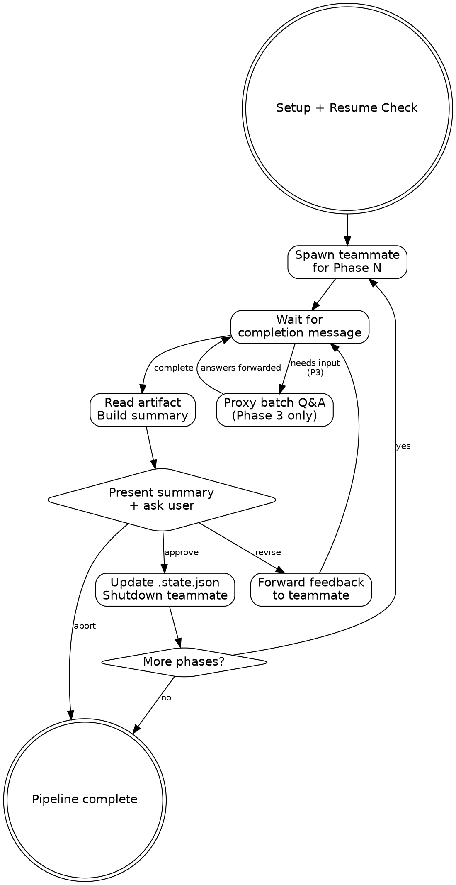

# Deep Work Pipeline Orchestrator

Runs the full deep-work pipeline (Phases 1-6) in a single session using agent teams.
Each phase gets a fresh teammate (clean context). You review artifacts between phases.

**Announce at start:** "Deep-work pipeline orchestrator loaded."

## Setup

1. Parse `$ARGUMENTS` as `<topic-slug>`
   - If empty, ask user via AskUserQuestion
2. Derive repo: `basename $(git remote get-url origin 2>/dev/null | sed 's/.git$//') 2>/dev/null || basename $(pwd)`
3. Set artifact directory: `~/notes/context-engineering/<repo>/<topic-slug>/`
4. Create artifact directory if it doesn't exist

## Resume Check

Read `.state.json` from the artifact directory. If it exists and has `completed_phases`:
- Report completed phases to the user
- Ask: "Resume from Phase N, or restart?"
- If resume: skip completed phases, begin at the next incomplete phase
- If restart: clear `.state.json` and start from Phase 1

If no `.state.json`, start from Phase 1.

## Team Setup

Create a team named `dw-<topic-slug>`:
```
TeamCreate(team_name: "dw-<topic-slug>", description: "Deep work pipeline: <topic-slug>")
```

You (the team lead) own the state machine. You spawn one teammate per phase, wait for completion, gate, then advance.

## Pipeline Execution



### For Each Phase

#### 1. Spawn Teammate

Spawn a **foreground** `general-purpose` agent via `Agent` tool:
- `name`: `dw-phase-N` (e.g., `dw-phase-1`)
- `team_name`: `dw-<topic-slug>`
- `model`: `sonnet` (for phases 1-5), inherited for phase 6

Build the teammate prompt using the template below, parameterized per phase.

#### 2. Wait for Completion

The teammate will send a message when done. Messages arrive automatically.

**Phase 3 special handling:** The teammate will send design questions for batch resolution instead of a completion message. See [Phase 3 Interaction](#phase-3-interaction).

#### 3. Read Artifact + Gate

After the teammate reports completion:
1. Read the phase artifact(s) from the artifact directory. Phase 1 produces two files (`00-ticket.md` and `01-research-questions.md`) — read both. All other phases produce one artifact each (see phase-config.md).
2. Present to the user:
   - Phase name and number
   - Brief summary (3-5 bullets of key findings/decisions)
   - Artifact file path(s)
3. Ask via AskUserQuestion:
   > "Phase N complete. Artifact: `<path>`
   >
   > [summary bullets]
   >
   > **Approve** to advance | **Revise** with feedback | **Abort** pipeline"

#### 4. Handle Gate Response

- **Approve**: Update `.state.json`, shutdown teammate, advance to next phase
- **Revise**: Forward the user's feedback to the teammate via `SendMessage`. Wait for the teammate to revise and re-report. Re-gate. Maximum 3 revision rounds per phase — after the third, ask user: "3 revisions attempted. Continue revising, or approve as-is?"
- **Abort**: Shutdown teammate, update `.state.json` with current progress including `aborted_at` field, stop.

#### 5. Update State

After each approved phase, update `.state.json`:
```json
{
  "topic": "<slug>",
  "repo": "<repo>",
  "current_phase": N,
  "completed_phases": [1, 2, ...N],
  "last_updated": "<ISO timestamp>",
  "status": "in_progress"
}
```

On abort, set `"status": "aborted"` and `"aborted_at": N` (the phase that was aborted).
On completion, set `"status": "complete"`.

## Phase 3 Interaction

Phase 3 generates design questions that need user resolution. The flow:

1. Teammate writes the draft artifact with OPEN questions
2. Teammate sends you the design questions summary (question titles + options + recommendations)
3. You present the questions to the user via AskUserQuestion, offering batch mode:
   > "Phase 3 has N design questions to resolve. Review the options below and respond with your choices (e.g., 'DQ-1: A, DQ-2: B') or 'accept all' to use recommendations.
   >
   > [questions summary from teammate]
   >
   > You can also message the teammate directly to discuss specific questions."
4. Forward the user's answers to the teammate via SendMessage
5. Teammate finalizes the artifact with resolved decisions
6. Teammate sends completion message — proceed to normal gate

## Teammate Prompt Template

Adapt this template for each phase:

```
You are executing Phase {N} ({phase_name}) of a deep-work pipeline.

Topic slug: {slug}
Repo: {repo}
Artifact directory: {artifact_dir}

Invoke the skill by running: /dw-{skill_suffix} {slug}

{phase_specific_instructions}

When done, send a message to the team lead. ALWAYS prefix with a status tag:

STATUS: complete
- [key finding 1]
- [key finding 2]
- Artifact: {artifact_path}

Or if you need user decisions (Phase 3 only):

STATUS: needs-input
[design questions summary]
```

### Phase-Specific Instructions

**Phase 1** (research-questions):
```
No special constraints. Run the skill as documented.
```

**Phase 2** (research) — FIREWALL:
```
CRITICAL: You MUST NOT read 00-ticket.md or 01-research-questions.md directly.
The research questions are provided below — use ONLY these:

{paste the questions section from 01-research-questions.md here}

This firewall ensures your research is objective and unbiased by the original prompt.
```

**Phase 3** (design-discussion):
```
When the skill asks you to present design questions to the user, instead send
the questions summary to the team lead. The team lead will proxy the user's
answers back to you. Use "batch" mode for resolution.

Do NOT use AskUserQuestion directly — route all user interaction through the team lead.
```

**Phase 4** (outline):
```
No special constraints. Run the skill as documented.
```

**Phase 5** (plan):
```
No special constraints. Run the skill as documented.
```

**Phase 6** (implement-subagents):
```
No special constraints. Run the skill as documented.
This phase dispatches its own subagents internally for implementation tasks.
```

## Teammate Message Protocol

Teammates prefix their messages with a status tag for unambiguous routing:

- **`STATUS: complete`** — Phase work is done. Followed by summary bullets and artifact path. Proceed to gate.
- **`STATUS: needs-input`** — Teammate needs user decisions (Phase 3 design questions). Followed by the questions. Proxy to user.
- **`STATUS: error`** — Something failed. Followed by description. Report to user and ask how to proceed.

The teammate prompt template instructs this prefix convention. The team lead routes based on the prefix, not on keyword matching in the body.

## Firewall Enforcement (Phase 2)

Before spawning the Phase 2 teammate:
1. Read `01-research-questions.md` from the artifact directory
2. Extract ONLY the content below the `## Research Questions` heading (this is the standard heading used by Phase 1)
3. Embed the questions directly in the teammate prompt
4. Do NOT include the original prompt, ticket content, or any solution-oriented context

The teammate prompt must NOT reference the artifact file path for 01-research-questions.md or 00-ticket.md.

## Completion

When all 6 phases are approved:
1. Update `.state.json` with `completed_phases: [1, 2, 3, 4, 5, 6]`
2. Report: "Pipeline complete. All artifacts in `<artifact_dir>`."
3. Shutdown team: send `{type: "shutdown_request"}` to any remaining teammates
