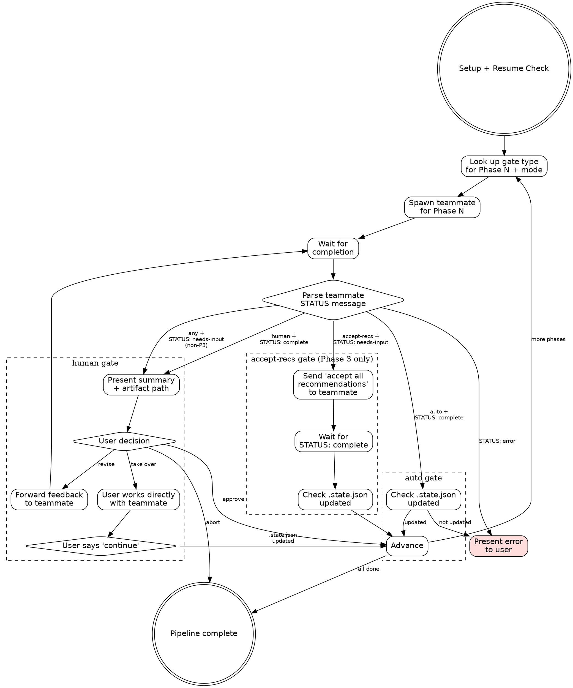

# Deep Work Pipeline Orchestrator

Runs the full deep-work pipeline (Phases 1-6) in a single session using agent teams.
Each phase gets a fresh teammate (clean context). Gate behavior is configurable per mode.
The team lead is a thin dispatcher — it does NOT read artifacts or accumulate phase content.

**Announce at start:** "Deep-work pipeline orchestrator loaded."

## Setup

1. Parse `$ARGUMENTS` for `<topic-slug>`, optional `--mode`, and optional initial context:
   ```
   /deep-work-pipeline <initial-context> [--slug <topic-slug>] [--mode full|research-gate|design-gate|auto]
   ```
   - `<initial-context>`: Everything in `$ARGUMENTS` that isn't a recognized flag. This is free-form text, a file path, or a task description to pass to Phase 1. May be empty.
   - `--slug <topic-slug>`: The topic slug for artifact directories. If not provided, infer from initial context or ask user via AskUserQuestion.
   - `--mode`: Gate mode. If not provided, default to `full`.
   - Valid modes: `full`, `research-gate`, `design-gate`, `auto`
   - If invalid mode, report error and ask user to choose from valid modes
   - Store the initial context (stripped of `--slug` and `--mode` flags) as `initial_context` for Phase 1
2. Derive repo: `basename $(git remote get-url origin 2>/dev/null | sed 's/.git$//') 2>/dev/null || basename $(pwd)`
3. Set artifact directory: `~/notes/context-engineering/<repo>/<topic-slug>/`
4. Create artifact directory if it doesn't exist
5. Report: "Pipeline mode: **<mode>**. Topic: **<topic-slug>**." (and if initial context is present: "Initial context captured for Phase 1.")

## Resume Check

Read `.state.json` from the artifact directory. If it exists and has `completed_phases`:
- Report completed phases to the user
- If `.state.json` contains a `gate_mode` field, show it: "Original mode: **<mode>**."
  - Ask: "Resume from Phase N with mode **<original_mode>**, switch to **<current_mode>**, or restart?"
  - If user wants to switch modes, use the new mode going forward
- If no `gate_mode` in `.state.json` (legacy pipeline), use the mode from `$ARGUMENTS`
- If resume: skip completed phases, begin at the next incomplete phase
- If restart: clear `.state.json` and start from Phase 1

If no `.state.json`, start from Phase 1. Write initial `.state.json`:
```json
{
  "topic": "<topic-slug>",
  "repo": "<repo>",
  "gate_mode": "<mode>",
  "initial_context": "<initial_context or null>",
  "current_phase": 0,
  "completed_phases": [],
  "last_updated": "<ISO timestamp>"
}
```

## Team Setup

Create a team named `dw-<topic-slug>`:
```
TeamCreate(team_name: "dw-<topic-slug>", description: "Deep work pipeline: <topic-slug>")
```

You (the team lead) are a thin dispatcher. You spawn teammates, gate based on mode, and advance phases.
You do NOT read artifacts, accumulate phase content, or write `.state.json` — the sub-skills handle their own state and artifact I/O.

## Model Selection

All teammates use `opus`. Implementation subagents dispatched internally by Phase 6 use their own model (sonnet) as specified in their prompt templates.

| Phases | Model | Rationale |
|--------|-------|-----------|
| 1-6 | opus | All orchestrator teammates need strong reasoning |

## Pipeline Execution

Read the gate mode matrix from `phase-config.md` to determine the gate type for each phase under the current mode.



### For Each Phase

#### 1. Look Up Gate Type

Read the gate mode matrix from `phase-config.md`. For the current phase number and the pipeline's `gate_mode`, determine the gate type: `human`, `auto`, or `accept-recs`.

#### 2. Spawn Teammate

Spawn a **foreground** `general-purpose` agent via `Agent` tool:
- `name`: `dw-phase-N` (e.g., `dw-phase-1`)
- `team_name`: `dw-<topic-slug>`
- `model`: `opus`

Build the teammate prompt using the template in [Teammate Prompt Template](#teammate-prompt-template), parameterized per phase.

**Phase 3 in `auto` mode only:** Add this directive to the teammate prompt:
> "For Step 7 (question resolution), choose 'Accept recommendations' mode. Resolve all OPEN questions using your recommendations. Do NOT send STATUS: needs-input."

#### 3. Wait for Completion

The teammate will work and eventually the Agent call will return with the teammate's final message.

#### 4. Dispatch by Gate Type

**If gate type is `auto`:**
1. Read `.state.json` from artifact directory
2. If the current phase is in `completed_phases` → advance to next phase
3. If NOT → warn user: "Teammate reported complete but `.state.json` wasn't updated. Artifact may be incomplete."
   - Offer via AskUserQuestion: **Continue anyway** / **Investigate** / **Abort**

**If gate type is `human`:**
1. Present to the user via AskUserQuestion:
   > "Phase N complete. Artifact: `<path>`
   >
   > [teammate's summary bullets from their final message]
   >
   > **Approve** — advance to next phase
   > **Revise** — I'll relay your feedback to the teammate
   > **Take over** — work with the teammate directly, tell me when done
   > **Abort** — stop the pipeline"
2. Handle the user's choice:
   - **Approve**: Advance to next phase.
   - **Revise**: Forward the user's feedback to the teammate via `SendMessage`. Wait for the teammate to revise and re-report. Re-gate. Maximum 3 revision rounds — after the third, ask: "3 revisions attempted. Continue revising, or approve as-is?"
   - **Take over**: Inform user they can work directly with the teammate. Wait for the user to say "done" / "continue" / "phase complete". Then read `.state.json` to confirm the phase is in `completed_phases`. If confirmed, advance. If not, warn and ask.
   - **Abort**: Stop pipeline.

**If gate type is `accept-recs` (Phase 3 only):**
This case is handled via the teammate prompt directive in Step 2. The teammate auto-accepts recommendations and completes without sending `STATUS: needs-input`. The agent returns with `STATUS: complete`. Proceed as with `auto` gate — check `.state.json` and advance.

**Handling `STATUS: needs-input` on human-gated Phase 3:**
When Phase 3 is human-gated and the teammate sends `STATUS: needs-input`:
1. The teammate's final message contains the design questions summary
2. Present the questions to the user:
   > "Phase 3 has N design questions to resolve.
   >
   > [questions summary from teammate]
   >
   > **Answer in batch** — provide your choices (e.g., 'DQ-1: A, DQ-3: B')
   > **Accept all recommendations** — use the teammate's picks
   > **Take over** — work with the teammate directly"
3. Relay the user's answers to the teammate via `SendMessage`
4. Wait for teammate to finalize and report `STATUS: complete`
5. Proceed to the normal human gate

**Handling `STATUS: error` (any gate type):**
Stop auto-advance. Present the error to the user:
> "Phase N encountered an error:
>
> [error description from teammate]
>
> **Retry** — respawn the teammate for this phase
> **Take over** — work with the teammate to resolve
> **Abort** — stop the pipeline"

**Handling unexpected `STATUS: needs-input` (non-Phase-3):**
Present to user as if it were an error — this is unexpected behavior. Let the user decide how to proceed.

## Phase 3 Interaction

Phase 3 interaction is handled by the gate dispatch logic above:
- **Human-gated Phase 3**: Lead proxies design questions to user via batch mode when teammate sends `STATUS: needs-input`, then relays answers.
- **Auto Phase 3 (`accept-recs`)**: Teammate prompt includes accept-recommendations directive. No mid-phase interaction needed.

See "Dispatch by Gate Type" for the full flow.

## Teammate Prompt Template

Adapt this template for each phase:

```
You are executing Phase {N} ({phase_name}) of a deep-work pipeline.

Topic slug: {slug}
Repo: {repo}
Artifact directory: {artifact_dir}

Invoke the skill by running: /dw-{skill_suffix} {skill_arguments}

{phase_specific_instructions}

When done, send a message to the team lead. ALWAYS prefix with a status tag:

STATUS: complete
- [key finding 1]
- [key finding 2]
- Artifact: {artifact_path}

Or if you need user decisions (Phase 3 only):

STATUS: needs-input
[design questions summary — question titles, options, and your recommendations]

Or if something failed:

STATUS: error
[description of what went wrong and what was attempted]
```

### Skill Arguments by Phase

`{skill_arguments}` varies by phase:

| Phase | `{skill_arguments}` |
|-------|---------------------|
| 1 | `{initial_context}` if set, otherwise `{slug}` — passes the user's original prompt/file path so Phase 1 can use it as the task description |
| 2-6 | `{slug}` — these phases read prior artifacts, no initial context needed |

### Phase-Specific Instructions

**Phase 1** (research-questions):
```
No special constraints. Run the skill as documented.
```

**Phase 2** (research) — FIREWALL:
```
No special constraints. Run the skill as documented.
The skill's own bias firewall handles question extraction via extract-research-questions.sh.
Do NOT read 00-ticket.md or pass the original prompt.
```

**Phase 3** (design-discussion):

When Phase 3 gate type is `human` (modes: full, research-gate, design-gate):
```
When the skill asks you to present design questions to the user, instead send
the questions summary to the team lead using STATUS: needs-input. The team lead
will proxy the user's answers back to you. Use "batch" mode for resolution.

Do NOT use AskUserQuestion directly — route all user interaction through the team lead.
```

When Phase 3 gate type is `accept-recs` (mode: auto):
```
For Step 7 (question resolution), choose "Accept recommendations" mode.
Resolve all OPEN questions using your stated recommendations. Finalize the
artifact and report STATUS: complete. Do NOT send STATUS: needs-input.
```

**Phase 4** (outline):
```
No special constraints. Run the skill as documented.
```

**Phase 5** (plan):
```
No special constraints. Run the skill as documented.
```

**Phase 6** (implement-subagents):
```
No special constraints. Run the skill as documented.
This phase dispatches its own subagents internally for implementation tasks.
```

## Teammate Message Protocol

Teammates prefix their messages with a status tag for unambiguous routing:

- **`STATUS: complete`** — Phase work is done. Followed by summary bullets and artifact path.
  - Auto gate: lead checks `.state.json`, advances.
  - Human gate: lead presents summary to user, runs gate.
- **`STATUS: needs-input`** — Teammate needs user decisions (Phase 3 design questions). Followed by the questions.
  - Human gate: lead proxies questions to user, relays answers.
  - Accept-recs gate: should not occur (teammate prompt prevents it).
- **`STATUS: error`** — Something failed. Followed by description.
  - All gates: lead stops auto-advance, presents error to user.

The lead routes based on the status prefix and the current gate type.

## Firewall Enforcement (Phase 2)

The Phase 2 skill handles its own firewall internally via `extract-research-questions.sh`.
The team lead does NOT need to read or embed questions — just spawn the teammate and let
the skill extract them.

The teammate prompt must NOT reference 00-ticket.md or pass the original prompt.

## Completion

When all 6 phases are approved:
1. Read `.state.json` to confirm all phases complete
2. Report: "Pipeline complete (mode: **<gate_mode>**). All artifacts in `<artifact_dir>`."
