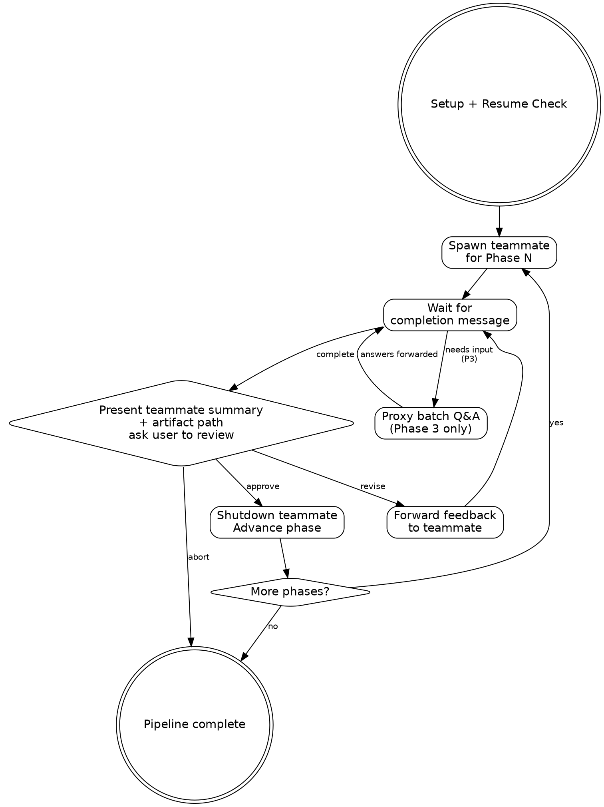

# Deep Work Pipeline Orchestrator

Runs the full deep-work pipeline (Phases 1-6) in a single session using agent teams.
Each phase gets a fresh teammate (clean context). Gate behavior is configurable per mode.
The team lead is a thin dispatcher — it does NOT read artifacts or accumulate phase content.

**Announce at start:** "Deep-work pipeline orchestrator loaded."

## Setup

1. Parse `$ARGUMENTS` for `<topic-slug>` and optional `--mode`:
   ```
   /deep-work-pipeline <topic-slug> [--mode full|research-gate|design-gate|auto]
   ```
   - If `<topic-slug>` is empty, ask user via AskUserQuestion
   - If `--mode` is not provided, default to `full`
   - Valid modes: `full`, `research-gate`, `design-gate`, `auto`
   - If invalid mode, report error and ask user to choose from valid modes
2. Derive repo: `basename $(git remote get-url origin 2>/dev/null | sed 's/.git$//') 2>/dev/null || basename $(pwd)`
3. Set artifact directory: `~/notes/context-engineering/<repo>/<topic-slug>/`
4. Create artifact directory if it doesn't exist
5. Report: "Pipeline mode: **<mode>**. Topic: **<topic-slug>**."

## Resume Check

Read `.state.json` from the artifact directory. If it exists and has `completed_phases`:
- Report completed phases to the user
- If `.state.json` contains a `gate_mode` field, show it: "Original mode: **<mode>**."
  - Ask: "Resume from Phase N with mode **<original_mode>**, switch to **<current_mode>**, or restart?"
  - If user wants to switch modes, use the new mode going forward
- If no `gate_mode` in `.state.json` (legacy pipeline), use the mode from `$ARGUMENTS`
- If resume: skip completed phases, begin at the next incomplete phase
- If restart: clear `.state.json` and start from Phase 1

If no `.state.json`, start from Phase 1. Write initial `.state.json`:
```json
{
  "topic": "<topic-slug>",
  "repo": "<repo>",
  "gate_mode": "<mode>",
  "current_phase": 0,
  "completed_phases": [],
  "last_updated": "<ISO timestamp>"
}
```

## Team Setup

Create a team named `dw-<topic-slug>`:
```
TeamCreate(team_name: "dw-<topic-slug>", description: "Deep work pipeline: <topic-slug>")
```

You (the team lead) are a thin dispatcher. You spawn teammates, gate based on mode, and advance phases.
You do NOT read artifacts, accumulate phase content, or write `.state.json` — the sub-skills handle their own state and artifact I/O.

## Model Selection

All teammates use `opus`. Implementation subagents dispatched internally by Phase 6 use their own model (sonnet) as specified in their prompt templates.

| Phases | Model | Rationale |
|--------|-------|-----------|
| 1-6 | opus | All orchestrator teammates need strong reasoning |

## Pipeline Execution



### For Each Phase

#### 1. Spawn Teammate

Spawn a **foreground** `general-purpose` agent via `Agent` tool:
- `name`: `dw-phase-N` (e.g., `dw-phase-1`)
- `team_name`: `dw-<topic-slug>`
- `model`: per Model Selection table above

Build the teammate prompt using the template below, parameterized per phase.

#### 2. Wait for Completion

The teammate will send a message when done. Messages arrive automatically.

**Phase 3 special handling:** The teammate will send design questions for batch resolution instead of a completion message. See [Phase 3 Interaction](#phase-3-interaction).

#### 3. Gate

After the teammate reports `STATUS: complete`, present to the user:
- The teammate's summary (from their message — do NOT re-read the artifact)
- The artifact file path(s) so the user can review
- Ask via AskUserQuestion:
  > "Phase N complete. Artifact: `<path>`
  >
  > [teammate's summary bullets]
  >
  > Review the artifact, then: **Approve** to advance | **Revise** with feedback | **Abort** pipeline"

The user reads the artifact themselves. The team lead does not.

#### 4. Handle Gate Response

- **Approve**: Shutdown teammate via `SendMessage` with `{type: "shutdown_request"}`, advance to next phase.
- **Revise**: Forward the user's feedback to the teammate via `SendMessage`. Wait for the teammate to revise and re-report. Re-gate. Maximum 3 revision rounds per phase — after the third, ask user: "3 revisions attempted. Continue revising, or approve as-is?"
- **Abort**: Shutdown teammate. Stop pipeline.

## Phase 3 Interaction

Phase 3 generates design questions that need user resolution. The flow:

1. Teammate writes the draft artifact with OPEN questions
2. Teammate sends `STATUS: needs-input` with the design questions summary (question titles + options + recommendations)
3. You present the questions to the user via AskUserQuestion, offering batch mode:
   > "Phase 3 has N design questions to resolve. Review the options below and respond with your choices (e.g., 'DQ-1: A, DQ-2: B') or 'accept all' to use recommendations.
   >
   > [questions summary from teammate]
   >
   > You can also message the teammate directly to discuss specific questions."
4. Forward the user's answers to the teammate via SendMessage
5. Teammate finalizes the artifact with resolved decisions
6. Teammate sends `STATUS: complete` — proceed to normal gate

## Teammate Prompt Template

Adapt this template for each phase:

```
You are executing Phase {N} ({phase_name}) of a deep-work pipeline.

Topic slug: {slug}
Repo: {repo}
Artifact directory: {artifact_dir}

Invoke the skill by running: /dw-{skill_suffix} {slug}

{phase_specific_instructions}

When done, send a message to the team lead. ALWAYS prefix with a status tag:

STATUS: complete
- [key finding 1]
- [key finding 2]
- Artifact: {artifact_path}

Or if you need user decisions (Phase 3 only):

STATUS: needs-input
[design questions summary]
```

### Phase-Specific Instructions

**Phase 1** (research-questions):
```
No special constraints. Run the skill as documented.
```

**Phase 2** (research) — FIREWALL:
```
No special constraints. Run the skill as documented.
The skill's own bias firewall handles question extraction via extract-research-questions.sh.
Do NOT read 00-ticket.md or pass the original prompt.
```

**Phase 3** (design-discussion):
```
When the skill asks you to present design questions to the user, instead send
the questions summary to the team lead. The team lead will proxy the user's
answers back to you. Use "batch" mode for resolution.

Do NOT use AskUserQuestion directly — route all user interaction through the team lead.
```

**Phase 4** (outline):
```
No special constraints. Run the skill as documented.
```

**Phase 5** (plan):
```
No special constraints. Run the skill as documented.
```

**Phase 6** (implement-subagents):
```
No special constraints. Run the skill as documented.
This phase dispatches its own subagents internally for implementation tasks.
```

## Teammate Message Protocol

Teammates prefix their messages with a status tag for unambiguous routing:

- **`STATUS: complete`** — Phase work is done. Followed by summary bullets and artifact path. Proceed to gate.
- **`STATUS: needs-input`** — Teammate needs user decisions (Phase 3 design questions). Followed by the questions. Proxy to user.
- **`STATUS: error`** — Something failed. Followed by description. Report to user and ask how to proceed.

The teammate prompt template instructs this prefix convention. The team lead routes based on the prefix, not on keyword matching in the body.

## Firewall Enforcement (Phase 2)

The Phase 2 skill handles its own firewall internally via `extract-research-questions.sh`.
The team lead does NOT need to read or embed questions — just spawn the teammate and let
the skill extract them.

The teammate prompt must NOT reference 00-ticket.md or pass the original prompt.

## Completion

When all 6 phases are approved:
1. Read `.state.json` to confirm all phases complete
2. Report: "Pipeline complete. All artifacts in `<artifact_dir>`."
