# Deep Work Pipeline Guide

A 6-phase context engineering workflow that separates research from solutioning.
Each phase runs in a **fresh conversation** to maintain context isolation.

**Announce at start:** "Deep-work pipeline guide loaded."

## Pipeline

```dot
digraph deep_work {
    rankdir=TB;
    node [shape=box, style=rounded, fontname="Helvetica"];
    edge [fontname="Helvetica", fontsize=10];

    subgraph cluster_pipeline {
        label="Deep Work Pipeline — each phase in a fresh conversation";
        style=dashed;
        color=gray60;
        fontname="Helvetica";

        p1 [label="/dw-research-questions\nPrompt → objective questions"];
        firewall [label="🔥 BIAS FIREWALL 🔥\nUser copies questions only\nOriginal prompt NOT passed"
                  shape=octagon style=filled fillcolor="#ff4444" fontcolor=white];
        p2 [label="/dw-research\nInvestigate codebase\n(NO prompt access)"];
        reintro [label="Prompt re-introduced\nResearch locked in"
                 shape=ellipse style=filled fillcolor="#ffffcc"];
        p3 [label="/dw-design-discussion\nOptions grounded in evidence"];
        p4 [label="/dw-outline\nDecisions → file changes"];
        p5 [label="/dw-plan\nExact tasks, patterns, tests"];
        p6 [label="/dw-implement\nExecute the plan"];
    }

    start [label="User prompt" shape=doublecircle];
    done [label="Complete" shape=doublecircle];

    start -> p1;
    p1 -> firewall [label="questions only"];
    firewall -> p2;
    p2 -> reintro [label="02-research.md"];
    reintro -> p3;
    p3 -> p4 [label="03-design-discussion.md"];
    p4 -> p5 [label="04-structure-outline.md"];
    p5 -> p6 [label="05-plan.md"];
    p6 -> done;
}
```



## Commands

| Phase | Command | Purpose |
|-------|---------|---------|
| 1 | `/dw-research-questions <slug>` | Decompose task into objective research questions |
| 2 | `/dw-research <slug>` | Investigate codebase (bias firewall — no prompt access) |
| 3 | `/dw-design-discussion <slug>` | Explore design options grounded in research |
| 4 | `/dw-outline <slug>` | Map decisions to file changes |
| 5 | `/dw-plan <slug>` | Create detailed implementation plan |
| 6 | `/dw-implement <slug>` | Execute the plan |

**CRITICAL:** Each phase MUST run in a **fresh conversation**. The bias firewall
between Phase 1→2 requires that research never sees the original prompt.

## Artifact Directory

All phases read/write artifacts at:
```
~/notes/context-engineering/<repo>/<topic-slug>/
```
- `<repo>` derived from `git remote get-url origin`
- `<topic-slug>` passed as argument to each command

## Check Progress

If `$ARGUMENTS` is provided as a topic-slug:
1. Derive repo: `basename $(git remote get-url origin 2>/dev/null | sed 's/.git$//') 2>/dev/null || basename $(pwd)`
2. Read `.state.json` from `~/notes/context-engineering/<repo>/<topic-slug>/`
3. Report completed phases, current status, and next command to run
4. If no `.state.json` found, suggest starting with `/dw-research-questions <slug>`

If no arguments, show this pipeline documentation.

## Bias Firewall (Phase 1→2)

After Phase 1 generates research questions, the user copies ONLY the questions
section. Phase 2 runs in a fresh conversation with NO access to the original
prompt. This ensures research is objective and unbiased by the desired solution.

The original prompt is re-introduced in Phase 3, after research is locked in.

## Artifact Flow

| File | Written By | Read By |
|------|-----------|---------|
| `00-ticket.md` | Phase 1 | Phase 3 |
| `01-research-questions.md` | Phase 1 | None (user copies questions manually) |
| `02-research.md` | Phase 2 | Phases 3, 4, 5 |
| `03-design-discussion.md` | Phase 3 | Phase 4 |
| `04-structure-outline.md` | Phase 4 | Phase 5 |
| `05-plan.md` | Phase 5 | Phase 6 |
| `06-completion.md` | Phase 6 | None |
| `.state.json` | All phases | This guide |
