# Phase 1: Research Questions

Decompose the user's prompt into objective, investigative questions answerable
by reading the codebase. Questions must NOT assume any particular solution.

**Announce at start:** "Starting deep-work Phase 1: Research Questions."

## Setup

1. Parse `$ARGUMENTS`:
   - If a file path, read the file as the task description
   - If text, use it directly as the task description
   - Extract or ask user for a `<topic-slug>` (lowercase, hyphens, no special chars)
2. Derive repo name:
   ```bash
   basename $(git remote get-url origin 2>/dev/null | sed 's/.git$//') 2>/dev/null || basename $(pwd)
   ```
3. Create artifact directory:
   ```bash*
   mkdir -p ~/notes/context-engineering/<repo>/<topic-slug>
   ```
4. Write `00-ticket.md` to the artifact directory:
   ```markdown
   ---
   phase: ticket
   date: <today>
   topic: <topic-slug>
   repo: <repo>
   git_sha: <HEAD>
   status: complete
   ---

   ## Ticket

   <user's prompt or file contents>
   ```

## Process

### Step 1: Targeted codebase scan
Gather lightweight structural context (NOT deep implementation details):
- List root directory structure
- Read CLAUDE.md files for project context and conventions
- Dispatch a codebase-locator agent: "Find files and directories related to:
  <key nouns/systems from prompt>. Return locations grouped by purpose."

### Step 2: Generate research questions
Generate 5-15 questions. EVERY question must be:
- **Objective** — answerable by reading code, not by making design decisions
- **Specific** — references concrete subsystems, not abstract concepts
- **Grounded** — uses real module/file names from the codebase scan

Distribute across categories:

| Category | Pattern | Example |
|----------|---------|---------|
| Subsystem Understanding | "How does [component] work?" | "How does auth middleware chain requests?" |
| Code Tracing | "What is the [data] flow from [A] to [B]?" | "Request lifecycle from handler to DB?" |
| Pattern Discovery | "What patterns exist for [action]?" | "Patterns for adding API endpoints?" |
| Dependency Mapping | "What does [module] depend on?" | "What does handlers package import?" |
| Boundary Identification | "Where do [A] and [B] integrate?" | "Where do HTTP and storage connect?" |
| Constraint Discovery | "What invariants does [system] enforce?" | "What do tests enforce for handlers?" |

**FORBIDDEN question patterns:**
- "How should we..." — this is solutioning
- "What's the best way to..." — this is evaluation
- "Would it be better to..." — this is comparison
- "Can we..." — this is feasibility for a specific solution

### Step 3: Write artifact
Write `01-research-questions.md` to the artifact directory:
```yaml
---
phase: research-questions
date: <today>
topic: <topic-slug>
repo: <repo>
git_sha: <HEAD>
status: complete
---

## Original Prompt
<full prompt — stored for traceability, NOT passed to Phase 2>

## Research Questions

### Subsystem Understanding
1. <question>

### Code Tracing
2. <question>

### Pattern Discovery
3. <question>
...
```

## Handoff

```dot
digraph handoff {
    rankdir=LR;
    node [shape=box, style=rounded, fontname="Helvetica"];

    p1_out [label="01-research-questions.md\n(contains prompt + questions)"];
    user [label="User copies\nquestions ONLY" shape=diamond style=filled fillcolor="#ffffcc"];
    firewall [label="🔥 BIAS FIREWALL 🔥" shape=octagon style=filled fillcolor="#ff4444" fontcolor=white];
    p2_in [label="Pasted questions\n(NO prompt, NO file read)"];

    p1_out -> user [label="review & edit"];
    user -> firewall;
    firewall -> p2_in [label="fresh conversation"];
}
```



## Completion

1. Present questions to user grouped by category
2. Update `.state.json` in the artifact directory:
   ```json
   {
     "topic": "<topic-slug>",
     "repo": "<repo>",
     "current_phase": 1,
     "completed_phases": [1],
     "last_updated": "<ISO timestamp>"
   }
   ```
3. Instruct: "Review and edit questions as needed. When ready, **copy everything
   below '## Research Questions'** and run `/dw-02-research <topic-slug>` in a
   **fresh conversation**, pasting the questions when prompted."
