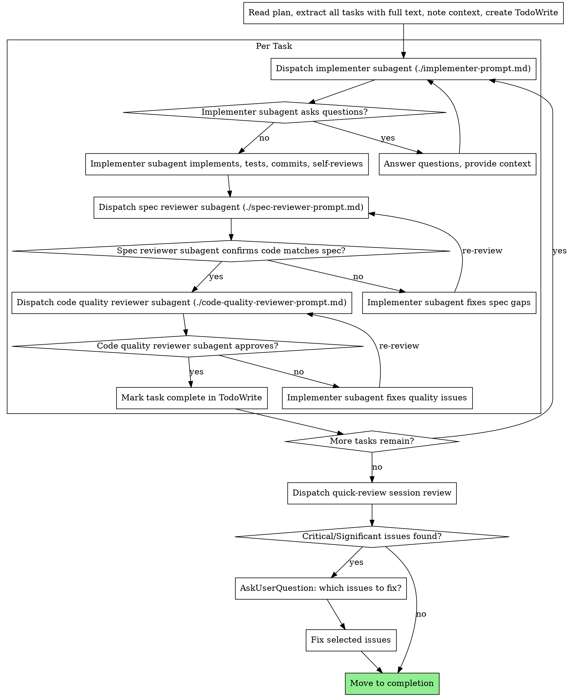

# Phase 6: Implement - Subagent Style

Execute plan by dispatching fresh subagent per task, with two-stage review after each: spec compliance review first, then code quality review.

**Core principle:** Fresh subagent per task + two-stage review (spec then quality) = high quality, fast iteration

**Announce at start:** "Starting deep-work Phase 6: Implementation - Subagent Style."

## Setup

1. Parse `$ARGUMENTS` as `<topic-slug>`
   - If empty, ask user via AskUserQuestion
2. Derive repo: `basename $(git remote get-url origin 2>/dev/null | sed 's/.git$//') 2>/dev/null || basename $(pwd)`
3. Set artifact directory: `~/notes/context-engineering/<repo>/<topic-slug>/`

## Pre-flight Validation

- `05-plan.md` exists → if not: "Plan not found. Complete Phases 1-5 first." **Stop.**

## Tooling
- Task management can be done with the native tools available tools in the agent.
  - In Claude Code, use the TaskCreate, TaskUpdate, and TaskList tools to manage tasks.
  - Manage task dependencies with the TaskUpdate tool's dependency field.

## Model Selection
- All Task tool dispatches (implementer, spec reviewer, code quality reviewer, quick-review) should use `model: "sonnet"` parameter
- This applies to every subagent spawned during the implementation process

## Plan Structure Expectations

The plan should be structured with clear headers for phases and tasks. The subagent-driven approach relies on dispatching a new subagent for as small a scope as possible to preserve context. Ideallly each task in a phase of the plan should be it's own subagent loop. Try to avoid sending whole phases or multiple tasks to a single subagent.

## The Process



## Prompt Templates

- `./implementer-prompt.md` - Dispatch implementer subagent
- `./spec-reviewer-prompt.md` - Dispatch spec compliance reviewer subagent
- `./code-quality-reviewer-prompt.md` - Dispatch code quality reviewer subagent

## Example Workflow

```
You: I'm using Subagent-Driven Development to execute this plan.

[Read plan file once: docs/plans/feature-plan.md]
[Extract all 5 tasks with full text and context]
[Create all tasks using the task tool]

Task 1: Hook installation script

[Get Task 1 text and context (already extracted)]
[Dispatch implementation subagent with full task text + context]

Implementer: "Before I begin - should the hook be installed at user or system level?"

You: "User level (~/.config/superpowers/hooks/)"

Implementer: "Got it. Implementing now..."
[Later] Implementer:
  - Implemented install-hook command
  - Added tests, 5/5 passing
  - Self-review: Found I missed --force flag, added it
  - Committed

[Dispatch spec compliance reviewer]
Spec reviewer: ✅ Spec compliant - all requirements met, nothing extra

[Get git SHAs, dispatch code quality reviewer]
Code reviewer: Strengths: Good test coverage, clean. Issues: None. Approved.

[Mark Task 1 complete]

Task 2: Recovery modes

[Get Task 2 text and context (already extracted)]
[Dispatch implementation subagent with full task text + context]

Implementer: [No questions, proceeds]
Implementer:
  - Added verify/repair modes
  - 8/8 tests passing
  - Self-review: All good
  - Committed

[Dispatch spec compliance reviewer]
Spec reviewer: ❌ Issues:
  - Missing: Progress reporting (spec says "report every 100 items")
  - Extra: Added --json flag (not requested)

[Implementer fixes issues]
Implementer: Removed --json flag, added progress reporting

[Spec reviewer reviews again]
Spec reviewer: ✅ Spec compliant now

[Dispatch code quality reviewer]
Code reviewer: Strengths: Solid. Issues (Important): Magic number (100)

[Implementer fixes]
Implementer: Extracted PROGRESS_INTERVAL constant

[Code reviewer reviews again]
Code reviewer: ✅ Approved

[Mark Task 2 complete]

...

[After all tasks]
[Dispatch quick-review session review: /quick-review local commits <git_sha_start>..<git_sha_end>]
Quick reviewer: Strengths: Solid architecture, good test coverage.
  Critical: SQL injection in search.ts:45
  Minor: Naming inconsistency in utils.ts

[Critical issues found → AskUserQuestion: "The session review found these Critical/Significant issues: ...
Which should be addressed?"]

User: "Fix the SQL injection, skip the naming issue"

[Fix SQL injection, re-commit]

Done!
```

## Session Review (After All Tasks)

After all tasks are complete, dispatch a fresh Task subagent (`general-purpose`, `model: "sonnet"`) to invoke the `/quick-review` skill:

```
Invoke the /quick-review skill to review the local commits <git_sha_start>..<git_sha_end>
```

When the review returns:
- **Critical or Significant issues found:** Use AskUserQuestion to present the findings and ask the user which parts of the implemented code should be changed. Apply requested fixes before proceeding to completion.
- **Minor issues only or no issues:** Proceed to completion.

This replaces the previous "final code reviewer" step with a fresh-context holistic review of all session changes.

## Advantages
** Context Engineering:**
- Subagents have fresh context and are given exactly what they need (task text + relevant context) → better understanding, fewer questions
- Smaller context window per subagent means we get more power out of the models

**vs. Executing Plans:**
- Continuous progress (no waiting)
- Review checkpoints automatic

**Efficiency gains:**
- No file reading overhead (controller provides full text)
- Controller curates exactly what context is needed
- Subagent gets complete information upfront
- Questions surfaced before work begins (not after)

**Quality gates:**
- Self-review catches issues before handoff
- Two-stage review: spec compliance, then code quality
- Review loops ensure fixes actually work
- Spec compliance prevents over/under-building
- Code quality ensures implementation is well-built

**Cost:**
- More subagent invocations (implementer + 2 reviewers per task)
- Controller does more prep work (extracting all tasks upfront)
- Review loops add iterations
- But catches issues early (cheaper than debugging later)

## Red Flags

**Never:**
- Skip reviews (spec compliance OR code quality)
- Proceed with unfixed issues
- Dispatch multiple implementation subagents in parallel (conflicts)
- Make subagent read plan file (provide full text instead)
- Provide the subagent with too much information. They should recieve the full task text and relevant context, but not the entire plan or unrelated details.
- Skip scene-setting context (subagent needs to understand where task fits)
- Ignore subagent questions (answer before letting them proceed)
- Accept "close enough" on spec compliance (spec reviewer found issues = not done)
- Skip review loops (reviewer found issues = implementer fixes = review again)
- Let implementer self-review replace actual review (both are needed)
- **Start code quality review before spec compliance is ✅** (wrong order)
- Move to next task while either review has open issues

**If subagent asks questions:**
- Answer clearly and completely
- Provide additional context if needed
- Don't rush them into implementation

**If reviewer finds issues:**
- Implementer (same subagent) fixes them
- Reviewer reviews again
- Repeat until approved
- Don't skip the re-review

**If subagent fails task:**
- Dispatch fix subagent with specific instructions
- Don't try to fix manually (context pollution)
