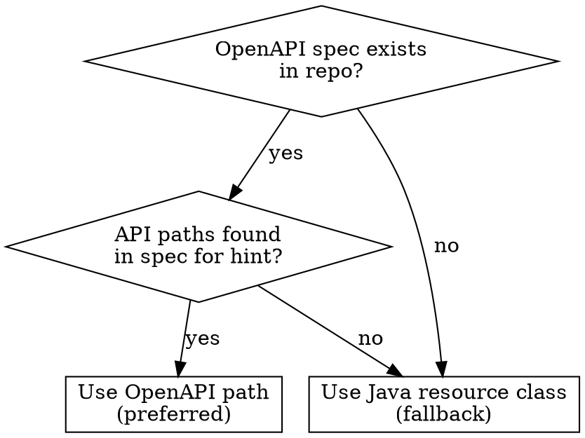

# Generate Postman Collection

## Overview

Generates a Postman v2.1 collection JSON for API endpoints. Takes a text hint to locate the API, extracts endpoints/bodies/auth, and writes a ready-to-import collection to `~/postmans/`.

Prefers OpenAPI spec as primary source (machine-parseable, pre-resolved schemas, exact media types). Falls back to Java source when OpenAPI is unavailable.

## When to Use

- User asks for a Postman collection, Postman config, or API testing file
- User wants to generate REST client imports from existing API code
- User says "postman" or "collection" in the context of API endpoints

## Source Selection



**OpenAPI location in this repo:** `server/openapi/services/openapi-mms.json`

## Workflow — OpenAPI Path (Preferred)

### Step 1: Find API Paths in OpenAPI Spec

```bash
# Find paths matching user's hint
jq '.paths | keys[] | select(contains("{hint}"))' server/openapi/services/openapi-mms.json
```

### Step 2: Extract Endpoint Metadata

For each matching path, extract per HTTP method:

```bash
# Get operation summary, parameters, media types, response codes
jq '.paths["{path}"]["{method}"] | {
  operationId, summary,
  parameters: [.parameters[]? | {name, in, required, description}],
  requestBody: .requestBody.content | keys,
  responses: (.responses | keys)
}' server/openapi/services/openapi-mms.json
```

### Step 3: Resolve Request/Response Schemas

Follow `$ref` chains to get field names, types, examples:

```bash
# Resolve request body schema
jq '.paths["{path}"]["post"].requestBody.content["{mediaType}"].schema' ...
# Then resolve the $ref
jq '.components.schemas.{SchemaName}' ...
# Recursively resolve nested $refs for action/criteria objects
```

Use `example` values from the schema for sample bodies. Follow nested `$ref`s for discriminated unions.

### Step 4: Generate Collection JSON

Structure per Postman Collection v2.1 — see **Collection Structure** below.

### Step 5: Write the File

```
~/postmans/{api-name}/{Collection_Name}.postman_collection.json
```

## Workflow — Java Fallback

Use when OpenAPI spec is missing or doesn't contain the target API.

### Step 1: Locate Resource Class

```bash
Grep pattern="@Path.*{hint}" glob="**/*Resource.java"
Glob pattern="**/*{Hint}*Resource.java"
```

### Step 2: Extract Endpoint Metadata

From the resource class, extract for each method:
- **HTTP method**: `@GET`, `@POST`, `@PATCH`, `@PUT`, `@DELETE`
- **Path**: class-level `@Path` + method-level `@Path`
- **Path/Query params**: `@PathParam`, `@QueryParam` annotations
- **Media types**: `@Consumes`/`@Produces` — **resolve constants** (e.g. `V_PREVIEW_JSON`) by reading `VersionMediaType.java`
- **Operation summary**: from `@Operation(summary = ...)`

### Step 3: Extract Request/Response Bodies

Find view/DTO classes referenced in method parameters:
- Extract JSON field names, types, required/optional
- Follow nested types and discriminated unions
- Build sample JSON with realistic values

### Step 4–5: Generate and Write

Same as OpenAPI path.

## Collection Structure

```json
{
  "info": {
    "name": "<API Name>",
    "description": "<Brief description with base path and media type>",
    "schema": "https://schema.getpostman.com/json/collection/v2.1.0/collection.json"
  },
  "variable": [
    // baseUrl, path params as collection variables with descriptions
  ],
  "auth": {
    // Collection-level auth (digest for Atlas APIs, bearer for others)
  },
  "item": [
    // One item per endpoint, ordered: List, Create, Get, Update, Delete
  ]
}
```

**Per-request item:**
- `name`: From `summary` / `@Operation(summary)`
- `method`: HTTP verb
- `header`: Content-Type and Accept from the spec's media types
- `url`: Full path with collection variables, query params (optional ones `disabled: true`)
- `body`: Sample JSON from schema `example` values or realistic defaults (POST/PUT/PATCH only)

## Quick Reference — Field Sources

| Field | OpenAPI Source | Java Fallback |
|---|---|---|
| Collection name | `tags` on operations | `@Operation(tags)` or class name |
| Request name | `summary` | `@Operation(summary)` |
| Base path | Path key | Class-level `@Path` |
| Sub-path | Path key suffix | Method-level `@Path` |
| HTTP method | Path object key | `@GET`, `@POST`, etc. |
| Accept/Content-Type | `requestBody.content` keys, response content keys | `@Produces`/`@Consumes` (resolve constants!) |
| Path params | `parameters` with `in: path` | `@PathParam` |
| Query params | `parameters` with `in: query` | `@QueryParam` |
| Request body fields | `components.schemas` via `$ref` | View/DTO class fields |
| Sample values | Schema `example` fields | Realistic defaults |

## Atlas API Conventions

- **Auth**: Digest auth with `{{publicKey}}` / `{{privateKey}}` variables
- **Base URL**: `https://cloud-dev.mongodb.com`
- **Media types** (from OpenAPI `content` keys or Java constants):
  - Preview APIs: `application/vnd.atlas.preview+json`
  - GA APIs: `application/vnd.atlas.YYYY-MM-DD+json`
- **Common query params**: `envelope=false`, `pretty=true` as defaults; `itemsPerPage`, `pageNum` disabled
- **Variable descriptions**: Include format hints like "24-hex project ID"

## Common Mistakes

- **Guessing media types**: Always extract from spec or resolve Java constants — never assume `application/json`
- **Missing nested types**: Follow `$ref` chains and discriminated unions (`type` field) into subtypes
- **Ignoring `example` values**: OpenAPI schemas often have `example` — use them instead of generic placeholders
- **Forgetting disabled params**: Optional pagination params should be included but `disabled: true`
