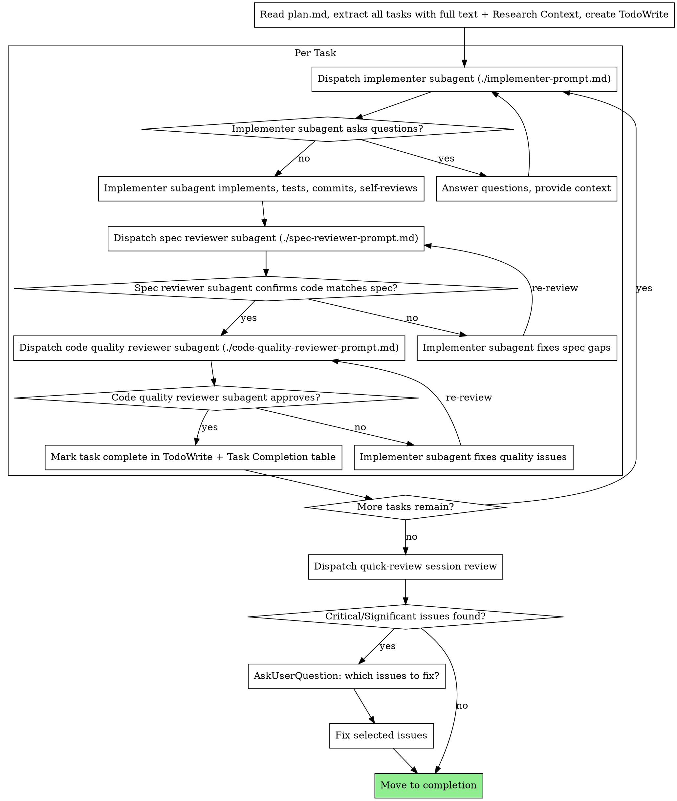

# /implement-plan

Execute a plan written by `/write-plan` (or any plan in dw-05 format living at `~/notes/context-engineering/<repo>/<slug>/plan.md`) by dispatching a fresh subagent per task, with two-stage review (spec compliance → code quality) after each.

**Core principle:** Fresh subagent per task + two-stage review = high quality, fast iteration.

**Announce at start:** "Starting /implement-plan."

## Setup

1. Run `~/.claude/skills/deep-work/dw-setup.sh "$ARGUMENTS"` and parse stdout for `REPO`, `TOPIC_SLUG`, `ARTIFACT_DIR`.
   - If the script exits 2 (`MISSING_SLUG` on stderr), use `AskUserQuestion` to ask the user for a topic slug, then re-run.

## Pre-flight Validation

- `<ARTIFACT_DIR>/plan.md` exists → if not: "Plan not found at `<path>`. Run `/write-plan <slug>` first." **Stop.**

## Tooling

Use the agent's native task tools (in Claude Code: `TaskCreate`, `TaskUpdate`, `TaskList`). Manage task dependencies via `TaskUpdate`'s `dependency` field.

## Model Selection

All Task tool dispatches (implementer, spec reviewer, code quality reviewer, session quick-review) use `model: "sonnet"`.

## Plan Structure Expectations

The plan should be in dw-05 format with clear headers for phases and tasks. The subagent-driven approach relies on dispatching a new subagent for as small a scope as possible to preserve context. Ideally each task in the plan is its own subagent loop. Avoid sending whole phases or multiple tasks to a single subagent.

The plan's `## Research Context` section is the implementer's only reference document for codebase context — there are no separate `00-ticket.md` / `02-research.md` artifacts in the lighter `/write-plan` flow. When dispatching the implementer subagent, include the relevant Research Context excerpts (typically `### Files in scope` and `### Patterns to follow`) alongside the task text.

## The Process



## Prompt Templates

Subagent dispatches read their prompts from siblings in this directory: `./implementer-prompt.md`, `./spec-reviewer-prompt.md`, `./code-quality-reviewer-prompt.md`. These are byte-for-byte copies of the same files in `dw-06-implement/`.

## Per-Task Execution

For each task in the plan:

1. **Dispatch implementer subagent** (`./implementer-prompt.md`, `model: "sonnet"`). Pass: full task text + relevant excerpts from the plan's `## Research Context` section (typically `### Files in scope` and `### Patterns to follow`).
2. **If implementer asks questions:** answer, then re-dispatch.
3. **Dispatch spec reviewer** (`./spec-reviewer-prompt.md`, `model: "sonnet"`). Pass: task requirements + implementer's report.
4. **If spec reviewer rejects:** same implementer fixes the gaps; re-dispatch spec reviewer. Loop until approved.
5. **Dispatch code-quality reviewer** (`./code-quality-reviewer-prompt.md`, `model: "sonnet"`). Pass: implementer's report + base/head SHAs.
6. **If code-quality reviewer rejects:** same implementer fixes; re-dispatch code-quality reviewer. Loop until approved.
7. **Mark task complete:** update both `TaskUpdate` and the `Task Completion` table in `plan.md` (set status to `[x]`, fill in the short SHA in the `Committed` column). If the implementer deviated from the plan, append an entry to the `Deviation Log` section of `plan.md`.

## Resume

If `/implement-plan <slug>` is invoked on a plan with some tasks already marked `[x]` in the Task Completion table:

1. Read the table; collect task IDs with status `[x]` (done) or `[-]` (skipped).
2. Skip those tasks. Begin per-task execution at the first task with status `[ ]` (pending), `[~]` (in progress), or `[!]` (blocked).
3. For `[~]` (in progress) tasks: assume the prior session left work uncommitted; check `git status`. If clean, restart the task; if dirty, ask the user via `AskUserQuestion` whether to discard or proceed from the dirty state.
4. For `[!]` (blocked) tasks: read the Deviation Log for context; ask the user whether the blocker is resolved before re-dispatching.

## Session Review

After all tasks are complete, dispatch a fresh Task subagent (`general-purpose`, `model: "sonnet"`) to invoke `/quick-review`:

```
Invoke the /quick-review skill to review the local commits <git_sha_start>..<git_sha_end>
```

When the review returns:
- **Critical or Significant issues found:** use `AskUserQuestion` to present findings; ask which to fix; apply requested fixes before proceeding.
- **Minor issues only or no issues:** proceed to completion.

## Completion

Report to the user:
- All tasks complete (count)
- Phase Progress and Task Completion tables fully filled in
- Session review verdict + any fixes applied
- Plan file path for future reference: `<ARTIFACT_DIR>/plan.md`

## Red Flags

**Never:**
- Skip reviews — both spec compliance AND code quality, in that order. Reviewer issues block task completion until fixed and re-reviewed.
- Let implementer self-review replace actual review — both are needed.
- Dispatch multiple implementation subagents in parallel (commit conflicts).
- Make subagents read the entire plan file — provide the full task text plus only the relevant Research Context excerpts, not the whole plan or unrelated details.
- Ignore subagent questions — answer them before letting work proceed.

**If a subagent asks questions:** answer clearly and provide additional context as needed before letting them proceed.

**If a reviewer finds issues:** the same implementer subagent fixes them and the reviewer re-reviews; repeat until approved.

**If a subagent fails a task:** dispatch a fix subagent with specific instructions rather than fixing manually (avoids context pollution).
