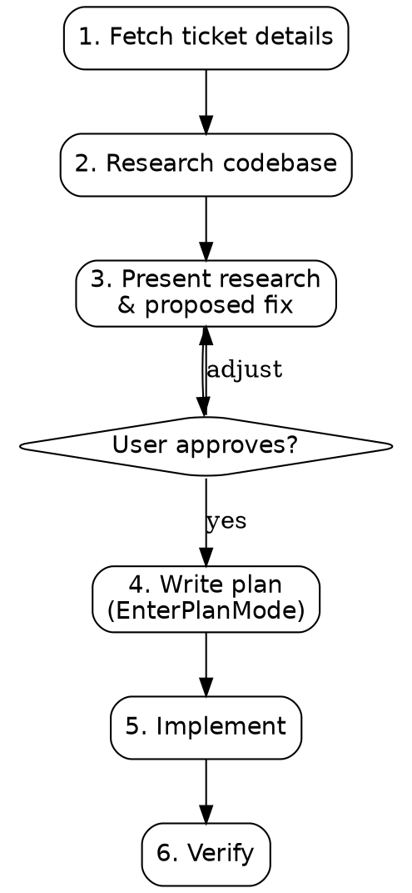

# Investigate and Fix

Single-session workflow for well-scoped tickets: investigate, research, propose, plan, implement.

**When to use:** Bug fixes, concurrency issues, small features, config changes — tickets where the problem is clear and the fix is localized.

**When NOT to use:** Large features, architectural changes, or tickets needing design discussion. Use the deep-work pipeline (`/dw-01-research-questions`) instead.



## Phase 1: Fetch Ticket

Parse `$ARGUMENTS` to determine ticket source:

| Input | Action |
|-------|--------|
| Jira key (e.g. `MHOUSE-16429`) | Fetch via Glean MCP: `mcp__glean_default__search` with the Jira key |
| Jira URL | Extract key from URL, then fetch via Glean |
| Pasted text | Use directly |

**Glean fetch pattern:**
1. Search Glean for the ticket key to get the ticket summary, description, and comments
2. If the ticket references linked docs, designs, or related tickets — fetch those too via `mcp__glean_default__read_document` or additional searches
3. Extract: **problem statement**, **acceptance criteria**, **linked context**

If Glean returns insufficient detail, note the gaps and proceed with what's available.

## Phase 2: Research Codebase

Dispatch subagents in parallel to investigate the problem:

### 2a. Locate relevant code

Dispatch a `codebase-locator` agent:
> "Find files and components related to: <key nouns from ticket>. Return file paths grouped by purpose."

### 2b. Analyze the problem area

Based on locator results, dispatch `codebase-analyzer` agent(s):
> "Analyze <specific file/component>. Document: current behavior, data flow, concurrency model (if relevant), error handling, and test coverage. Include file:line references."

### 2c. Find similar patterns (if applicable)

If the fix involves a pattern that likely exists elsewhere, dispatch a `codebase-pattern-finder` agent:
> "Find examples of <pattern> in the codebase. Return concrete code examples with file:line references."

## Phase 3: Present Research & Proposed Fix

Present findings to the user in this structure:

```markdown
## Investigation Summary

### Problem
<What's broken and why, with file:line references>

### Root Cause
<The specific code/config causing the issue>

### Proposed Fix
<Concrete description of changes needed>
- File: `path/to/file.go` — <what changes>
- File: `path/to/test.go` — <new test>

### Evidence
- <Pattern references from codebase>
- <Similar fixes or patterns found>

### Risk Assessment
<What could go wrong, edge cases, backward compatibility>
```

**STOP here.** Wait for user approval before proceeding. Do NOT enter plan mode or write code.

Use `AskUserQuestion`:
- Question: "Does this investigation and proposed fix look right?"
- Options:
  - "Looks good, proceed to planning"
  - "Needs adjustment" (user provides feedback)
  - "Too complex for single session — switch to deep-work pipeline"

If "needs adjustment": incorporate feedback, re-present. Repeat until approved.
If "switch to deep-work": suggest `/dw-01-research-questions` with the topic slug. **Stop.**

## Phase 4: Plan

On approval, enter plan mode via `EnterPlanMode`.

Write a plan that includes:
1. **Each file to modify/create** with the specific changes
2. **Code snippets** showing the exact implementation approach (struct changes, method changes, new functions)
3. **Test approach** — what to test, how to verify
4. **Verification commands** — exact build/test/lint commands from AGENTS.md

The plan should be detailed enough that the implementation phase is mechanical — no design decisions remain.

Present the plan for approval before exiting plan mode.

## Phase 5: Implement

After plan approval, exit plan mode and implement:

1. Make changes file by file, following the plan exactly
2. Log deviations if any arise
3. Run verification commands from the plan
4. Present results

## Phase 6: Verify

Run the full verification suite specified in the plan. Report results. If failures are unrelated to the changes (pre-existing), note that explicitly.

## Common Mistakes

| Mistake | Fix |
|---------|-----|
| Starting to code before user approves the investigation | Phase 3 is a hard gate — always wait for approval |
| Proposing a fix without understanding existing patterns | Always run the pattern-finder in Phase 2 |
| Skipping the plan and jumping to implementation | The plan catches design issues early — don't skip it |
| Over-scoping the fix | Fix the ticket, not adjacent issues. YAGNI. |
