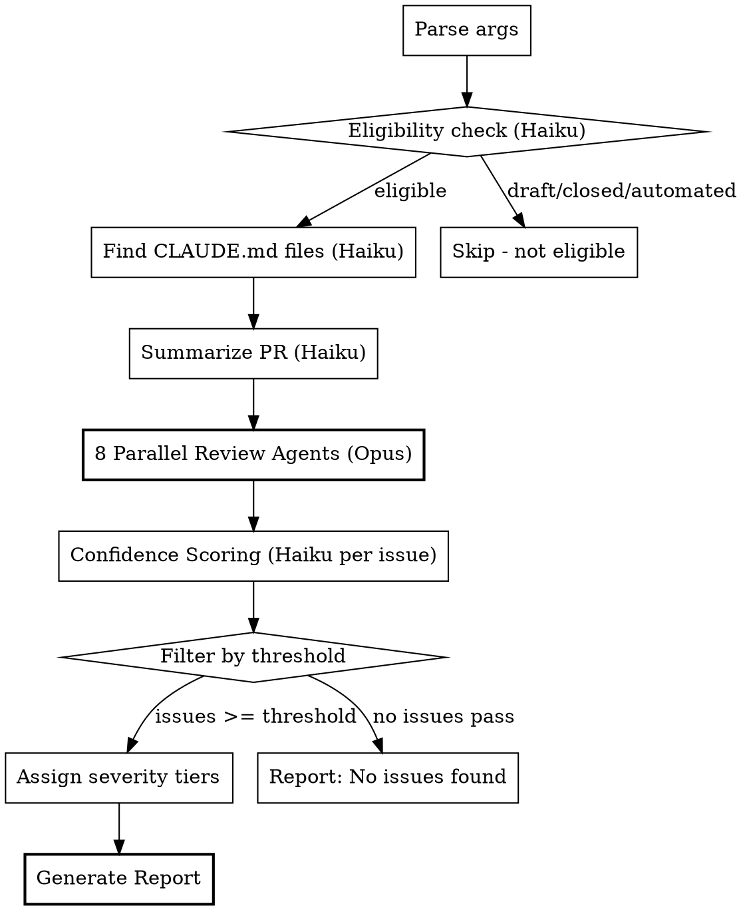

# PR Review

Multi-agent ensemble code review that returns a detailed report for human review before any comments are posted.

## Overview

Launches 8 specialized Opus agents in parallel to review a PR from different angles, then uses confidence scoring to filter false positives. Returns a structured report with severity tiers instead of posting to GitHub.

**Key differences from code-review:code-review:**
- Report output (you decide what to post)
- Opus for core analysis (higher quality)
- 70 threshold by default (configurable)
- 8 review agents (adds security, test coverage, correctness validation)
- Severity tiers (Critical/High/Medium/Low)
- Executive summary + code fix examples
- Positive observations section

## Usage

```
/pr-review <owner/repo> <pr-number> [--threshold N]
```

Examples:
- `/pr-review anthropics/claude-code 123`
- `/pr-review anthropics/claude-code 123 --threshold 60`

## Pipeline



## Implementation

Follow these steps precisely:

### Step 1: Eligibility Check (Haiku)

Launch a Haiku agent to check if the PR:
- (a) is closed
- (b) is a draft
- (c) does not need review (automated PR, trivial change)
- (d) already has a code review from you

If any condition is true, stop and report why.

```bash
gh pr view -R <owner/repo> <pr-number> --json state,isDraft,author,title,body
```

### Step 2: Find CLAUDE.md Files (Haiku)

Launch a Haiku agent to find all relevant CLAUDE.md files:
- Root CLAUDE.md (if exists)
- CLAUDE.md files in directories modified by the PR

Return file paths only, not contents.

### Step 3: Summarize PR (Haiku)

Launch a Haiku agent to:
```bash
gh pr view -R <owner/repo> <pr-number>
gh pr diff -R <owner/repo> <pr-number>
```

Return a 2-3 sentence summary of what the PR does.

### Step 4: Parallel Review Agents (8x Opus)

Launch 8 Opus agents in parallel. Each returns a list of issues with:
- Issue description
- File and line reference
- Reason flagged (CLAUDE.md, bug, history, security, etc.)
- Suggested fix (concrete code example when possible)

**Agent #1: CLAUDE.md Compliance**
Audit changes against all CLAUDE.md files found in Step 2. Note that CLAUDE.md is guidance for writing code, so not all instructions apply during review.

**Agent #2: Bug & Error Handling Scan**
Read file changes and scan for:

*Bugs:*
- Logic errors and off-by-one mistakes
- Null/undefined dereferences
- Race conditions in concurrent code
- Edge cases not handled

*Error Handling:*
- Missing try/catch around operations that can fail
- Silent failures (caught but not logged/handled)
- Unvalidated user input before use
- Missing null checks before dereference
- Error messages that leak sensitive information
- Failure recovery paths that leave inconsistent state

Focus on the diff only, not surrounding context. Target significant issues, avoid nitpicks. Ignore likely false positives.

**Agent #3: Git History Context**
Read git blame and history of modified code. Identify bugs considering historical context and original intent.

**Agent #4: Previous PR Comments**
Read previous PRs that touched these files. Check for comments that may apply to current changes.

**Agent #5: Code Comment Compliance**
Read code comments in modified files. Ensure changes comply with guidance in comments (TODOs, warnings, invariants).

**Agent #6: Security Analysis**
Scan for security vulnerabilities:
- Injection risks (SQL, command, XSS)
- Authentication/authorization flaws
- Data exposure issues
- Insecure defaults
- Missing input validation

**Agent #7: Test Coverage Check**
Verify that code changes have corresponding test changes:
- New functions should have tests
- Modified logic should have updated tests
- Check for test file changes alongside source changes

**Agent #8: Correctness Validation**
Verify that the code changes actually solve the stated problem.

*Inputs:*
- PR title and description
- Jira ticket details (if linked in PR description or branch name)
- The diff

*Process:*
1. Extract the stated intent from PR description
2. If Jira ticket linked (e.g., `PROJ-123`), use `jira-cli` skill to fetch ticket summary and acceptance criteria
3. Analyze whether the code changes address the stated problem

*Flag issues when:*
- PR claims to fix X, but the fix doesn't address the root cause
- PR claims to add feature Y, but implementation is incomplete
- Jira acceptance criteria exist but aren't met by the changes
- PR description is vague/missing and changes are non-trivial

*Do NOT flag:*
- PRs with clear description that match the implementation
- Refactoring PRs where "correctness" is subjective
- Trivial changes (typo fixes, version bumps)

### Step 5: Confidence Scoring (Haiku per issue)

For each issue from Step 4, launch a parallel Haiku agent with:
- The PR details
- Issue description
- CLAUDE.md file paths from Step 2

Score each issue 0-100 using this rubric (give verbatim to agent):

| Score | Meaning |
|-------|---------|
| **0** | False positive. Doesn't hold up to scrutiny, or pre-existing issue. |
| **25** | Might be real, couldn't verify. Stylistic issue not in CLAUDE.md. |
| **50** | Verified real but nitpicky. Not important relative to PR. |
| **75** | Verified real, will be hit in practice. Important or in CLAUDE.md. |
| **100** | Definitely real, frequent in practice. Evidence confirms. |

For CLAUDE.md issues, agent must verify the file actually calls out that issue.

### Step 6: Filter by Threshold

Default threshold: **70** (configurable via `--threshold N`)

Filter out issues scoring below threshold.

If no issues pass, generate "No issues found" report and stop.

### Step 7: Assign Severity Tiers

Categorize passing issues:

| Tier | Criteria |
|------|----------|
| **Critical** | Score 95+, or security vulnerability, or will cause runtime failure |
| **High** | Score 85-94, or CLAUDE.md violation, or logic bug |
| **Medium** | Score 75-84, or code quality issue |
| **Low** | Score 70-74, or style/convention issue |

### Step 8: Generate Report

Output a structured report (do NOT post to GitHub):

```markdown
## PR Review Report

**Repository:** <owner/repo>
**PR:** #<number> - <title>
**Reviewed:** <timestamp>

### Summary
<2-3 sentence summary of what the PR does>

### Executive Summary
<2-3 sentence assessment of the review findings>

Examples:
- "Solid implementation with one critical auth vulnerability that must be addressed. Two medium-priority issues around error handling."
- "Clean PR with no significant issues. Minor style suggestions only."
- "Several correctness concerns — the fix doesn't appear to address the root cause described in PROJ-456."

### Statistics
- Issues found: X (Y critical, Z high, W medium, V low)
- Issues filtered (below threshold): N
- Agents that found issues: [list]

### Critical Issues
1. **<description>** (Source: <agent>, Score: <N>)
   - File: `path/to/file.go:123`
   - Reason: <why this is a problem>
   - Suggested fix:
     ```go
     // concrete code example showing the fix
     ```
   - Link: <GitHub link with full SHA>

### High Priority Issues
...

### Medium Priority Issues
...

### Low Priority Issues
...

### Positive Observations
- <Good pattern observed>
- <Well-implemented aspect>
- <Strength worth noting>

### Files Reviewed
- `path/to/file1.go`
- `path/to/file2.ts`

### CLAUDE.md Files Consulted
- `CLAUDE.md`
- `src/CLAUDE.md`
```

**Note on code examples:** Suggested fixes are best-effort. If the fix is architectural or context-dependent, describe the approach instead of providing literal code. The goal is actionability — the reviewer should know exactly what to do.

## False Positive Examples

Instruct agents to ignore:
- Pre-existing issues
- Apparent bugs that aren't actually bugs
- Pedantic nitpicks a senior engineer wouldn't flag
- Issues linters/compilers catch (imports, types, formatting)
- General quality issues unless required by CLAUDE.md
- Issues silenced by lint ignore comments
- Intentional functionality changes
- Issues on unmodified lines

## Notes

- Do NOT build or typecheck - CI handles that
- Use `gh` for all GitHub interaction
- Create a todo list before starting
- Cite and link each issue (CLAUDE.md references must include link)
- GitHub links require full SHA: `https://github.com/owner/repo/blob/<full-sha>/path/file.go#L10-L15`
- Line range format: `L[start]-L[end]`
- Include 1+ lines of context around the issue line

## Quick Reference

| Component | Model | Purpose |
|-----------|-------|---------|
| Eligibility | Haiku | Gate: skip drafts/closed/automated |
| CLAUDE.md finder | Haiku | Locate project standards |
| Summarizer | Haiku | PR overview |
| Reviewers (8x) | Opus | Deep analysis |
| Scorers (per issue) | Haiku | Confidence calibration |

| Agent | Focus |
|-------|-------|
| #1 | CLAUDE.md Compliance |
| #2 | Bug & Error Handling Scan |
| #3 | Git History Context |
| #4 | Previous PR Comments |
| #5 | Code Comment Compliance |
| #6 | Security Analysis |
| #7 | Test Coverage Check |
| #8 | Correctness Validation |

| Default | Value |
|---------|-------|
| Threshold | 70 |
| Review agents | 8 |
| Scoring rubric | 0-100 |
