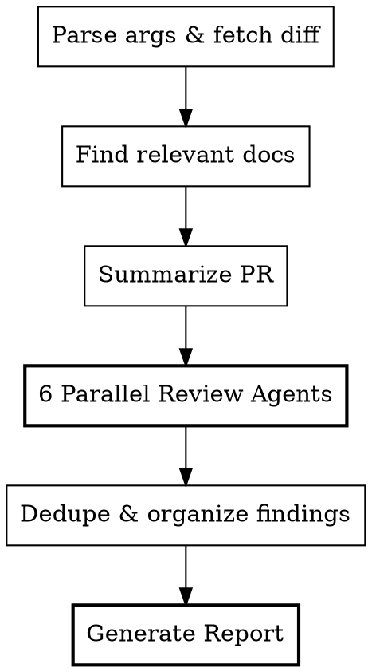

# PR Review

Multi-agent ensemble code review that returns a detailed report for human review before any comments are posted.

## Overview

Launches 6 specialized agents in parallel to review a PR from different angles, dedupes findings, and returns a structured report with severity tiers for human review.

**Key differences from code-review:code-review:**
- Report output (you decide what to post)
- 6 focused review agents (consolidated for efficiency and reduced context overhead)
- Agents self-assign severity (Critical/High/Medium/Low)
- Executive summary + code fix examples
- Positive observations section

## Anti-Patterns

These patterns cause context explosion and degrade review accuracy. Avoid them.

| Anti-Pattern | Why It's Bad | Do This Instead |
|--------------|--------------|-----------------|
| Using `TaskOutput` to collect agent results | Pulls full transcripts (~50KB each) including every tool call and response | Wait for agents to return naturally via the Task tool response |
| Running agents with `run_in_background: true` | Forces TaskOutput usage to retrieve results later | Run agents in foreground; they return when complete |
| Agents returning raw file contents | Files read during analysis leak into orchestrator context | Return findings about files, not file contents |

**Key principle:** Agents can read and analyze anything internally. The constraint is what they *return* to the orchestrator — enough to be actionable, no more.

## Usage

```
/pr-review <github-url>
/pr-review <owner/repo> <pr-number>
```

Examples:
- `/pr-review https://github.com/anthropics/claude-code/pull/123`
- `/pr-review anthropics/claude-code 123`

**Assumption:** Run from a local clone of the repository being reviewed. The local codebase should be reasonably up-to-date (agents use it for code search and context).

## Pipeline


```graphviz
digraph pr_review {
    rankdir=TB;

    "Parse args & fetch diff" [shape=box];
    "Find relevant docs" [shape=box];
    "Summarize PR" [shape=box];
    "6 Parallel Review Agents" [shape=box, style=bold];
    "Dedupe & organize findings" [shape=box];
    "Generate Report" [shape=box, style=bold];

    "Parse args & fetch diff" -> "Find relevant docs";
    "Find relevant docs" -> "Summarize PR";
    "Summarize PR" -> "6 Parallel Review Agents";
    "6 Parallel Review Agents" -> "Dedupe & organize findings";
    "Dedupe & organize findings" -> "Generate Report";
}
```

## Implementation

Follow these steps precisely:

### Step 0: Parse Args & Fetch Diff

**0a. Parse Input:**
Parse owner/repo/pr-number from input. Accept either:
- GitHub URL: `https://github.com/owner/repo/pull/123`
- Args: `owner/repo 123`

**0b. Fetch and Cache PR Diff:**
```bash
# Fetch the full diff and save to tmp
DIFF_FILE="/tmp/pr-review-${PR_NUMBER}.diff"
gh pr diff -R <owner/repo> <pr-number> > "$DIFF_FILE"

# For very large PRs, if the diff is truncated, use paginated file fetching:
# gh api repos/<owner>/<repo>/pulls/<pr-number>/files --paginate
```

**0c. Get PR Metadata:**
```bash
gh pr view -R <owner/repo> <pr-number> --json title,body,baseRefName,headRefName,author
```

**Context for subsequent steps:**
- `diff_file`: Path to cached diff (`/tmp/pr-review-${PR_NUMBER}.diff`)
- `owner`, `repo`, `pr_number`: PR identifiers
- `pr_title`, `pr_body`: PR metadata
- Local codebase is available for code search (may not exactly match PR head)

### Step 1: Find Relevant Documentation

Find all relevant CLAUDE.md files and linked docs:

**1a. Find CLAUDE.md files:**
- Root CLAUDE.md (if exists)
- CLAUDE.md files in directories modified by the PR

Extract modified directories from the cached diff file, then search locally for CLAUDE.md files in those directories.

**1b. Progressive discovery of linked docs:**
Many CLAUDE.md files link to additional documentation (e.g., `docs/frontend-standards.md`, `docs/api-conventions.md`). Scan the found CLAUDE.md files for links to other docs and include those that are relevant to the PR.

Relevance signals:
- Doc name matches PR domain (frontend PR → frontend docs, API PR → API docs)
- Doc is in a directory modified by the PR
- Doc is explicitly referenced in context of the changed code

Example: If reviewing a React component PR and CLAUDE.md links to `docs/component-guidelines.md`, include it.

**Return:** List of all relevant doc paths (CLAUDE.md files + linked docs)

### Step 2: Summarize PR

Using the PR metadata from Step 0 and the cached diff file, generate a 2-3 sentence summary of what the PR does.

This summary will be passed to all review agents for context.

### Step 3: Parallel Review Agents

Launch 6 agents in parallel. Each returns a list of issues with:
- Issue description
- File and line reference
- Reason flagged (CLAUDE.md, bug, history, security, etc.)
- Suggested fix (concrete code example when possible)
- **Why it matters** (consequence if not addressed)
- **Alternative approaches** (when applicable)

**Guidance for ALL agents:**

Each agent MUST follow these principles when analyzing and reporting issues:

| Principle | What It Means |
|-----------|---------------|
| **Explain reasoning** | Don't just flag issues — explain *why* it's a problem and what consequences follow if not addressed |
| **Provide alternatives** | When suggesting fixes, offer alternative approaches when multiple valid solutions exist |
| **Balance pragmatism** | Focus on changes that provide meaningful value; avoid perfectionism that doesn't serve the PR's goals |
| **Consider system context** | Think about broader architectural implications, not just the isolated code change |
| **Be direct and actionable** | Every issue should tell the reviewer exactly what to do and why |

**Issue return format for all agents:**
```
Issue: <concise description>
Severity: <Critical | High | Medium | Low>
File: <path:line>
Why it matters: <consequence if not addressed>
Suggested fix: <concrete code or approach>
Alternative: <other valid approach, if any>
```

**Severity guidelines for agents:**
- **Critical**: Security vulnerability, will cause runtime failure, data loss
- **High**: Logic bug, violates documented standards, breaks functionality
- **Medium**: Code quality issue, missing error handling, performance concern
- **Low**: Style/convention issue, minor improvement suggestion

**Context passed to ALL agents:**
- `diff_file`: Path to cached PR diff (read this instead of calling `gh pr diff`)
- `pr_summary`: 2-3 sentence summary of what the PR does
- `doc_paths`: List of relevant documentation (CLAUDE.md files + linked docs from Step 1)
- `owner`, `repo`, `pr_number`: PR identifiers

**Available resources for ALL agents:**
- **Cached diff:** Read from `diff_file` — do NOT call `gh pr diff` again
- **Local codebase:** Use local file reads and search (Grep, Glob) for code context. Note: local files may not exactly match PR head, but are close enough for context
- **Git operations:** `git blame`, `git log` work on local repo
- **GitHub API:** Use `gh api` for PR comments, related PRs, or other GitHub-specific data

**Agent #1: Documentation Compliance**
Audit changes against all documented guidance:

*Project documentation (from Step 1):*
- CLAUDE.md files and any linked docs (e.g., `frontend-standards.md`, `api-conventions.md`)
- Project-specific conventions and standards
- Required patterns or forbidden anti-patterns
- Note: these are guidance for writing code, so not all instructions apply during review

*Inline code documentation:*
- TODO comments that conflict with changes
- Warning comments being ignored
- Invariant comments being violated
- Documentation that contradicts the implementation

Flag when code violates documented guidance. Include the specific documentation reference (file path and relevant section).

**Agent #2: Bug, Error Handling & Test Coverage**
Analyze code reliability and test coverage together:

*Bugs:*
- Logic errors and off-by-one mistakes
- Null/undefined dereferences
- Race conditions in concurrent code
- Edge cases not handled

*Error Handling:*
- Missing try/catch around operations that can fail
- Silent failures (caught but not logged/handled)
- Unvalidated user input before use
- Missing null checks before dereference
- Error messages that leak sensitive information
- Failure recovery paths that leave inconsistent state

*Test Coverage:*
- New functions without corresponding tests
- Modified logic without updated tests
- Error handling paths without test coverage
- Edge cases identified above without tests

When flagging a bug or error handling issue, note whether it has test coverage. When flagging missing tests, prioritize based on the risk of the untested code.

Focus on the diff only, not surrounding context. Target significant issues, avoid nitpicks. Ignore likely false positives.

**Agent #3: Security Analysis**
Scan for security vulnerabilities:
- Injection risks (SQL, command, XSS)
- Authentication/authorization flaws
- Data exposure issues
- Insecure defaults
- Missing input validation
- Secrets or credentials in code
- Insecure cryptographic practices

Security issues should always be flagged regardless of test coverage or other factors.

**Agent #4: Historical Context**
Analyze git history and previous PR feedback:

*Git history analysis:*
- Use `git blame <file>` to understand original intent of modified code
- Use `git log --oneline -10 <file>` to see evolution of the code
- Identify if changes contradict the original design intent
- Check if similar changes were previously reverted

*Previous PR comments:*
- Use `gh api` to find PRs that touched these files
- Check for reviewer feedback that applies to current changes
- Identify recurring issues that weren't addressed

Flag issues where history provides important context the author may have missed.

**Agent #5: Correctness Validation**
Verify that the code changes actually solve the stated problem.

*Inputs:*
- PR title and description
- Jira ticket details (if linked in PR description or branch name)
- The diff

*Process:*
1. Extract the stated intent from PR description
2. If Jira ticket linked (e.g., `PROJ-123`), use `jira-cli` skill to fetch ticket summary and acceptance criteria
3. Analyze whether the code changes address the stated problem

*Flag issues when:*
- PR claims to fix X, but the fix doesn't address the root cause
- PR claims to add feature Y, but implementation is incomplete
- Jira acceptance criteria exist but aren't met by the changes
- PR description is vague/missing and changes are non-trivial

*Do NOT flag:*
- PRs with clear description that match the implementation
- Refactoring PRs where "correctness" is subjective
- Trivial changes (typo fixes, version bumps)

**Agent #6: Code Quality**
Evaluate performance, design patterns, and best practices:

*Performance:*
- O(n²) or worse complexity where O(n) is possible
- Unnecessary iterations or redundant computations
- N+1 query patterns in database access
- Missing batching for API calls
- Memory leaks or unbounded growth
- Missing cleanup of resources (connections, file handles, subscriptions)
- Blocking operations in async contexts
- Frontend: unnecessary re-renders, large bundle imports, missing virtualization

*Design quality:*
- Single Responsibility: Does each function/class do one thing well?
- Naming: Do names reveal intent? Are they consistent with codebase conventions?
- Abstraction level: Is code at a consistent level of abstraction?
- Coupling: Are dependencies explicit and minimal?

*Language idioms:*
- Using language features appropriately (destructuring, optionals, pattern matching)
- Following community conventions for the language/framework
- Avoiding language-specific anti-patterns

*Framework conventions:*
- Following established patterns for React, Vue, Angular, etc.
- Proper use of hooks, lifecycle methods, state management
- Component composition and prop design
- Accessibility best practices (ARIA, semantic HTML, keyboard navigation)

*Maintainability:*
- Would a new team member understand this code?
- Magic numbers or strings that should be constants?
- Duplicated logic that should be extracted?
- Overly nested conditionals?

Focus on issues that will be hit in practice, not theoretical concerns. Do NOT flag purely aesthetic style issues (formatting, bracket placement).

### Step 4: Dedupe & Organize Findings

Collect all issues from the 6 agents and:

1. **Dedupe**: If multiple agents flagged the same issue (same file/line, similar description), merge into one finding and note which agents flagged it
2. **Group by severity**: Organize findings into Critical, High, Medium, Low sections
3. **Group by file**: Within each severity, group findings by file for easier navigation

If no issues were found, note this in the report.

### Step 5: Generate Report

Output a structured report (do NOT post to GitHub):

```markdown
## PR Review Report

**Repository:** <owner/repo>
**PR:** #<number> - <title>
**Reviewed:** <timestamp>

### Summary
<2-3 sentence summary of what the PR does>

### Executive Summary
<2-3 sentence assessment of the review findings>

Examples:
- "Solid implementation with one critical auth vulnerability that must be addressed. Two medium-priority issues around error handling."
- "Clean PR with no significant issues. Minor style suggestions only."
- "Several correctness concerns — the fix doesn't appear to address the root cause described in PROJ-456."

### Statistics
- Issues found: X (Y critical, Z high, W medium, V low)
- Agents that found issues: [list]

### Critical Issues
1. **<description>** (Source: <agent>)
   - File: `path/to/file.go:123`
   - Why it matters: <consequence if not addressed>
   - Suggested fix:
     ```go
     // concrete code example showing the fix
     ```
   - Link: <GitHub link with full SHA>

### High Priority Issues
...

### Medium Priority Issues
...

### Low Priority Issues
...

### Positive Observations
- <Good pattern observed>
- <Well-implemented aspect>
- <Strength worth noting>

### Files Reviewed
- `path/to/file1.go`
- `path/to/file2.ts`

### Documentation Consulted
- `CLAUDE.md`
- `src/CLAUDE.md`
- `docs/frontend-standards.md`
```

**Note on code examples:** Suggested fixes are best-effort. If the fix is architectural or context-dependent, describe the approach instead of providing literal code. The goal is actionability — the reviewer should know exactly what to do.

## False Positive Examples

Instruct agents to ignore:
- Pre-existing issues
- Apparent bugs that aren't actually bugs
- Pedantic nitpicks a senior engineer wouldn't flag
- Issues linters/compilers catch (imports, types, formatting)
- General quality issues unless required by CLAUDE.md
- Issues silenced by lint ignore comments
- Intentional functionality changes
- Issues on unmodified lines

## Notes

- Do NOT build or typecheck - CI handles that
- Agents should read from the cached diff file, not call `gh pr diff` again
- Use local git commands (`git blame`, `git log`) for history
- Use `gh api` for GitHub-specific data (PR comments, related PRs)
- Create a todo list before starting
- Cite and link each issue (CLAUDE.md references must include link)
- GitHub links require full SHA: `https://github.com/owner/repo/blob/<full-sha>/path/file.go#L10-L15`
- Line range format: `L[start]-L[end]`
- Include 1+ lines of context around the issue line
- Cached diff is stored in `/tmp/pr-review-${PR_NUMBER}.diff`

## Quick Reference

| Component | Purpose |
|-----------|---------|
| Diff fetcher | Cache PR diff to `/tmp` |
| Doc finder | Locate CLAUDE.md + linked docs |
| Summarizer | PR overview |
| Reviewers (6x) | Deep analysis with self-assigned severity |

| Agent | Focus |
|-------|-------|
| #1 | Documentation Compliance (CLAUDE.md + linked docs + inline comments) |
| #2 | Bug, Error Handling & Test Coverage |
| #3 | Security Analysis |
| #4 | Historical Context (git history + previous PR comments) |
| #5 | Correctness Validation |
| #6 | Code Quality (performance + patterns + best practices) |

| Severity | Criteria |
|----------|----------|
| Critical | Security vulnerability, runtime failure, data loss |
| High | Logic bug, violates standards, breaks functionality |
| Medium | Code quality, missing error handling, performance |
| Low | Style/convention, minor improvements |
