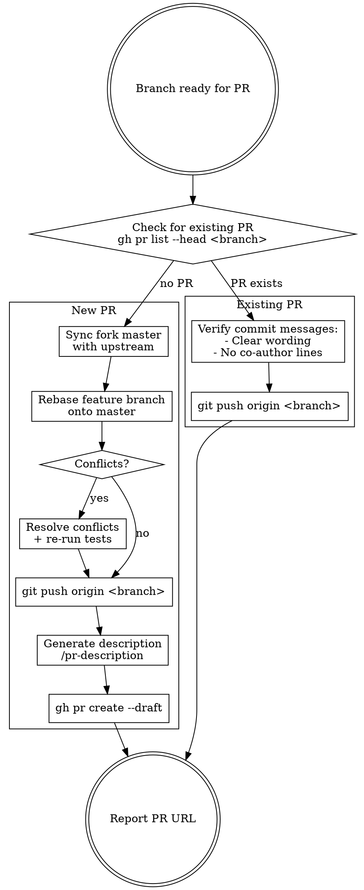

# Submit PR

Handles the full workflow for getting a feature branch into a PR — either creating a new draft PR or pushing updates to an existing one.

## When to Use

- Branch work is complete and ready for PR
- User says "create PR", "submit PR", "push to PR", "open PR"
- Existing PR needs new commits pushed

## Workflow



## New PR Flow

### 1. Sync Fork

If the repo is a fork (origin != upstream), sync master using `sync-fork`:
```bash
sync-fork
```

**Always use `sync-fork`** — do NOT manually fetch/checkout/pull/push master.

### 2. Rebase Feature Branch

```bash
git checkout <feature-branch>
git rebase master
```

- **If conflicts:** resolve them, then re-run the project's test suite before continuing
- **Do NOT force push** unless the branch was already pushed and rebase rewrote history. For a never-pushed branch, a regular `git push` works.

### 3. Push Branch

```bash
git push origin <feature-branch>
```

Only use `--force-with-lease` if the branch was previously pushed and rebase rewrote its history.

### 4. Generate PR Description

Invoke `/pr-description` to generate from the PR template and git diff.

### 5. Create Draft PR

Always create as draft. User will manually mark ready.

```bash
gh pr create --draft \
  --repo <upstream-owner>/<repo> \
  --head <fork-owner>:<branch> \
  --base <main-branch> \
  --title "<TICKET-ID>: <title>" \
  --body "$(cat <<'EOF'
<generated description>
EOF
)"
```

- **Title prefix:** Extract ticket ID from the Jira URL or branch name
- **Target:** PR goes against the upstream repo, not the fork

## Existing PR Flow

### 1. Check Commits

Review new commit messages since last push:
- Clear, descriptive wording
- No `Co-Authored-By` trailers

### 2. Push

```bash
git push origin <feature-branch>
```

## Common Mistakes

| Mistake | Fix |
|---------|-----|
| Creating PR as non-draft | Always use `--draft` |
| Force-pushing a never-pushed branch | Regular `git push` for new branches |
| Forgetting to rebase before new PR | Always sync + rebase for new PRs |
| PR targets fork instead of upstream | Use `--repo` and `--head` flags |
| Skipping tests after conflict resolution | Conflicts can break code silently |
