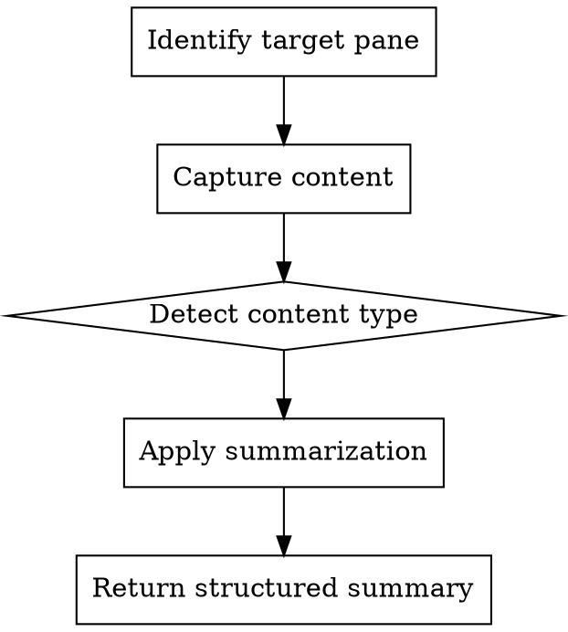

# tmux Stalker Summarized

## Overview

Capture and summarize tmux pane content efficiently. Auto-detects content type (tests, logs, stack traces, narrative) and returns structured summaries optimized for context preservation.

**Core principle:** Raw terminal output wastes context. Extract signal, discard noise.

## When to Use

- Checking test results in another pane
- Investigating errors/stack traces from a build
- Reviewing application logs for failures or events
- Getting context from long-running processes
- Scanning multiple panes for relevant information

## Workflow



## Quick Reference

| Task | Command |
|------|---------|
| List all panes | `tmux list-panes -a -F "#{session_name}:#{window_index}.#{pane_index} [#{pane_current_command}] #{pane_current_path}"` |
| Find pane by command | `tmux list-panes -a -F "..." \| grep -i "go\|npm\|python"` |
| Capture recent (200 lines) | `tmux capture-pane -t TARGET -p -S -200` |
| Capture full history | `tmux capture-pane -t TARGET -p -S - -E -` |

## Content Type Detection

Analyze captured content to determine type:

| Content Type | Detection Signals |
|--------------|-------------------|
| **Test Output** | `=== RUN`, `--- PASS`, `--- FAIL`, `PASS`, `FAIL`, `ok`, `pytest`, checkmark, X |
| **Stack Trace** | `panic:`, `Traceback`, `at Object.`, `goroutine`, `Exception`, file:line patterns |
| **Application Logs** | Timestamps, log levels (`ERROR`, `WARN`, `INFO`, `DEBUG`), structured JSON |
| **Narrative** | Command prompts, shell output, prose text, command history |

**Detection order:** Stack traces -> Test output -> Logs -> Narrative (fallback)

## Summarization Templates

### Test Output Summary

```markdown
## Test Results: [PASSED/FAILED]

**Stats:** X passed, Y failed, Z skipped (coverage: N%)

### Failures
1. **TestName** - `file.go:123`
   - Expected: <value>
   - Actual: <value>
   - Message: <assertion message>

2. **TestName2** - `file.go:456`
   ...

### Passed (notable)
- TestComplexScenario (0.5s)
- TestIntegrationFlow (1.2s)
```

### Stack Trace Summary

```markdown
## Error: <error type/message>

**Root cause:** `package/file.go:123` - <function name>

### Call stack (most relevant)
1. `file.go:123` - functionName() - <context>
2. `file.go:89` - callerFunction()
3. `main.go:45` - main()

### Related errors (if multiple)
- Same error at `other.go:55` (3 occurrences)
```

### Log Summary

```markdown
## Log Analysis: <time range>

### Errors (X total)
- `[ERROR]` <timestamp> - <message> - `source:line`
- ...

### Warnings (Y total)
- `[WARN]` <timestamp> - <message>

### Key Events
- <timestamp> - Request started: <id>
- <timestamp> - Auth succeeded: <user>
- <timestamp> - Transaction completed: <details>

### Patterns Detected
- 3 connection timeouts in 5 minutes
- Auth failures from IP: x.x.x.x
```

### Narrative Summary

```markdown
## Terminal Activity

**Last command:** <command>
**Working directory:** <path>
**Status:** <success/error/in-progress>

### Summary
<2-3 sentence description of what happened>

### Key Output
- <important line 1>
- <important line 2>
```

## Stack Trace Patterns by Language

### Go
```
panic: <message>
goroutine N [running]:
package/path.Function(args)
    /full/path/file.go:123 +0xABC
```
Extract: `file.go:123`, function name, panic message

### Python
```
Traceback (most recent call last):
  File "path/file.py", line 123, in function_name
    code_line
ExceptionType: message
```
Extract: `file.py:123`, function_name, ExceptionType: message

### Node.js/JavaScript
```
Error: message
    at functionName (file.js:123:45)
    at Object.<anonymous> (file.js:89:12)
```
Extract: `file.js:123`, functionName, Error: message

### Java
```
Exception in thread "main" java.lang.ExceptionType: message
    at package.Class.method(File.java:123)
```
Extract: `File.java:123`, Class.method, ExceptionType: message

## Pane Targeting

### By location
```bash
tmux capture-pane -t session:window.pane -p -S -200
```

### By command (find first)
```bash
# Find pane running tests
TARGET=$(tmux list-panes -a -F "#{session_name}:#{window_index}.#{pane_index} #{pane_current_command}" | grep -i "go test\|pytest\|npm test" | head -1 | cut -d' ' -f1)
tmux capture-pane -t "$TARGET" -p -S -200
```

### Current window, other pane
```bash
# List panes in current window, find non-active
tmux list-panes -F "#{pane_index} #{pane_active}" | grep " 0$" | cut -d' ' -f1
```

## History Depth Strategy

1. **Start with recent** (200 lines) - covers most immediate context
2. **Expand if truncated** - if output appears cut off mid-test/mid-trace
3. **Full history** only when specifically needed or searching for older events

## Output Guidelines

**Always include:**
- Content type detected
- Key findings (failures, errors, important events)
- File:line references for code locations
- Actionable summary

**Never include:**
- Raw unprocessed output (defeats the purpose)
- Redundant/repeated information
- Successful test details (unless specifically asked)
- Debug-level logs (unless investigating specific issue)

**Context budget:** Aim for 50-100 lines of summary regardless of input size.

## Common Mistakes

| Mistake | Fix |
|---------|-----|
| Returning raw output | Always summarize - that's the point |
| Missing file:line refs | Extract all code locations for navigation |
| Including all passed tests | Only mention passes as count or if notable |
| Ignoring multiple errors | Deduplicate and count repeated errors |
| Wrong content type | Check detection signals before summarizing |

## Subagent Invocation

To use this skill via a Task subagent (preserving main conversation context):

```
Task(
  subagent_type="general-purpose",
  model="opus",
  prompt="Follow the tmux-stalker-summarized skill to: <specific request>"
)
```

**Example prompts:**

```
# Check test results
"Follow the tmux-stalker-summarized skill to summarize test results from pane mms-automation:1.1"

# Find errors in any pane
"Follow the tmux-stalker-summarized skill to scan all panes for errors and stack traces"

# Review server logs
"Follow the tmux-stalker-summarized skill to summarize ERROR and WARN entries from the pane running the server"
```

The subagent will:
1. Read the skill instructions
2. Capture the requested pane content
3. Apply the appropriate summarization template
4. Return a context-efficient summary

**Why opus model:** Higher quality analysis and summarization. Raw output stays in subagent context, only summary returns.

## Example Invocations (Direct Use)

**Check test pane:**
> "Summarize test results from the pane running go test"

**Investigate error:**
> "What errors are in pane 1.1? Focus on stack traces"

**Scan for failures:**
> "Check all panes in current window for any failures or errors"

**Review logs:**
> "Summarize ERROR and WARN entries from the server log pane"
