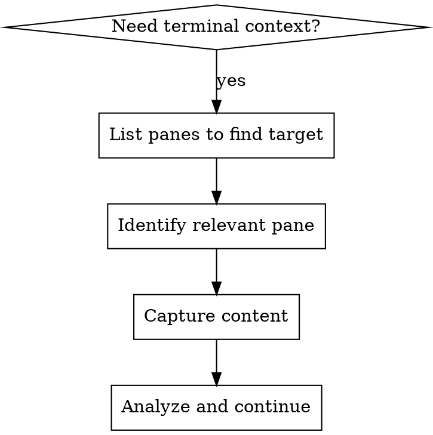

# tmux Stalker

## Overview

Read content from any tmux pane to gather context during investigations, debugging, or operational tasks. Access visible content, full scrollback history, and pane metadata without switching terminal context.

## When to Use

- Investigating errors or issues shown in another pane
- Checking output from long-running processes (builds, tests, servers)
- Gathering context from multiple terminal workspaces
- Reviewing command history from another session
- Understanding what's happening across your terminal environment

## Quick Reference

| Task | Command |
|------|---------|
| List all panes | `tmux list-panes -a -F "#{session_name}:#{window_index}.#{pane_index} [#{pane_current_command}] #{pane_current_path}"` |
| List sessions | `tmux list-sessions` |
| Capture visible content | `tmux capture-pane -t TARGET -p` |
| Capture full history | `tmux capture-pane -t TARGET -p -S - -E -` |
| Get pane details | `tmux display -t TARGET -p "cmd: #{pane_current_command}, path: #{pane_current_path}, pid: #{pane_pid}"` |

## Target Syntax

Panes are addressed as `session:window.pane`:
- `mysession:1.2` - Session "mysession", window 1, pane 2
- `:1.2` - Current session, window 1, pane 2
- `%5` - Pane ID 5 (unique across all sessions)

## Workflow



## Useful Format Variables

When listing panes, these variables provide context:

| Variable | Description |
|----------|-------------|
| `#{session_name}` | Session name |
| `#{window_index}` | Window number |
| `#{pane_index}` | Pane number within window |
| `#{pane_current_command}` | Currently running command |
| `#{pane_current_path}` | Working directory |
| `#{pane_pid}` | Process ID |
| `#{pane_title}` | Pane title (set by applications) |
| `#{history_size}` | Lines in scrollback |

## Examples

**Find a pane running a specific command:**
```bash
tmux list-panes -a -F "#{session_name}:#{window_index}.#{pane_index} #{pane_current_command}" | grep -i "npm\|node\|go"
```

**Capture last 500 lines from a pane:**
```bash
tmux capture-pane -t mysession:1.2 -p -S -500
```

**Get full scrollback history:**
```bash
tmux capture-pane -t mysession:1.2 -p -S - -E -
```

**Search for error in all pane metadata:**
```bash
tmux list-panes -a -F "#{session_name}:#{window_index}.#{pane_index} - #{pane_title} - #{pane_current_command}"
```

## Capture-Pane Flags

| Flag | Purpose |
|------|---------|
| `-p` | Print to stdout (required for capture) |
| `-t TARGET` | Specify target pane |
| `-S START` | Start line (`-` = beginning of history) |
| `-E END` | End line (`-` = end of visible) |
| `-J` | Join wrapped lines |
| `-N` | Preserve trailing spaces |

## Common Patterns

**Debugging a failing test:**
1. List panes to find test runner: `tmux list-panes -a -F "..."`
2. Capture the test output: `tmux capture-pane -t TARGET -p -S -200`
3. Analyze the error and continue investigation

**Checking server logs:**
1. Find the server pane by command (node, python, go run)
2. Capture recent output for context
3. Look for errors, warnings, or relevant log entries

**Cross-session investigation:**
1. List all sessions: `tmux list-sessions`
2. List panes in target session: `tmux list-panes -t SESSION`
3. Capture content from relevant panes

## Limitations

- Read-only: Cannot send commands to panes (by design)
- Requires tmux server running
- Content capture is point-in-time (no live streaming)
- Very large scrollback buffers may be slow to capture
