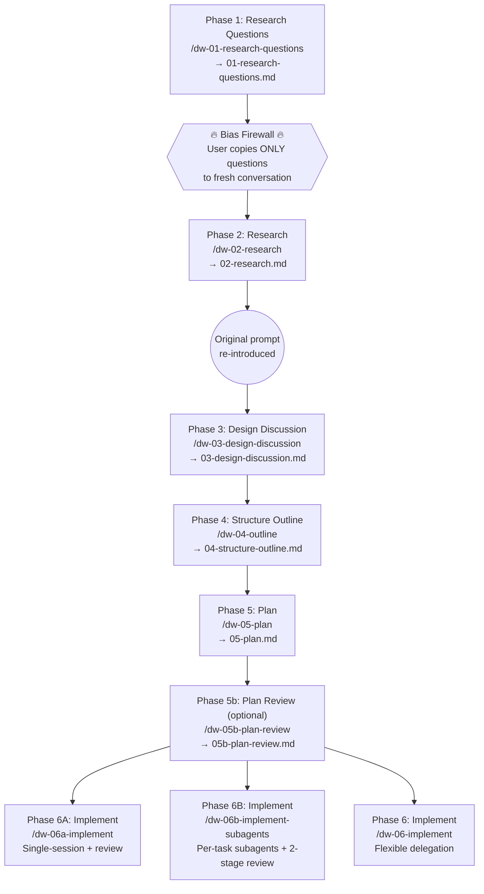

# Claude Essentials

A collection of Claude Code customizations including global instructions, agents, skills, and utility scripts for enhanced AI-assisted development.

## Skills Overview

### Deep-Work Pipeline

A 6-phase context engineering workflow that separates research from solutioning. Each phase runs in a fresh conversation to maintain context isolation, producing structured artifacts that flow into the next phase.



Use `/deep-work <slug>` to check pipeline progress or start a new task.

#### Phase Details

| Phase | Skill | Purpose | Key Output |
|-------|-------|---------|------------|
| 1 | `dw-01-research-questions` | Decompose task into 5-15 objective research questions (no solutioning) | `01-research-questions.md` |
| 2 | `dw-02-research` | Answer questions by investigating the codebase objectively — cannot read the original prompt | `02-research.md` |
| 3 | `dw-03-design-discussion` | Combine research with original prompt; explore design options, evaluate tradeoffs, make decisions | `03-design-discussion.md` |
| 4 | `dw-04-outline` | Map design decisions to concrete file changes organized into implementable phases | `04-structure-outline.md` |
| 5 | `dw-05-plan` | Expand outline into fully detailed plan — every task has enough detail that the implementing agent makes no design decisions | `05-plan.md` |
| 5b | `dw-05b-plan-review` | Adversarial review of the plan for requirements gaps, logic bugs, security, performance, and code quality (optional) | `05b-plan-review.md` |
| 6A | `dw-06a-implement` | Execute plan in single session: batches of 3 tasks → report → continue/apply feedback → session code review | `06-completion.md` |
| 6B | `dw-06b-implement-subagents` | Fresh subagent per task with two-stage review (spec compliance → code quality) + session code review | `06-completion.md` |
| 6 | `dw-06-implement` | Flexible: choose subagent-driven, parallel session, or manual execution | `06-completion.md` |

All artifacts are stored in `~/notes/context-engineering/<repo>/<topic-slug>/` with a `.state.json` file tracking phase completion.

---

### Code Review & PR Skills

| Skill | Command | Purpose |
|-------|---------|---------|
| **pr-review** | `/pr-review <github-url>` | Multi-agent ensemble review — 6 parallel agents (docs compliance, bugs, security, history, correctness, quality) produce a report for human review before posting |
| **quick-review** | `/quick-review <owner/repo> <pr>` | Single-pass expert review with severity-ranked findings (critical → minor) |
| **pr-description** | `/pr-description [context-files...]` | Generate reviewer-focused PR descriptions from git changes; finds and fills PR templates |
| **submit-pr** | `/submit-pr` | Full PR submission workflow — creates draft PRs or pushes updates to existing ones |
| **session-retrospective** | `/session-retrospective` | Analyze session process efficiency — scores context engineering, tool usage, sub-agent work, and cost efficiency (1-5) |

---

### Terminal & Debugging

| Skill | Command | Purpose |
|-------|---------|---------|
| **tmux-stalker** | `/tmux-stalker` | Read content from any tmux pane — useful for checking long-running processes, reviewing logs, debugging across sessions |
| **tmux-stalker-summarized** | `/tmux-stalker-summarized` | Context-efficient summaries of tmux pane content (test output, stack traces, logs) |

---

### Workflow Skills

| Skill | Command | Purpose |
|-------|---------|---------|
| **refine-ticket** | `/refine-ticket` | Interactively refine a Jira ticket, pasted text, or file into a structured `ticket.md` ready for the deep-work pipeline |
| **investigate-and-fix** | `/investigate-and-fix <ticket>` | Single-session alternative to the full pipeline — investigate, research, propose, plan, and implement for well-scoped bug fixes or small features |

---

### Design & Architecture

| Skill | Command | Purpose |
|-------|---------|---------|
| **software-design-philosophy** | `/software-design-philosophy` | Evaluate code or designs against 15 principles and 14 red flags from "A Philosophy of Software Design" |

---

### Utility Skills

| Skill | Command | Purpose |
|-------|---------|---------|
| **generate-postman-collection** | `/generate-postman-collection` | Generate Postman v2.1 collection JSON from OpenAPI specs or Java source code |

---

## Agents

| Agent | Purpose |
|-------|---------|
| **codebase-analyzer** | Analyze implementation details with file:line references |
| **codebase-locator** | Find files and components by feature or topic |
| **codebase-pattern-finder** | Find similar implementations, usage examples, and existing patterns |
| **splunk-analyzer** | Analyze Splunk JSON logs for patterns, errors, and request flows |
| **web-search-researcher** | Deep web research combining search with internal documentation |

## Quick Start

1. Clone this repository:
   ```bash
   git clone https://github.com/yourusername/claude-essentials.git ~/code/claude-essentials
   ```

2. Create symlink to enable globally:
   ```bash
   # Backup existing config if present
   [ -d ~/.claude ] && mv ~/.claude ~/.claude.backup

   # Create symlink
   ln -s ~/code/claude-essentials/.claude ~/.claude
   ```

3. Copy and customize settings:
   ```bash
   cp ~/.claude/settings.local.json.example ~/.claude/settings.local.json
   # Edit to add your permissions
   ```

4. Verify installation:
   ```bash
   claude  # Start Claude Code
   # Check that settings load correctly
   ```

See [INSTALL.md](INSTALL.md) for detailed installation instructions.

## Directory Structure

```
claude-essentials/
├── README.md
├── INSTALL.md
├── .claude/
│   ├── CLAUDE.md                        # Global instructions
│   ├── settings.json                    # Model/plugin config
│   ├── settings.local.json.example
│   ├── docs/
│   │   └── software-design-philosophy.md
│   ├── skills/
│   │   ├── deep-work/                   # Pipeline guide & progress checker
│   │   ├── dw-01-research-questions/    # Phase 1
│   │   ├── dw-02-research/              # Phase 2
│   │   ├── dw-03-design-discussion/     # Phase 3
│   │   ├── dw-04-outline/               # Phase 4
│   │   ├── dw-05-plan/                  # Phase 5
│   │   ├── dw-05b-plan-review/          # Phase 5b (optional adversarial review)
│   │   ├── dw-06-implement/             # Phase 6 (flexible)
│   │   ├── dw-06a-implement/            # Phase 6A (single-session)
│   │   ├── dw-06b-implement-subagents/  # Phase 6B (subagents)
│   │   ├── refine-ticket/               # Pre-pipeline ticket refinement
│   │   ├── investigate-and-fix/         # Single-session bug fix workflow
│   │   ├── pr-description/
│   │   ├── pr-review/
│   │   ├── quick-review/
│   │   ├── submit-pr/                   # PR creation/update workflow
│   │   ├── session-retrospective/
│   │   ├── software-design-philosophy/
│   │   ├── generate-postman-collection/
│   │   ├── tmux-stalker/
│   │   └── tmux-stalker-summarized/
│   └── agents/
│       ├── codebase-analyzer.md
│       ├── codebase-locator.md
│       ├── codebase-pattern-finder.md
│       ├── splunk-analyzer.md
│       └── web-search-researcher.md
└── scripts/
    ├── log_analysis_lib.py
    ├── example_commands.md
    └── test_log_analysis.py
```

## Customization

### Adding New Skills
Create a directory in `.claude/skills/` with a markdown file containing frontmatter:
```yaml
---
name: my-skill
description: What this skill does
---
```

### Adding New Agents
Create a markdown file in `.claude/agents/` with frontmatter:
```yaml
---
name: my-agent
description: What this agent does
tools: Read, Grep, Glob, LS
model: sonnet
---
```

## Requirements

- Claude Code CLI
- Python 3.8+ (for log analysis scripts)
- tmux (for tmux-stalker skills)
- gh CLI (for PR review skills)

## License

MIT
