# Deep-Work Phase Isolation Implementation Plan

> **For Claude:** REQUIRED SUB-SKILL: Use superpowers:executing-plans to implement this plan task-by-task. Each task writes a skill file using superpowers:writing-skills methodology.

**Goal:** Split the monolithic deep-work orchestrator into 6 independent phase skills + 1 guide, each running in a fresh conversation for true context isolation.

**Architecture:** Each phase becomes a self-contained SKILL.md in `.claude/skills/dw-*/`. Phases connect through filesystem artifacts at `~/notes/context-engineering/<repo>/<topic-slug>/`. The bias firewall between Phase 1→2 is enforced physically — separate conversations mean the model cannot access the original prompt during research.

**Tech Stack:** Claude Code skills (SKILL.md with YAML frontmatter), bash for setup/validation, filesystem artifacts (markdown + JSON).

**Design doc:** `docs/plans/2026-02-10-deep-work-phase-isolation-design.md`

---

## Phase 1: Guide Skill

### Overview
Convert the existing `/deep-work` orchestrator from an executor to a non-executing pipeline reference and progress tracker.

### Task 1.1: Rewrite /deep-work as guide skill

**Files:**
- Modify: `.claude/skills/deep-work/SKILL.md`

**Step 1: Write the new SKILL.md**

Replace the entire contents of `.claude/skills/deep-work/SKILL.md` with:

````markdown
---
name: deep-work
description: "Use when starting or checking progress on a deep-work pipeline. Shows pipeline overview, phase progress, and which command to run next in a fresh conversation."
---

# Deep Work Pipeline Guide

A 6-phase context engineering workflow that separates research from solutioning.
Each phase runs in a **fresh conversation** to maintain context isolation.

**Announce at start:** "Deep-work pipeline guide loaded."

## Pipeline

```dot
digraph deep_work {
    rankdir=TB;
    node [shape=box, style=rounded, fontname="Helvetica"];
    edge [fontname="Helvetica", fontsize=10];

    subgraph cluster_pipeline {
        label="Deep Work Pipeline — each phase in a fresh conversation";
        style=dashed;
        color=gray60;
        fontname="Helvetica";

        p1 [label="/dw-research-questions\nPrompt → objective questions"];
        firewall [label="🔥 BIAS FIREWALL 🔥\nUser copies questions only\nOriginal prompt NOT passed"
                  shape=octagon style=filled fillcolor="#ff4444" fontcolor=white];
        p2 [label="/dw-research\nInvestigate codebase\n(NO prompt access)"];
        reintro [label="Prompt re-introduced\nResearch locked in"
                 shape=ellipse style=filled fillcolor="#ffffcc"];
        p3 [label="/dw-design-discussion\nOptions grounded in evidence"];
        p4 [label="/dw-outline\nDecisions → file changes"];
        p5 [label="/dw-plan\nExact tasks, patterns, tests"];
        p6 [label="/dw-implement\nExecute the plan"];
    }

    start [label="User prompt" shape=doublecircle];
    done [label="Complete" shape=doublecircle];

    start -> p1;
    p1 -> firewall [label="questions only"];
    firewall -> p2;
    p2 -> reintro [label="02-research.md"];
    reintro -> p3;
    p3 -> p4 [label="03-design-discussion.md"];
    p4 -> p5 [label="04-structure-outline.md"];
    p5 -> p6 [label="05-plan.md"];
    p6 -> done;
}
```



## Commands

| Phase | Command | Purpose |
|-------|---------|---------|
| 1 | `/dw-research-questions <slug>` | Decompose task into objective research questions |
| 2 | `/dw-research <slug>` | Investigate codebase (bias firewall — no prompt access) |
| 3 | `/dw-design-discussion <slug>` | Explore design options grounded in research |
| 4 | `/dw-outline <slug>` | Map decisions to file changes |
| 5 | `/dw-plan <slug>` | Create detailed implementation plan |
| 6 | `/dw-implement <slug>` | Execute the plan |

**CRITICAL:** Each phase MUST run in a **fresh conversation**. The bias firewall
between Phase 1→2 requires that research never sees the original prompt.

## Artifact Directory

All phases read/write artifacts at:
```
~/notes/context-engineering/<repo>/<topic-slug>/
```
- `<repo>` derived from `git remote get-url origin`
- `<topic-slug>` passed as argument to each command

## Check Progress

If `$ARGUMENTS` is provided as a topic-slug:
1. Derive repo: `basename $(git remote get-url origin 2>/dev/null | sed 's/.git$//') 2>/dev/null || basename $(pwd)`
2. Read `.state.json` from `~/notes/context-engineering/<repo>/<topic-slug>/`
3. Report completed phases, current status, and next command to run
4. If no `.state.json` found, suggest starting with `/dw-research-questions <slug>`

If no arguments, show this pipeline documentation.

## Bias Firewall (Phase 1→2)

After Phase 1 generates research questions, the user copies ONLY the questions
section. Phase 2 runs in a fresh conversation with NO access to the original
prompt. This ensures research is objective and unbiased by the desired solution.

The original prompt is re-introduced in Phase 3, after research is locked in.

## Artifact Flow

| File | Written By | Read By |
|------|-----------|---------|
| `00-ticket.md` | Phase 1 | Phase 3 |
| `01-research-questions.md` | Phase 1 | None (user copies questions manually) |
| `02-research.md` | Phase 2 | Phases 3, 4, 5 |
| `03-design-discussion.md` | Phase 3 | Phase 4 |
| `04-structure-outline.md` | Phase 4 | Phase 5 |
| `05-plan.md` | Phase 5 | Phase 6 |
| `06-completion.md` | Phase 6 | None |
| `.state.json` | All phases | This guide |
````

**Step 2: Verify file was written correctly**

Run: `head -3 .claude/skills/deep-work/SKILL.md`
Expected: YAML frontmatter with `name: deep-work`

**Step 3: Commit**

```bash
git add .claude/skills/deep-work/SKILL.md
git commit -m "refactor: convert /deep-work to non-executing pipeline guide"
```

### Phase 1 Success Criteria
**Automated:**
- [ ] `.claude/skills/deep-work/SKILL.md` exists with guide content
- [ ] No references to "Phase Execution" loop or phase orchestration remain

**Scope guard:** This phase does NOT modify any other files. The `phases/` directory and commands still exist.

---

## Phase 2: Research Phase Skills

### Overview
Create the two most critical phase skills: research questions (entry point) and research (bias firewall). These form the foundation of the pipeline.

### Task 2.1: Create /dw-research-questions skill

**Files:**
- Create: `.claude/skills/dw-research-questions/SKILL.md`

**Step 1: Create skill directory**

```bash
mkdir -p .claude/skills/dw-research-questions
```

**Step 2: Write SKILL.md**

Write the following to `.claude/skills/dw-research-questions/SKILL.md`:

````markdown
---
name: dw-research-questions
description: "Use when starting a new deep-work task. Decomposes a task description into objective research questions that avoid premature solutioning. Phase 1 of the deep-work pipeline."
---

# Phase 1: Research Questions

Decompose the user's prompt into objective, investigative questions answerable
by reading the codebase. Questions must NOT assume any particular solution.

**Announce at start:** "Starting deep-work Phase 1: Research Questions."

## Setup

1. Parse `$ARGUMENTS`:
   - If a file path, read the file as the task description
   - If text, use it directly as the task description
   - Extract or ask user for a `<topic-slug>` (lowercase, hyphens, no special chars)
2. Derive repo name:
   ```bash
   basename $(git remote get-url origin 2>/dev/null | sed 's/.git$//') 2>/dev/null || basename $(pwd)
   ```
3. Create artifact directory:
   ```bash
   mkdir -p ~/notes/context-engineering/<repo>/<topic-slug>
   ```
4. Write `00-ticket.md` to the artifact directory:
   ```markdown
   ---
   phase: ticket
   date: <today>
   topic: <topic-slug>
   repo: <repo>
   git_sha: <HEAD>
   status: complete
   ---

   ## Ticket

   <user's prompt or file contents>
   ```

## Process

### Step 1: Targeted codebase scan
Gather lightweight structural context (NOT deep implementation details):
- List root directory structure
- Read CLAUDE.md files for project context and conventions
- Dispatch a codebase-locator agent: "Find files and directories related to:
  <key nouns/systems from prompt>. Return locations grouped by purpose."

### Step 2: Generate research questions
Generate 5-15 questions. EVERY question must be:
- **Objective** — answerable by reading code, not by making design decisions
- **Specific** — references concrete subsystems, not abstract concepts
- **Grounded** — uses real module/file names from the codebase scan

Distribute across categories:

| Category | Pattern | Example |
|----------|---------|---------|
| Subsystem Understanding | "How does [component] work?" | "How does auth middleware chain requests?" |
| Code Tracing | "What is the [data] flow from [A] to [B]?" | "Request lifecycle from handler to DB?" |
| Pattern Discovery | "What patterns exist for [action]?" | "Patterns for adding API endpoints?" |
| Dependency Mapping | "What does [module] depend on?" | "What does handlers package import?" |
| Boundary Identification | "Where do [A] and [B] integrate?" | "Where do HTTP and storage connect?" |
| Constraint Discovery | "What invariants does [system] enforce?" | "What do tests enforce for handlers?" |

**FORBIDDEN question patterns:**
- "How should we..." — this is solutioning
- "What's the best way to..." — this is evaluation
- "Would it be better to..." — this is comparison
- "Can we..." — this is feasibility for a specific solution

### Step 3: Write artifact
Write `01-research-questions.md` to the artifact directory:
```yaml
---
phase: research-questions
date: <today>
topic: <topic-slug>
repo: <repo>
git_sha: <HEAD>
status: complete
---

## Original Prompt
<full prompt — stored for traceability, NOT passed to Phase 2>

## Research Questions

### Subsystem Understanding
1. <question>

### Code Tracing
2. <question>

### Pattern Discovery
3. <question>
...
```

## Handoff

```dot
digraph handoff {
    rankdir=LR;
    node [shape=box, style=rounded, fontname="Helvetica"];

    p1_out [label="01-research-questions.md\n(contains prompt + questions)"];
    user [label="User copies\nquestions ONLY" shape=diamond style=filled fillcolor="#ffffcc"];
    firewall [label="🔥 BIAS FIREWALL 🔥" shape=octagon style=filled fillcolor="#ff4444" fontcolor=white];
    p2_in [label="Pasted questions\n(NO prompt, NO file read)"];

    p1_out -> user [label="review & edit"];
    user -> firewall;
    firewall -> p2_in [label="fresh conversation"];
}
```



## Completion

1. Present questions to user grouped by category
2. Update `.state.json` in the artifact directory:
   ```json
   {
     "topic": "<topic-slug>",
     "repo": "<repo>",
     "current_phase": 1,
     "completed_phases": [1],
     "last_updated": "<ISO timestamp>"
   }
   ```
3. Instruct: "Review and edit questions as needed. When ready, **copy everything
   below '## Research Questions'** and run `/dw-research <topic-slug>` in a
   **fresh conversation**, pasting the questions when prompted."
````

**Step 3: Verify file structure**

Run: `head -3 .claude/skills/dw-research-questions/SKILL.md`
Expected: YAML frontmatter with `name: dw-research-questions`

**Step 4: Commit**

```bash
git add .claude/skills/dw-research-questions/SKILL.md
git commit -m "feat: add /dw-research-questions as standalone Phase 1 skill"
```

---

### Task 2.2: Create /dw-research skill

**Files:**
- Create: `.claude/skills/dw-research/SKILL.md`

**Step 1: Create skill directory**

```bash
mkdir -p .claude/skills/dw-research
```

**Step 2: Write SKILL.md**

Write the following to `.claude/skills/dw-research/SKILL.md`:

````markdown
---
name: dw-research
description: "Use when you have research questions from deep-work Phase 1. Objectively investigates the codebase to answer pasted questions without access to the original task description."
---

# Phase 2: Research

Objectively answer every research question by investigating the codebase.
Document what IS, not what should be. You are a documentarian, not a critic.

**Announce at start:** "Starting deep-work Phase 2: Research."

## BIAS FIREWALL — CRITICAL CONSTRAINTS

You will receive research questions pasted by the user. You MUST NOT:
- Read `01-research-questions.md` or `00-ticket.md` from the artifact directory
- Ask what the user is trying to build
- Infer or guess the user's intent
- Suggest improvements, solutions, or approaches

You ONLY answer the questions as asked.

## Setup

1. Parse `$ARGUMENTS` as `<topic-slug>`
   - If empty, ask user for topic-slug via AskUserQuestion
2. Derive repo name:
   ```bash
   basename $(git remote get-url origin 2>/dev/null | sed 's/.git$//') 2>/dev/null || basename $(pwd)
   ```
3. Set artifact directory: `~/notes/context-engineering/<repo>/<topic-slug>/`

## Pre-flight Validation

- Verify artifact directory exists → if not: "No artifact directory found. Run `/dw-research-questions <slug>` first in a separate conversation." **Stop.**
- Verify `00-ticket.md` exists in directory (confirms Phase 1 ran) → if not: "Phase 1 hasn't completed. Run `/dw-research-questions <slug>` first." **Stop.**
- **Do NOT read `00-ticket.md`** — only check existence via bash `test -f`.

## Input

If research questions were not included in `$ARGUMENTS`, ask:
"Paste the research questions from Phase 1 (everything below '## Research Questions')."

## Process

### Step 1: Parse questions
Extract numbered questions from pasted text. Identify the category of each.

### Step 2: Map questions to agents

| Category | Agent Type |
|----------|-----------|
| Subsystem understanding | codebase-analyzer |
| Code tracing | codebase-analyzer |
| Pattern discovery | codebase-pattern-finder |
| Dependency mapping | codebase-locator |
| Boundary identification | codebase-locator → codebase-analyzer |
| Constraint discovery | codebase-pattern-finder |

### Step 3: Dispatch agents
For each agent, prepend this objectivity wrapper to the task prompt:

> "You are a documentarian. Answer the following question by reading the
> codebase. Report ONLY what exists. Do not suggest improvements, critique
> patterns, or propose solutions. Include file:line references for all claims."

Dispatch independent questions in parallel.

### Step 4: Compile findings
For each question:
```
### Q<N>: <question text>
**Status:** COMPLETE | INCOMPLETE
**Sources:** <agent type(s) used>

<findings with file:line references>
```

Mark INCOMPLETE when: code can't be found, uses dynamic dispatch, or spans too
many files. For INCOMPLETE, document what WAS found and what remains ambiguous.

### Step 5: Cross-reference
Identify overlapping answers, contradictions, and cross-cutting patterns.

### Step 6: Write artifact
Write `02-research.md` to the artifact directory:
```yaml
---
phase: research
date: <today>
topic: <topic-slug>
repo: <repo>
git_sha: <HEAD>
agents_dispatched: <count>
questions_complete: <count>
questions_incomplete: <count>
input_artifacts: []
status: complete
---

## Research Findings

### Q1: <question>
**Status:** COMPLETE
**Sources:** codebase-analyzer

<detailed findings with file:line references>

...

## Summary
- <N>/<total> questions fully answered
- <M> questions incomplete (<list which and why>)

## Cross-References
- <overlaps, contradictions, patterns>
```

## Completion

1. Present findings summary, highlighting INCOMPLETE questions
2. Update `.state.json`:
   ```json
   {
     "topic": "<topic-slug>",
     "repo": "<repo>",
     "current_phase": 2,
     "completed_phases": [1, 2],
     "last_updated": "<ISO timestamp>"
   }
   ```
3. Instruct: "Research is locked in. Run `/dw-design-discussion <topic-slug>`
   in a **fresh conversation** to continue. The original prompt will be
   re-introduced alongside these findings."
````

**Step 3: Verify file structure**

Run: `head -3 .claude/skills/dw-research/SKILL.md`
Expected: YAML frontmatter with `name: dw-research`

**Step 4: Commit**

```bash
git add .claude/skills/dw-research/SKILL.md
git commit -m "feat: add /dw-research as standalone Phase 2 skill with bias firewall"
```

### Phase 2 Success Criteria
**Automated:**
- [ ] `.claude/skills/dw-research-questions/SKILL.md` exists with Phase 1 content
- [ ] `.claude/skills/dw-research/SKILL.md` exists with bias firewall constraints
- [ ] Neither skill references reading from `phases/*.md`

**Scope guard:** This phase does NOT delete old files. Old `phases/` and `commands/` still exist.

---

## Phase 3: Design Phase Skills

### Overview
Create the design discussion and structure outline skills. These read the original prompt (re-introduced after bias firewall) and research to make decisions.

### Task 3.1: Create /dw-design-discussion skill

**Files:**
- Create: `.claude/skills/dw-design-discussion/SKILL.md`

**Step 1: Create skill directory**

```bash
mkdir -p .claude/skills/dw-design-discussion
```

**Step 2: Write SKILL.md**

Write the following to `.claude/skills/dw-design-discussion/SKILL.md`:

````markdown
---
name: dw-design-discussion
description: "Use when deep-work Phase 2 research is complete. Combines research findings with the original task to explore design options, evaluate tradeoffs, and make decisions interactively."
---

# Phase 3: Design Discussion

Combine objective research findings with the original prompt to identify design
decisions, enumerate options, and evaluate tradeoffs. Research is locked in —
the prompt safely re-enters the pipeline here.

**Announce at start:** "Starting deep-work Phase 3: Design Discussion."

## Setup

1. Parse `$ARGUMENTS` as `<topic-slug>`
   - If empty, ask user via AskUserQuestion
2. Derive repo: `basename $(git remote get-url origin 2>/dev/null | sed 's/.git$//') 2>/dev/null || basename $(pwd)`
3. Set artifact directory: `~/notes/context-engineering/<repo>/<topic-slug>/`

## Pre-flight Validation

- `02-research.md` exists → if not: "Research not found. Complete Phases 1-2 first." **Stop.**
- `00-ticket.md` exists → if not: "No ticket found. Run `/dw-research-questions` first." **Stop.**

## Process

### Step 1: Load context
1. Read `02-research.md` completely
2. Read `00-ticket.md` completely
3. Summarize: "The user wants to [goal from ticket]. Research found [key findings]."

### Step 2: Identify design decisions
Based on the gap between "what the user wants" and "what exists," identify every
design decision. Common types:
- Where should new code live? (module/package/directory)
- What pattern should it follow? (based on existing patterns from research)
- How should it integrate with existing code? (based on boundaries from research)
- What should the API/interface look like?
- How should edge cases be handled?
- What should be tested and how?

### Step 3: Build options
For EACH decision, create 2-4 options. Every option MUST:
- Cite a specific research finding (e.g., "Research Q2 found that...")
- Include concrete pros and cons
- Be grounded in what exists in the codebase

**FORBIDDEN:** Options that ignore research findings or require uninvestigated changes.

### Step 4: Present decisions interactively
Present ONE AT A TIME via AskUserQuestion:
- Show context (relevant research findings)
- Present options table with pros/cons
- Include your recommendation with rationale
- Record user's choice as CHOSEN, others as REJECTED

### Step 5: Surface risks
Compile: constraints from research, INCOMPLETE research gaps, out-of-scope items.

### Step 6: Write artifact
Write `03-design-discussion.md` to the artifact directory:
```yaml
---
phase: design-discussion
date: <today>
topic: <topic-slug>
repo: <repo>
git_sha: <HEAD>
input_artifacts: [00-ticket.md, 02-research.md]
decisions_count: <N>
status: complete
---

## Goal
<restated from ticket, grounded in research findings>

## Design Decisions

### Decision 1: <title>
**Context:** <relevant research findings>

| Option | Description | Pros | Cons | Verdict |
|--------|-------------|------|------|---------|
| A | ... | <citing research> | ... | **CHOSEN** |
| B | ... | <citing research> | ... | REJECTED |

**Rationale:** <why chosen option was selected>

## Constraints Discovered
## Risks from Incomplete Research
## Out of Scope
```

## Completion

1. Present design decisions summary
2. Update `.state.json` with `current_phase: 3, completed_phases: [1, 2, 3]`
3. Instruct: "Run `/dw-outline <topic-slug>` in a **fresh conversation** to continue."
````

**Step 3: Commit**

```bash
git add .claude/skills/dw-design-discussion/SKILL.md
git commit -m "feat: add /dw-design-discussion as standalone Phase 3 skill"
```

---

### Task 3.2: Create /dw-outline skill

**Files:**
- Create: `.claude/skills/dw-outline/SKILL.md`

**Step 1: Create skill directory**

```bash
mkdir -p .claude/skills/dw-outline
```

**Step 2: Write SKILL.md**

Write the following to `.claude/skills/dw-outline/SKILL.md`:

````markdown
---
name: dw-outline
description: "Use when deep-work Phase 3 design decisions are complete. Maps chosen decisions to concrete file changes organized into implementable phases."
---

# Phase 4: Structure Outline

Translate design decisions into a concrete change map — the "what and where"
without the "how exactly." A table of contents for the implementation plan.

**Announce at start:** "Starting deep-work Phase 4: Structure Outline."

## Setup

1. Parse `$ARGUMENTS` as `<topic-slug>`
   - If empty, ask user via AskUserQuestion
2. Derive repo: `basename $(git remote get-url origin 2>/dev/null | sed 's/.git$//') 2>/dev/null || basename $(pwd)`
3. Set artifact directory: `~/notes/context-engineering/<repo>/<topic-slug>/`

## Pre-flight Validation

- `03-design-discussion.md` exists → if not: "Design decisions not found. Complete Phases 1-3 first." **Stop.**
- `02-research.md` exists → if not: "Research not found. Complete Phases 1-2 first." **Stop.**

## Process

### Step 1: Load context
1. Read `03-design-discussion.md` — focus on CHOSEN decisions, constraints, scope
2. Read `02-research.md` — focus on file paths, patterns, code locations

### Step 2: Map decisions to file changes
For each CHOSEN decision, determine:
- Files to create (NEW), modify (MODIFY with line ranges from research), or delete (DELETE)
- Brief description of what changes in each file

### Step 3: Group into phases
Organize changes into sequential phases where:
- Each phase is independently testable
- Each produces a working (if incomplete) system
- Dependencies between phases are explicit
- Earlier phases establish foundations; later phases build on them

Per phase include: **Scope**, **Files touched**, **Dependencies**, **Validation command**.

### Step 4: Build file impact summary

| File | Action | Phase(s) | Reason |
|------|--------|----------|--------|

### Step 5: Compile risk register
Pull forward from design discussion: incomplete research, unverified assumptions, mitigations.

### Step 6: Write artifact
Write `04-structure-outline.md` to the artifact directory:
```yaml
---
phase: structure-outline
date: <today>
topic: <topic-slug>
repo: <repo>
git_sha: <HEAD>
input_artifacts: [02-research.md, 03-design-discussion.md]
phases_count: <N>
total_files_touched: <N>
status: complete
---

## Change Summary
<2-3 sentences describing the total change set>

## Phases

### Phase 1: <name> — <one-line goal>
**Scope:** <what this phase accomplishes>
**Files:**
- `path/to/file` (NEW) — <what it contains>
- `path/to/existing` (MODIFY :line-range) — <what changes>
**Dependencies:** None | Phase <N>
**Validation:** <exact command and expected result>

## File Impact Summary
## Risk Register
## What We're NOT Doing
```

Present outline. Ask: "Does this scope and phasing look right?"

## Completion

1. Present outline summary
2. Update `.state.json` with `current_phase: 4, completed_phases: [1, 2, 3, 4]`
3. Instruct: "Run `/dw-plan <topic-slug>` in a **fresh conversation** to continue."
````

**Step 3: Commit**

```bash
git add .claude/skills/dw-outline/SKILL.md
git commit -m "feat: add /dw-outline as standalone Phase 4 skill"
```

### Phase 3 Success Criteria
**Automated:**
- [ ] `.claude/skills/dw-design-discussion/SKILL.md` exists
- [ ] `.claude/skills/dw-outline/SKILL.md` exists
- [ ] Both skills include pre-flight validation that stops on missing artifacts

**Scope guard:** This phase does NOT delete old files or modify existing skills.

---

## Phase 4: Implementation Phase Skills

### Overview
Create the plan and implement skills. These are the final two pipeline phases — plan produces mechanical detail, implement delegates to execution skills.

### Task 4.1: Create /dw-plan skill

**Files:**
- Create: `.claude/skills/dw-plan/SKILL.md`

**Step 1: Create skill directory**

```bash
mkdir -p .claude/skills/dw-plan
```

**Step 2: Write SKILL.md**

Write the following to `.claude/skills/dw-plan/SKILL.md`:

````markdown
---
name: dw-plan
description: "Use when deep-work Phase 4 structure outline is complete. Expands the outline into a detailed implementation plan with exact file paths, code patterns, tests, and validation commands."
---

# Phase 5: Plan

Expand the structure outline into a fully detailed implementation plan. Every
task has exact file paths, function signatures, code patterns, test cases, and
validation commands. The implementing agent executes mechanically — no
architectural decisions remain.

**Announce at start:** "Starting deep-work Phase 5: Plan."

## Setup

1. Parse `$ARGUMENTS` as `<topic-slug>`
   - If empty, ask user via AskUserQuestion
2. Derive repo: `basename $(git remote get-url origin 2>/dev/null | sed 's/.git$//') 2>/dev/null || basename $(pwd)`
3. Set artifact directory: `~/notes/context-engineering/<repo>/<topic-slug>/`

## Pre-flight Validation

- `04-structure-outline.md` exists → if not: "Outline not found. Complete Phases 1-4 first." **Stop.**
- `02-research.md` exists → if not: "Research not found. Complete Phases 1-2 first." **Stop.**

## Process

### Step 1: Load context
1. Read `04-structure-outline.md` — phase structure and file map
2. Read `02-research.md` — code patterns and file:line references

### Step 2: Expand phases into tasks
For each phase in the outline, create tasks covering ONE file change (or tightly coupled pair).

**Every task MUST include:**
1. **File:** Exact path, action (NEW/MODIFY), line range for modifications
2. **Pattern:** Research finding to follow with file:line ref
   (e.g., "Follow `pkg/handlers/user.go:30-55` pattern from Q2")
3. **What to create/modify:** Exact names, signatures, fields — enough detail
   that the implementer makes no design decisions
4. **Tests:** Test function names, cases with inputs/expected outputs, reference
   test patterns from research
5. **Validation:** Exact command and expected result
6. **Commit:** Files to include and suggested message

**Task granularity:** 2-5 minutes each. Pattern: write failing test → run
(expect fail) → implement → run (expect pass) → commit.

### Step 3: Phase success criteria
Per phase: automated criteria (commands that must pass) + manual criteria.

### Step 4: Scope guards
Per phase: "This phase does NOT include [X]" and "Do NOT modify [file] in this phase."

### Step 5: Address risks
Include specific task or checkpoint for each risk from the outline's register.

### Step 6: Write artifact
Write `05-plan.md` to the artifact directory. Include plan header:

```markdown
# <Topic> Implementation Plan

> **For Claude:** REQUIRED SUB-SKILL: Use superpowers:executing-plans to implement this plan task-by-task.

**Goal:** <from outline>
**Architecture:** <key decisions>
**Tech Stack:** <relevant tech>
```

Followed by full phase/task detail in standard plan format.

```yaml
---
phase: plan
date: <today>
topic: <topic-slug>
repo: <repo>
git_sha: <HEAD>
input_artifacts: [02-research.md, 04-structure-outline.md]
total_phases: <N>
total_tasks: <N>
status: complete
---
```

## Completion

1. Present full plan to user for review
2. Update `.state.json` with `current_phase: 5, completed_phases: [1, 2, 3, 4, 5]`
3. Instruct: "Plan ready. Run `/dw-implement <topic-slug>` in a **fresh conversation** to execute."
````

**Step 3: Commit**

```bash
git add .claude/skills/dw-plan/SKILL.md
git commit -m "feat: add /dw-plan as standalone Phase 5 skill"
```

---

### Task 4.2: Create /dw-implement skill

**Files:**
- Create: `.claude/skills/dw-implement/SKILL.md`

**Step 1: Create skill directory**

```bash
mkdir -p .claude/skills/dw-implement
```

**Step 2: Write SKILL.md**

Write the following to `.claude/skills/dw-implement/SKILL.md`:

````markdown
---
name: dw-implement
description: "Use when deep-work Phase 5 plan is complete. Executes the implementation plan with progress tracking, deviation logging, and completion verification."
---

# Phase 6: Implement

Execute the implementation plan. Delegates to existing execution skills.

**Announce at start:** "Starting deep-work Phase 6: Implementation."

## Setup

1. Parse `$ARGUMENTS` as `<topic-slug>`
   - If empty, ask user via AskUserQuestion
2. Derive repo: `basename $(git remote get-url origin 2>/dev/null | sed 's/.git$//') 2>/dev/null || basename $(pwd)`
3. Set artifact directory: `~/notes/context-engineering/<repo>/<topic-slug>/`

## Pre-flight Validation

- `05-plan.md` exists → if not: "Plan not found. Complete Phases 1-5 first." **Stop.**

## Process

### Step 1: Load plan
Read `05-plan.md` completely. Identify total phases, tasks, and risk items.

### Step 2: Choose execution mode
Ask via AskUserQuestion:

| Option | Description |
|--------|-------------|
| Subagent-driven (this session) | Fresh subagent per task, review between. **REQUIRED:** superpowers:subagent-driven-development |
| Parallel session | New session with executing-plans. **REQUIRED:** superpowers:executing-plans |
| Manual | User implements, skill tracks progress |

### Step 3: Execute
Delegate to chosen execution skill with the plan file path as input.

### Step 4: Track deviations
Note during implementation: line number shifts, unplanned tasks, materialized
risks, skipped or modified tasks.

### Step 5: Write completion artifact
Write `06-completion.md` to the artifact directory:
```yaml
---
phase: implementation
date: <today>
topic: <topic-slug>
repo: <repo>
git_sha_start: <HEAD at start>
git_sha_end: <HEAD at end>
input_artifacts: [05-plan.md]
status: complete
---

## Completion Summary
- Phase 1: complete (<N>/<N> tasks)
...

## Deviations from Plan
- <task>: <what changed and why>

## Verification
- <command> — PASS|FAIL
```

## Completion

1. Present completion summary
2. Update `.state.json` with `current_phase: 6, completed_phases: [1, 2, 3, 4, 5, 6]`
3. Suggest: "Implementation complete. Use superpowers:finishing-a-development-branch to wrap up."
````

**Step 3: Commit**

```bash
git add .claude/skills/dw-implement/SKILL.md
git commit -m "feat: add /dw-implement as standalone Phase 6 skill"
```

### Phase 4 Success Criteria
**Automated:**
- [ ] `.claude/skills/dw-plan/SKILL.md` exists
- [ ] `.claude/skills/dw-implement/SKILL.md` exists
- [ ] Both include pre-flight validation

**Scope guard:** This phase does NOT delete old files.

---

## Phase 5: Cleanup

### Overview
Delete the old phase files and command wrappers that are now replaced by standalone skills.

### Task 5.1: Delete old phase files and commands

**Files:**
- Delete: `.claude/skills/deep-work/phases/` (entire directory)
- Delete: `.claude/commands/dw-research-questions.md`
- Delete: `.claude/commands/dw-research.md`
- Delete: `.claude/commands/dw-design-discussion.md`
- Delete: `.claude/commands/dw-outline.md`
- Delete: `.claude/commands/dw-plan.md`
- Delete: `.claude/commands/dw-implement.md`

**Step 1: Delete phases directory**

```bash
rm -rf .claude/skills/deep-work/phases/
```

**Step 2: Delete old command wrappers**

```bash
rm .claude/commands/dw-research-questions.md
rm .claude/commands/dw-research.md
rm .claude/commands/dw-design-discussion.md
rm .claude/commands/dw-outline.md
rm .claude/commands/dw-plan.md
rm .claude/commands/dw-implement.md
```

**Step 3: Verify cleanup**

Run: `ls .claude/skills/deep-work/`
Expected: Only `SKILL.md` (no `phases/` directory)

Run: `ls .claude/commands/dw-*.md 2>&1`
Expected: "No such file or directory" or empty

**Step 4: Commit**

```bash
git add -A .claude/skills/deep-work/phases/ .claude/commands/dw-research-questions.md .claude/commands/dw-research.md .claude/commands/dw-design-discussion.md .claude/commands/dw-outline.md .claude/commands/dw-plan.md .claude/commands/dw-implement.md
git commit -m "refactor: remove old phase files and command wrappers replaced by standalone skills"
```

### Phase 5 Success Criteria
**Automated:**
- [ ] `.claude/skills/deep-work/phases/` does not exist
- [ ] No `dw-*.md` files in `.claude/commands/`
- [ ] `.claude/skills/deep-work/SKILL.md` still exists (guide)
- [ ] All 6 new skill directories exist under `.claude/skills/`

### Final Verification Checklist
- [ ] `/deep-work` — guide skill with pipeline diagram and progress tracking
- [ ] `/dw-research-questions` — self-contained Phase 1 with setup, handoff diagram
- [ ] `/dw-research` — self-contained Phase 2 with bias firewall enforcement
- [ ] `/dw-design-discussion` — self-contained Phase 3 with pre-flight validation
- [ ] `/dw-outline` — self-contained Phase 4 with pre-flight validation
- [ ] `/dw-plan` — self-contained Phase 5 with pre-flight validation
- [ ] `/dw-implement` — self-contained Phase 6 with pre-flight validation
- [ ] No remaining references to `phases/*.md` in any skill
- [ ] Each phase skill has convention-based artifact directory resolution
- [ ] Each phase skill updates `.state.json` on completion
- [ ] Each phase skill directs user to run next phase in fresh conversation
- [ ] Graphviz diagrams present in guide (pipeline) and Phase 1 (handoff)
