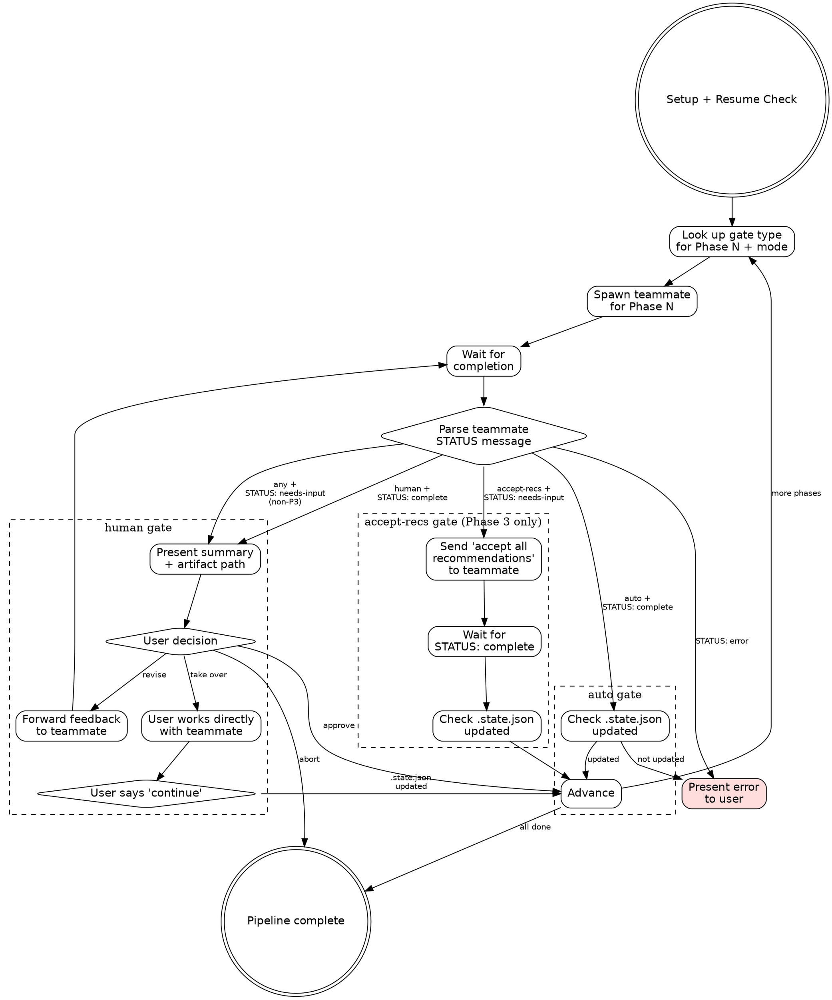

# Pipeline Orchestrator: Configurable Gating & Thin Lead — Implementation Plan

> **For agentic workers:** REQUIRED SUB-SKILL: Use superpowers:subagent-driven-development (recommended) or superpowers:executing-plans to implement this plan task-by-task. Steps use checkbox (`- [ ]`) syntax for tracking.

**Goal:** Add configurable gate modes (full/research-gate/design-gate/auto) and thin lead architecture to the deep-work pipeline orchestrator.

**Architecture:** Two markdown skill files are rewritten. `phase-config.md` becomes the source of truth for the per-mode gate matrix. `SKILL.md` is rewritten to parse `--mode`, look up gate types from the config, and dispatch accordingly with minimal context accumulation.

**Tech Stack:** Claude Code skills (markdown), Agent/SendMessage/AskUserQuestion tool APIs, `.state.json` for pipeline state.

**Spec:** `docs/superpowers/specs/2026-04-07-pipeline-orchestrator-gating-design.md`

---

## File Structure

| File | Action | Responsibility |
|------|--------|----------------|
| `.claude/skills/deep-work-pipeline/phase-config.md` | Rewrite | Gate mode matrix, gate type definitions, artifact dependencies, model selection |
| `.claude/skills/deep-work-pipeline/SKILL.md` | Rewrite | Orchestrator: argument parsing, gate mode dispatch, thin lead loop, Phase 3 flow, manual takeover, error handling |

---

### Task 1: Rewrite phase-config.md with gate mode matrix

**Files:**
- Modify: `.claude/skills/deep-work-pipeline/phase-config.md` (replace entire content)

- [ ] **Step 1: Replace phase-config.md content**

Replace the entire file with the new gate mode matrix. The key changes from the current file:
- Replace single `Gate` column with per-mode columns (`full`, `research-gate`, `design-gate`, `auto`)
- Fix Phase 6 model from `sonnet` to `opus`
- Add gate type definitions section
- Add mode descriptions section with progressive automation explanation
- Keep artifact dependencies table (unchanged)

```markdown
# Deep Work Pipeline — Phase Configuration

## Gate Mode Matrix

Each mode automates a strictly larger prefix of phases. The gate name indicates where automation **stops** — everything after is human-gated.

Modes form a progression: `full` < `research-gate` < `design-gate` < `auto`.

| Phase | Skill | Artifact | Model | Interaction | full | research-gate | design-gate | auto |
|-------|-------|----------|-------|-------------|------|---------------|-------------|------|
| 1 | dw-01-research-questions | 00-ticket.md, 01-research-questions.md | opus | none | human | auto | auto | auto |
| 2 | dw-02-research | 02-research.md | opus | none | human | human | auto | auto |
| 3 | dw-03-design-discussion | 03-design-discussion.md | opus | batch-qa | human | human | human | accept-recs |
| 4 | dw-04-outline | 04-structure-outline.md | opus | none | human | human | human | auto |
| 5 | dw-05-plan | 05-plan.md | opus | none | human | human | human | auto |
| 6 | dw-06b-implement-subagents | 06-completion.md | opus | none | human | human | human | human |

## Gate Types

- **human** — Present artifact summary + path to user. Offer: Approve / Revise / Take over / Abort.
- **auto** — Check `.state.json` updated after teammate completes. Advance immediately. Stop on `STATUS: error`.
- **accept-recs** — Send "Accept all recommendations" to Phase 3 teammate for design question resolution, then auto-advance.

## Mode Descriptions

| Mode | Automates | Human from | Use case |
|------|-----------|------------|----------|
| `full` | Nothing | Phase 1 | Unfamiliar codebase, high-stakes. Review everything. |
| `research-gate` | Phase 1 | Phase 2 | Trust question generation. Review research, then manual through design/outline/plan/implementation. |
| `design-gate` | Phases 1-2 | Phase 3 | Trust research. Review design decisions, then manual through outline/plan/implementation. |
| `auto` | Phases 1-5 | Phase 6 | Re-runs, well-understood features. Auto-advance everything except implementation. |

## Artifact Dependencies

| Phase | Reads | Writes |
|-------|-------|--------|
| 1 | — | 00-ticket.md, 01-research-questions.md |
| 2 | 01-research-questions.md (questions section only) | 02-research.md |
| 3 | 00-ticket.md, 02-research.md | 03-design-discussion.md |
| 4 | 00-ticket.md, 02-research.md, 03-design-discussion.md | 04-structure-outline.md |
| 5 | all prior artifacts | 05-plan.md |
| 6 | 05-plan.md | 06-completion.md |

## Firewall Constraint (Phase 2)

Phase 2 MUST NOT receive the original prompt or read 00-ticket.md.
The Phase 2 skill handles extraction internally via `extract-research-questions.sh` —
the pipeline orchestrator does not need to embed questions in the teammate prompt.
This ensures research objectivity before the prompt re-enters in Phase 3.
```

- [ ] **Step 2: Verify the file renders correctly**

Read the file back and confirm:
- The gate mode matrix has 6 rows × 4 mode columns
- All Phase 6 entries are `human`
- All Model entries are `opus`
- Mode progression is monotonically increasing automation

- [ ] **Step 3: Commit**

```bash
git add .claude/skills/deep-work-pipeline/phase-config.md
git commit -m "feat: add configurable gate modes to phase-config

Replace single Gate column with per-mode matrix (full, research-gate,
design-gate, auto). Fix Phase 6 model from sonnet to opus."
```

---

### Task 2: Rewrite SKILL.md — Setup, argument parsing, and resume check

**Files:**
- Modify: `.claude/skills/deep-work-pipeline/SKILL.md` (replace lines 1-50: frontmatter, title, setup, resume check)

- [ ] **Step 1: Replace the frontmatter, title, and Setup section**

Replace the current frontmatter and Setup section (lines 1-29) with updated versions that parse `--mode`:

```markdown
---
name: deep-work-pipeline
description: "Use when running the full deep-work pipeline end-to-end in a single session. Orchestrates all 6 phases sequentially using agent teams, with configurable review gates between each phase."
---

# Deep Work Pipeline Orchestrator

Runs the full deep-work pipeline (Phases 1-6) in a single session using agent teams.
Each phase gets a fresh teammate (clean context). Gate behavior is configurable per mode.
The team lead is a thin dispatcher — it does NOT read artifacts or accumulate phase content.

**Announce at start:** "Deep-work pipeline orchestrator loaded."

## Setup

1. Parse `$ARGUMENTS` for `<topic-slug>` and optional `--mode`:
   ```
   /deep-work-pipeline <topic-slug> [--mode full|research-gate|design-gate|auto]
   ```
   - If `<topic-slug>` is empty, ask user via AskUserQuestion
   - If `--mode` is not provided, default to `full`
   - Valid modes: `full`, `research-gate`, `design-gate`, `auto`
   - If invalid mode, report error and ask user to choose from valid modes
2. Derive repo: `basename $(git remote get-url origin 2>/dev/null | sed 's/.git$//') 2>/dev/null || basename $(pwd)`
3. Set artifact directory: `~/notes/context-engineering/<repo>/<topic-slug>/`
4. Create artifact directory if it doesn't exist
5. Report: "Pipeline mode: **<mode>**. Topic: **<topic-slug>**."
```

- [ ] **Step 2: Replace the Resume Check section**

Replace the current Resume Check section (lines 22-29) with a version that handles `gate_mode`:

```markdown
## Resume Check

Read `.state.json` from the artifact directory. If it exists and has `completed_phases`:
- Report completed phases to the user
- If `.state.json` contains a `gate_mode` field, show it: "Original mode: **<mode>**."
  - Ask: "Resume from Phase N with mode **<original_mode>**, switch to **<current_mode>**, or restart?"
  - If user wants to switch modes, use the new mode going forward
- If no `gate_mode` in `.state.json` (legacy pipeline), use the mode from `$ARGUMENTS`
- If resume: skip completed phases, begin at the next incomplete phase
- If restart: clear `.state.json` and start from Phase 1

If no `.state.json`, start from Phase 1. Write initial `.state.json`:
```json
{
  "topic": "<topic-slug>",
  "repo": "<repo>",
  "gate_mode": "<mode>",
  "current_phase": 0,
  "completed_phases": [],
  "last_updated": "<ISO timestamp>"
}
```
```

- [ ] **Step 3: Verify the replaced sections read correctly**

Read `.claude/skills/deep-work-pipeline/SKILL.md` lines 1-60 and confirm:
- Frontmatter includes "configurable review gates"
- Setup section parses `--mode` with default `full`
- Resume check handles `gate_mode` in `.state.json`
- Initial `.state.json` includes `gate_mode`

- [ ] **Step 4: Commit**

```bash
git add .claude/skills/deep-work-pipeline/SKILL.md
git commit -m "feat: add --mode argument parsing and gate_mode to resume check"
```

---

### Task 3: Rewrite SKILL.md — Team setup and model selection

**Files:**
- Modify: `.claude/skills/deep-work-pipeline/SKILL.md` (replace Team Setup and Model Selection sections, lines 32-50)

- [ ] **Step 1: Replace Team Setup and Model Selection sections**

Replace the current Team Setup (lines 32-39) and Model Selection (lines 41-50) with:

```markdown
## Team Setup

Create a team named `dw-<topic-slug>`:
```
TeamCreate(team_name: "dw-<topic-slug>", description: "Deep work pipeline: <topic-slug>")
```

You (the team lead) are a thin dispatcher. You spawn teammates, gate based on mode, and advance phases.
You do NOT read artifacts, accumulate phase content, or write `.state.json` — the sub-skills handle their own state and artifact I/O.

## Model Selection

All teammates use `opus`. Implementation subagents dispatched internally by Phase 6 use their own model (sonnet) as specified in their prompt templates.

| Phases | Model | Rationale |
|--------|-------|-----------|
| 1-6 | opus | All orchestrator teammates need strong reasoning |
```

- [ ] **Step 2: Commit**

```bash
git add .claude/skills/deep-work-pipeline/SKILL.md
git commit -m "feat: simplify model selection to opus for all phases"
```

---

### Task 4: Rewrite SKILL.md — Core pipeline loop with gate dispatch

This is the largest task. Replace the current Pipeline Execution section with the new thin-lead loop that dispatches based on gate type.

**Files:**
- Modify: `.claude/skills/deep-work-pipeline/SKILL.md` (replace Pipeline Execution section, lines 52-121)

- [ ] **Step 1: Replace the Pipeline Execution section and flow diagram**

Replace lines 52-83 (the current `## Pipeline Execution` section through the graphviz diagram) with:

```markdown
## Pipeline Execution

Read the gate mode matrix from `phase-config.md` to determine the gate type for each phase under the current mode.


```

- [ ] **Step 2: Replace the "For Each Phase" loop logic**

Replace lines 85-121 (the current per-phase loop: Spawn, Wait, Gate, Handle Gate Response) with:

```markdown
### For Each Phase

#### 1. Look Up Gate Type

Read the gate mode matrix from `phase-config.md`. For the current phase number and the pipeline's `gate_mode`, determine the gate type: `human`, `auto`, or `accept-recs`.

#### 2. Spawn Teammate

Spawn a **foreground** `general-purpose` agent via `Agent` tool:
- `name`: `dw-phase-N` (e.g., `dw-phase-1`)
- `team_name`: `dw-<topic-slug>`
- `model`: `opus`

Build the teammate prompt using the template in [Teammate Prompt Template](#teammate-prompt-template), parameterized per phase.

**Phase 3 in `auto` mode only:** Add this directive to the teammate prompt:
> "For Step 7 (question resolution), choose 'Accept recommendations' mode. Resolve all OPEN questions using your recommendations. Do NOT send STATUS: needs-input."

#### 3. Wait for Completion

The teammate will work and eventually the Agent call will return with the teammate's final message.

#### 4. Dispatch by Gate Type

**If gate type is `auto`:**
1. Read `.state.json` from artifact directory
2. If the current phase is in `completed_phases` → advance to next phase
3. If NOT → warn user: "Teammate reported complete but `.state.json` wasn't updated. Artifact may be incomplete."
   - Offer via AskUserQuestion: **Continue anyway** / **Investigate** / **Abort**

**If gate type is `human`:**
1. Present to the user via AskUserQuestion:
   > "Phase N complete. Artifact: `<path>`
   >
   > [teammate's summary bullets from their final message]
   >
   > **Approve** — advance to next phase
   > **Revise** — I'll relay your feedback to the teammate
   > **Take over** — work with the teammate directly, tell me when done
   > **Abort** — stop the pipeline"
2. Handle the user's choice:
   - **Approve**: Advance to next phase.
   - **Revise**: Forward the user's feedback to the teammate via `SendMessage`. Wait for the teammate to revise and re-report. Re-gate. Maximum 3 revision rounds — after the third, ask: "3 revisions attempted. Continue revising, or approve as-is?"
   - **Take over**: Inform user they can work directly with the teammate. Wait for the user to say "done" / "continue" / "phase complete". Then read `.state.json` to confirm the phase is in `completed_phases`. If confirmed, advance. If not, warn and ask.
   - **Abort**: Stop pipeline.

**If gate type is `accept-recs` (Phase 3 only):**
This case is handled via the teammate prompt directive in Step 2. The teammate auto-accepts recommendations and completes without sending `STATUS: needs-input`. The agent returns with `STATUS: complete`. Proceed as with `auto` gate — check `.state.json` and advance.

**Handling `STATUS: needs-input` on human-gated Phase 3:**
When Phase 3 is human-gated and the teammate sends `STATUS: needs-input`:
1. The teammate's final message contains the design questions summary
2. Present the questions to the user:
   > "Phase 3 has N design questions to resolve.
   >
   > [questions summary from teammate]
   >
   > **Answer in batch** — provide your choices (e.g., 'DQ-1: A, DQ-3: B')
   > **Accept all recommendations** — use the teammate's picks
   > **Take over** — work with the teammate directly"
3. Relay the user's answers to the teammate via `SendMessage`
4. Wait for teammate to finalize and report `STATUS: complete`
5. Proceed to the normal human gate

**Handling `STATUS: error` (any gate type):**
Stop auto-advance. Present the error to the user:
> "Phase N encountered an error:
>
> [error description from teammate]
>
> **Retry** — respawn the teammate for this phase
> **Take over** — work with the teammate to resolve
> **Abort** — stop the pipeline"

**Handling unexpected `STATUS: needs-input` (non-Phase-3):**
Present to user as if it were an error — this is unexpected behavior. Let the user decide how to proceed.
```

- [ ] **Step 3: Verify the full pipeline execution section**

Read the Pipeline Execution section and verify:
- Gate type lookup references `phase-config.md`
- Auto gate checks `.state.json` only, doesn't read artifacts
- Human gate offers four options: Approve / Revise / Take over / Abort
- Phase 3 `accept-recs` handled via teammate prompt directive
- Phase 3 `needs-input` on human gate proxies questions then re-gates
- Error handling covers all STATUS types
- Takeover protocol checks `.state.json` on user return

- [ ] **Step 4: Commit**

```bash
git add .claude/skills/deep-work-pipeline/SKILL.md
git commit -m "feat: implement gate mode dispatch and thin lead pipeline loop

Replace hardcoded human gates with mode-based dispatch: auto, human,
and accept-recs. Add manual takeover protocol and error handling."
```

---

### Task 5: Rewrite SKILL.md — Phase 3 interaction, teammate template, and phase-specific instructions

**Files:**
- Modify: `.claude/skills/deep-work-pipeline/SKILL.md` (replace Phase 3 Interaction, Teammate Prompt Template, and Phase-Specific Instructions sections)

- [ ] **Step 1: Replace the Phase 3 Interaction section**

Remove the current standalone "Phase 3 Interaction" section (lines 122-136) since this logic is now embedded in the gate dispatch (Task 4). Replace with a brief reference:

```markdown
## Phase 3 Interaction

Phase 3 interaction is handled by the gate dispatch logic above:
- **Human-gated Phase 3**: Lead proxies design questions to user via batch mode when teammate sends `STATUS: needs-input`, then relays answers.
- **Auto Phase 3 (`accept-recs`)**: Teammate prompt includes accept-recommendations directive. No mid-phase interaction needed.

See "Dispatch by Gate Type" for the full flow.
```

- [ ] **Step 2: Update the Teammate Prompt Template**

Replace the current template (lines 138-164) to reflect the thin lead approach:

```markdown
## Teammate Prompt Template

Adapt this template for each phase:

```
You are executing Phase {N} ({phase_name}) of a deep-work pipeline.

Topic slug: {slug}
Repo: {repo}
Artifact directory: {artifact_dir}

Invoke the skill by running: /dw-{skill_suffix} {slug}

{phase_specific_instructions}

When done, send a message to the team lead. ALWAYS prefix with a status tag:

STATUS: complete
- [key finding 1]
- [key finding 2]
- Artifact: {artifact_path}

Or if you need user decisions (Phase 3 only):

STATUS: needs-input
[design questions summary — question titles, options, and your recommendations]

Or if something failed:

STATUS: error
[description of what went wrong and what was attempted]
```
```

- [ ] **Step 3: Update Phase-Specific Instructions**

Replace the current Phase-Specific Instructions section (lines 166-203) with instructions that include the `accept-recs` directive for Phase 3:

```markdown
### Phase-Specific Instructions

**Phase 1** (research-questions):
```
No special constraints. Run the skill as documented.
```

**Phase 2** (research) — FIREWALL:
```
No special constraints. Run the skill as documented.
The skill's own bias firewall handles question extraction via extract-research-questions.sh.
Do NOT read 00-ticket.md or pass the original prompt.
```

**Phase 3** (design-discussion):

When Phase 3 gate type is `human` (modes: full, research-gate, design-gate):
```
When the skill asks you to present design questions to the user, instead send
the questions summary to the team lead using STATUS: needs-input. The team lead
will proxy the user's answers back to you. Use "batch" mode for resolution.

Do NOT use AskUserQuestion directly — route all user interaction through the team lead.
```

When Phase 3 gate type is `accept-recs` (mode: auto):
```
For Step 7 (question resolution), choose "Accept recommendations" mode.
Resolve all OPEN questions using your stated recommendations. Finalize the
artifact and report STATUS: complete. Do NOT send STATUS: needs-input.
```

**Phase 4** (outline):
```
No special constraints. Run the skill as documented.
```

**Phase 5** (plan):
```
No special constraints. Run the skill as documented.
```

**Phase 6** (implement-subagents):
```
No special constraints. Run the skill as documented.
This phase dispatches its own subagents internally for implementation tasks.
```
```

- [ ] **Step 4: Commit**

```bash
git add .claude/skills/deep-work-pipeline/SKILL.md
git commit -m "feat: update teammate template and phase-specific instructions for gate modes"
```

---

### Task 6: Rewrite SKILL.md — Message protocol, firewall, and completion sections

**Files:**
- Modify: `.claude/skills/deep-work-pipeline/SKILL.md` (replace remaining sections: Message Protocol, Firewall Enforcement, Completion)

- [ ] **Step 1: Update the Teammate Message Protocol section**

Replace the current section (lines 205-213) — no changes needed to the protocol itself, but add context about how the lead uses each status:

```markdown
## Teammate Message Protocol

Teammates prefix their messages with a status tag for unambiguous routing:

- **`STATUS: complete`** — Phase work is done. Followed by summary bullets and artifact path.
  - Auto gate: lead checks `.state.json`, advances.
  - Human gate: lead presents summary to user, runs gate.
- **`STATUS: needs-input`** — Teammate needs user decisions (Phase 3 design questions). Followed by the questions.
  - Human gate: lead proxies questions to user, relays answers.
  - Accept-recs gate: should not occur (teammate prompt prevents it).
- **`STATUS: error`** — Something failed. Followed by description.
  - All gates: lead stops auto-advance, presents error to user.

The lead routes based on the status prefix and the current gate type.
```

- [ ] **Step 2: Keep Firewall Enforcement section unchanged**

The current firewall section (lines 215-221) is correct. No changes needed:

```markdown
## Firewall Enforcement (Phase 2)

The Phase 2 skill handles its own firewall internally via `extract-research-questions.sh`.
The team lead does NOT need to read or embed questions — just spawn the teammate and let
the skill extract them.

The teammate prompt must NOT reference 00-ticket.md or pass the original prompt.
```

- [ ] **Step 3: Update the Completion section**

Replace the current Completion section (lines 223-228) to include `gate_mode` awareness:

```markdown
## Completion

When all 6 phases are approved:
1. Read `.state.json` to confirm all phases complete
2. Report: "Pipeline complete (mode: **<gate_mode>**). All artifacts in `<artifact_dir>`."
```

- [ ] **Step 4: Commit**

```bash
git add .claude/skills/deep-work-pipeline/SKILL.md
git commit -m "feat: update message protocol docs and completion for gate mode awareness"
```

---

### Task 7: Final review — verify complete SKILL.md coherence

**Files:**
- Read: `.claude/skills/deep-work-pipeline/SKILL.md` (full file)
- Read: `.claude/skills/deep-work-pipeline/phase-config.md` (full file)

- [ ] **Step 1: Read the complete SKILL.md and verify end-to-end coherence**

Read the full file. Check for:
- No duplicate sections (the old Phase 3 Interaction section was removed in Task 5)
- All references to "Model Selection" use opus consistently
- The gate dispatch logic references `phase-config.md` correctly
- The Teammate Prompt Template includes all three STATUS types
- Phase-Specific Instructions for Phase 3 has both gate-type variants
- Manual takeover is described in the gate dispatch section
- No references to the old "Shutdown teammate via SendMessage with {type: shutdown_request}" pattern (this was the old approach — foreground agents return when done, no explicit shutdown needed)

- [ ] **Step 2: Read phase-config.md and cross-reference with SKILL.md**

Verify:
- Gate types named in `phase-config.md` (human, auto, accept-recs) match those handled in SKILL.md
- All 4 modes in `phase-config.md` are accepted in SKILL.md argument parsing
- Phase numbers and skill names are consistent between the two files

- [ ] **Step 3: Fix any inconsistencies found**

If Steps 1-2 surface any issues, fix them inline.

- [ ] **Step 4: Final commit if changes were made**

```bash
git add .claude/skills/deep-work-pipeline/SKILL.md .claude/skills/deep-work-pipeline/phase-config.md
git commit -m "fix: resolve inconsistencies from final review"
```

Skip this step if no changes were needed.
