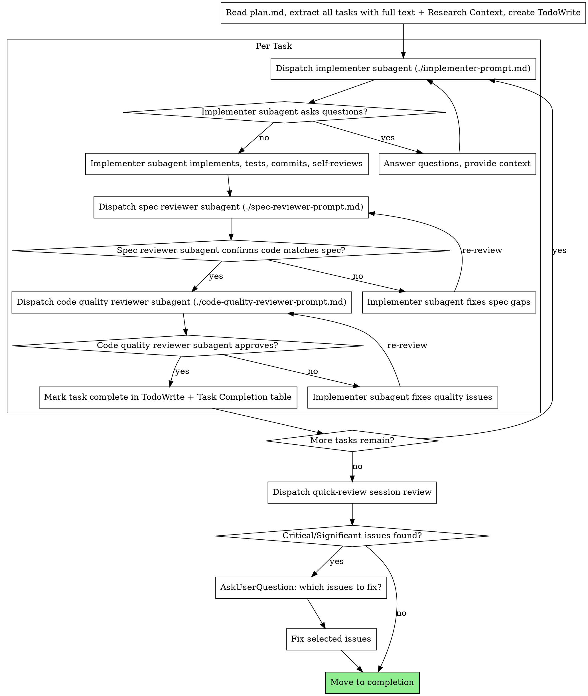

# /write-plan and /implement-plan — Implementation Plan

> **For agentic workers:** REQUIRED SUB-SKILL: Use superpowers:subagent-driven-development (recommended) or superpowers:executing-plans to implement this plan task-by-task. Steps use checkbox (`- [ ]`) syntax for tracking.

**Goal:** Build two new skills (`/write-plan`, `/implement-plan`) that pair to give small changes a durable plan artifact + dw-06-grade implementation discipline, without the four upstream deep-work phases.

**Architecture:** Two `SKILL.md` files under `.claude/skills/`. `/write-plan` parses input (free-form / file / Jira key), runs light codebase research via existing agents, and writes a full dw-05-format plan to `~/notes/context-engineering/<repo>/<slug>/plan.md`. `/implement-plan` ports `dw-06-implement`'s process verbatim with three substitutions (read `plan.md` not `05-plan.md`, no `.state.json`, inline Research Context as the implementer's reference).

**Tech Stack:** Markdown + YAML frontmatter for skill files; bash for the existing `dw-setup.sh` helper; Claude Code agents (`codebase-locator`, `codebase-analyzer`, `codebase-pattern-finder`) for research; Task tool for per-task subagent dispatch.

**Spec:** `docs/superpowers/specs/2026-05-01-write-and-implement-plan-design.md`

---

## File Structure

| Path | New / Modify | Responsibility |
|------|--------------|----------------|
| `.claude/skills/write-plan/SKILL.md` | NEW | Prompt-driven skill: parse input, dispatch research subagents, draft plan, write artifact, present for review |
| `.claude/skills/implement-plan/SKILL.md` | NEW | Prompt-driven skill: pre-flight, task extraction, per-task review loop, final session review |
| `.claude/skills/implement-plan/implementer-prompt.md` | NEW (copy) | Byte-for-byte copy of `.claude/skills/dw-06-implement/implementer-prompt.md` |
| `.claude/skills/implement-plan/spec-reviewer-prompt.md` | NEW (copy) | Byte-for-byte copy of `.claude/skills/dw-06-implement/spec-reviewer-prompt.md` |
| `.claude/skills/implement-plan/code-quality-reviewer-prompt.md` | NEW (copy) | Byte-for-byte copy of `.claude/skills/dw-06-implement/code-quality-reviewer-prompt.md` |

No existing files are modified. The reviewer prompts are copied independent of `dw-06` per the spec's "independence over single-source-of-truth" decision; if they ever need to diverge for the lighter use case, fork at that point.

## Conventions referenced from existing code

- **Skill file shape:** YAML frontmatter (`name`, `description`) followed by Markdown body. See `.claude/skills/dw-05-plan/SKILL.md:1-4` and `.claude/skills/dw-06-implement/SKILL.md:1-4`.
- **`dw-setup.sh` contract:** `~/.claude/skills/deep-work/dw-setup.sh <slug>` — exit 0 prints three KEY=VALUE lines (`REPO`, `TOPIC_SLUG`, `ARTIFACT_DIR`); exit 2 prints `MISSING_SLUG` to stderr. Source: `.claude/skills/deep-work/dw-setup.sh`.
- **Plan format:** Header + Phase Progress + Task Completion + Deviation Log + per-phase TDD tasks + frontmatter. See `.claude/skills/dw-05-plan/SKILL.md:121-204` for the canonical form.
- **Per-task review loop:** Implementer → Spec reviewer → Code-quality reviewer, sonnet model, with re-loop on rejection. See `.claude/skills/dw-06-implement/SKILL.md:36-87`.
- **Input parsing pattern (Jira / URL / pasted text):** `.claude/skills/investigate-and-fix/SKILL.md:34-50`.

---

## Execution Progress

### Phase Progress

| # | Phase | Status | Validation Command | Result |
|---|-------|--------|--------------------|--------|
| 0 | Scaffolding | `[ ] NOT STARTED` | `bash docs/superpowers/plans/scripts/validate-phase-0.sh` | — |
| 1 | `/write-plan` skill | `[ ] NOT STARTED` | `bash docs/superpowers/plans/scripts/validate-phase-1.sh` | — |
| 2 | `/implement-plan` skill | `[ ] NOT STARTED` | `bash docs/superpowers/plans/scripts/validate-phase-2.sh` | — |
| 3 | End-to-end dogfood | `[ ] NOT STARTED` | Manual user verification | — |

**Status legend:** `[ ] NOT STARTED` | `[~] IN PROGRESS` | `[x] DONE` | `[!] BLOCKED`

### Task Completion

| Task | Description | Status | Committed | Deviations |
|------|-------------|--------|-----------|------------|
| **Phase 0** | | | | |
| 0.1 | Create skill dirs + copy reviewer prompts | `[ ]` | — | |
| 0.2 | Write phase-0 validation script | `[ ]` | — | |
| **Phase 1** | | | | |
| 1.1 | Write phase-1 validation script | `[ ]` | — | |
| 1.2 | Author `/write-plan` SKILL.md (skeleton + setup + input parsing) | `[ ]` | — | |
| 1.3 | Author `/write-plan` SKILL.md (research + drafting + completion) | `[ ]` | — | |
| 1.4 | `/write-plan` smoke test on a small brief | `[ ]` | — | |
| **Phase 2** | | | | |
| 2.1 | Write phase-2 validation script | `[ ]` | — | |
| 2.2 | Author `/implement-plan` SKILL.md (skeleton + pre-flight + task extraction) | `[ ]` | — | |
| 2.3 | Author `/implement-plan` SKILL.md (review loop + session review + resume) | `[ ]` | — | |
| 2.4 | `/implement-plan` smoke test against the Phase 1 dogfood plan | `[ ]` | — | |
| **Phase 3** | | | | |
| 3.1 | End-to-end dogfood on a real change | `[ ]` | — | |

**Task status legend:** `[ ]` pending | `[~]` in progress | `[x]` done | `[!]` blocked | `[-]` skipped

### Deviation Log

> Record any deviations from the plan here. Include: task ID, what changed, why, and impact on downstream tasks.

_No deviations recorded._

---

## Phase 0: Scaffolding

**Goal:** Create both skill directories and stage the three reviewer prompts as copies. After this phase, the file tree is in place but neither skill has its `SKILL.md` body.

**Validation:** `bash docs/superpowers/plans/scripts/validate-phase-0.sh` exits 0.
**Scope guard:** Phase 0 does NOT include any `SKILL.md` content. Only directory creation and verbatim file copies.

### Task 0.1: Create skill directories and copy reviewer prompts

**Files:**
- Create: `.claude/skills/write-plan/` (directory)
- Create: `.claude/skills/implement-plan/` (directory)
- Create: `.claude/skills/implement-plan/implementer-prompt.md` (copy)
- Create: `.claude/skills/implement-plan/spec-reviewer-prompt.md` (copy)
- Create: `.claude/skills/implement-plan/code-quality-reviewer-prompt.md` (copy)

**Pattern:** No SKILL.md authoring yet — pure file ops. The three prompt copies are byte-for-byte identical to their `dw-06-implement/` siblings (verified: none reference deep-work-specific paths like `00-ticket.md` or `05-plan.md`; all are generic per-task prompt templates).

- [ ] **Step 1: Create the two skill directories**

```bash
mkdir -p .claude/skills/write-plan .claude/skills/implement-plan
```

- [ ] **Step 2: Copy the three reviewer prompts byte-for-byte**

```bash
cp .claude/skills/dw-06-implement/implementer-prompt.md .claude/skills/implement-plan/implementer-prompt.md
cp .claude/skills/dw-06-implement/spec-reviewer-prompt.md .claude/skills/implement-plan/spec-reviewer-prompt.md
cp .claude/skills/dw-06-implement/code-quality-reviewer-prompt.md .claude/skills/implement-plan/code-quality-reviewer-prompt.md
```

- [ ] **Step 3: Verify byte-identity**

```bash
diff -q .claude/skills/dw-06-implement/implementer-prompt.md .claude/skills/implement-plan/implementer-prompt.md
diff -q .claude/skills/dw-06-implement/spec-reviewer-prompt.md .claude/skills/implement-plan/spec-reviewer-prompt.md
diff -q .claude/skills/dw-06-implement/code-quality-reviewer-prompt.md .claude/skills/implement-plan/code-quality-reviewer-prompt.md
```
Expected: No output (files are identical). If any line of output, the copy failed; re-run Step 2.

- [ ] **Step 4: Commit**

```bash
git add .claude/skills/write-plan .claude/skills/implement-plan
git commit -m "feat(skills): scaffold write-plan and implement-plan dirs, copy reviewer prompts"
```

### Task 0.2: Write Phase 0 validation script

**Files:**
- Create: `docs/superpowers/plans/scripts/validate-phase-0.sh`

**Pattern:** A standalone bash script the implementer (and human) can run to confirm Phase 0's invariants hold. Lives under `docs/superpowers/plans/scripts/` so it's tracked alongside the plan.

- [ ] **Step 1: Write the validation script**

```bash
mkdir -p docs/superpowers/plans/scripts
cat > docs/superpowers/plans/scripts/validate-phase-0.sh <<'EOF'
#!/usr/bin/env bash
# Phase 0 validation: skill dirs exist and reviewer prompts match dw-06 sources.
set -euo pipefail

cd "$(git rev-parse --show-toplevel)"

[ -d .claude/skills/write-plan ]      || { echo "FAIL: write-plan dir missing"; exit 1; }
[ -d .claude/skills/implement-plan ]  || { echo "FAIL: implement-plan dir missing"; exit 1; }

for f in implementer-prompt.md spec-reviewer-prompt.md code-quality-reviewer-prompt.md; do
    src=".claude/skills/dw-06-implement/$f"
    dst=".claude/skills/implement-plan/$f"
    [ -f "$dst" ] || { echo "FAIL: $dst missing"; exit 1; }
    diff -q "$src" "$dst" >/dev/null || { echo "FAIL: $dst differs from $src"; exit 1; }
done

echo "PASS: Phase 0 invariants hold."
EOF
chmod +x docs/superpowers/plans/scripts/validate-phase-0.sh
```

- [ ] **Step 2: Run the script (expect PASS)**

```bash
bash docs/superpowers/plans/scripts/validate-phase-0.sh
```
Expected: `PASS: Phase 0 invariants hold.`

- [ ] **Step 3: Commit**

```bash
git add docs/superpowers/plans/scripts/validate-phase-0.sh
git commit -m "test(plans): add phase-0 validation script for write-plan/implement-plan"
```

### Phase 0 success criteria

- Automated: `bash docs/superpowers/plans/scripts/validate-phase-0.sh` exits 0.
- Manual: `ls .claude/skills/{write-plan,implement-plan}/` shows the expected entries.

---

## Phase 1: `/write-plan` skill

**Goal:** Author `.claude/skills/write-plan/SKILL.md` and validate it produces a sensible plan on a small brief.

**Validation:** `bash docs/superpowers/plans/scripts/validate-phase-1.sh` exits 0 + manual smoke test of `/write-plan` on a small brief.
**Scope guard:** Phase 1 does NOT touch `.claude/skills/implement-plan/` (other than the prompts copied in Phase 0). Phase 1 does NOT modify any existing `dw-*` skill.

### Task 1.1: Write Phase 1 validation script

**Files:**
- Create: `docs/superpowers/plans/scripts/validate-phase-1.sh`

**Pattern:** Same shape as `validate-phase-0.sh` — checks that `SKILL.md` exists, frontmatter has the right `name` and a non-empty `description`, and the body contains all required section headings.

- [ ] **Step 1: Write the validation script**

```bash
cat > docs/superpowers/plans/scripts/validate-phase-1.sh <<'EOF'
#!/usr/bin/env bash
# Phase 1 validation: write-plan SKILL.md exists with correct frontmatter and required sections.
set -euo pipefail

cd "$(git rev-parse --show-toplevel)"

f=.claude/skills/write-plan/SKILL.md
[ -f "$f" ] || { echo "FAIL: $f missing"; exit 1; }

# Frontmatter
head -5 "$f" | grep -q "^name: write-plan$"   || { echo "FAIL: frontmatter name not 'write-plan'"; exit 1; }
head -5 "$f" | grep -Eq "^description: .+"     || { echo "FAIL: frontmatter description missing or empty"; exit 1; }

# Required sections (must appear as Markdown headings)
for heading in \
    "^## Setup" \
    "^## Pre-flight" \
    "^## Process" \
    "^### Step 1: Parse input" \
    "^### Step 2: Light research" \
    "^### Step 3: Draft plan" \
    "^### Step 4: Write artifact" \
    "^## Completion"; do
    grep -Eq "$heading" "$f" || { echo "FAIL: missing section matching /$heading/"; exit 1; }
done

# References to required infrastructure
grep -q "dw-setup.sh"            "$f" || { echo "FAIL: must reference dw-setup.sh";        exit 1; }
grep -q "codebase-locator"       "$f" || { echo "FAIL: must reference codebase-locator";   exit 1; }
grep -q "codebase-analyzer"      "$f" || { echo "FAIL: must reference codebase-analyzer";  exit 1; }
grep -q "Research Context"       "$f" || { echo "FAIL: must instruct to add Research Context section to plan"; exit 1; }
grep -q "Phase Progress"         "$f" || { echo "FAIL: must instruct to write Phase Progress table"; exit 1; }
grep -q "Task Completion"        "$f" || { echo "FAIL: must instruct to write Task Completion table"; exit 1; }
grep -q "Deviation Log"          "$f" || { echo "FAIL: must instruct to write Deviation Log"; exit 1; }

echo "PASS: Phase 1 invariants hold."
EOF
chmod +x docs/superpowers/plans/scripts/validate-phase-1.sh
```

- [ ] **Step 2: Run the script (expect FAIL — SKILL.md doesn't exist yet)**

```bash
bash docs/superpowers/plans/scripts/validate-phase-1.sh || true
```
Expected: `FAIL: .claude/skills/write-plan/SKILL.md missing`

- [ ] **Step 3: Commit**

```bash
git add docs/superpowers/plans/scripts/validate-phase-1.sh
git commit -m "test(plans): add phase-1 validation script for /write-plan SKILL.md"
```

### Task 1.2: Author `/write-plan` SKILL.md (frontmatter + Setup + Pre-flight + Step 1: Parse input)

**Files:**
- Create: `.claude/skills/write-plan/SKILL.md` (top half)

**Pattern:** Mirror the dw-05 skill's shape — see `.claude/skills/dw-05-plan/SKILL.md:1-32` for frontmatter, announce, Setup, and Pre-flight Validation conventions. For input parsing, mirror `.claude/skills/investigate-and-fix/SKILL.md:34-50`.

- [ ] **Step 1: Write the file with frontmatter through Step 1**

````markdown
---
name: write-plan
description: "Use when you have a small, well-scoped change that doesn't need design discussion but should land as a durable plan artifact with dw-06-grade implementation discipline. Lighter than the deep-work pipeline; more durable than investigate-and-fix."
---

# /write-plan

Drafts a full dw-05-format implementation plan from a brief, a file, or a Jira key. Light inline research via codebase agents fills in file:line references and patterns; the plan lands at `~/notes/context-engineering/<repo>/<slug>/plan.md` ready for `/implement-plan <slug>`.

**Use this when:** the change is small enough that Phases 1-4 of the deep-work pipeline (research questions, research, design discussion, outline) would be overkill, but you still want a durable plan artifact, fresh-subagent-per-task implementation, and two-stage review.

**Do NOT use this when:** the change has real design questions, needs cross-session paper trail, or has a scope you can't articulate in a paragraph. Use `/dw-01-research-questions <slug>` instead.

**Announce at start:** "Starting /write-plan."

## Setup

1. Run `~/.claude/skills/deep-work/dw-setup.sh "<slug>"` (extract `<slug>` from `$ARGUMENTS`; everything after the slug is the brief input). Parse stdout for `REPO`, `TOPIC_SLUG`, `ARTIFACT_DIR`.
   - If the script exits 2 (`MISSING_SLUG` on stderr), use `AskUserQuestion` to ask the user for a topic slug, then re-run with the slug.

## Pre-flight Validation

- `<ARTIFACT_DIR>/plan.md` does NOT already exist → if it DOES, use `AskUserQuestion`:
  - **Overwrite** — proceed and clobber the existing plan
  - **New slug** — ask for a different slug, re-run Setup
  - **Abort** — stop the skill
- The brief is non-empty → if `$ARGUMENTS` after the slug is empty AND no file path was provided, use `AskUserQuestion` to ask for the brief inline.

## Process

### Step 1: Parse input

`$ARGUMENTS` after the slug is the input. Resolve it to a brief string in this order:

| Input shape | Action |
|-------------|--------|
| Matches `^[A-Z]+-[0-9]+$` (Jira key, e.g. `PROJ-12345`) | Fetch via `mcp__glean_default__search` with the key. Extract problem statement, acceptance criteria, linked context. If linked docs are referenced, optionally `mcp__glean_default__read_document` for the most relevant. |
| Existing file path (use `Read`) | Read the file. Treat full contents as the brief. |
| Otherwise | Treat as free-form pasted text. |

If Glean returns nothing useful, note the gap and proceed with what's available — do NOT block.
````

- [ ] **Step 2: Run the validation script (still expect FAIL — body incomplete)**

```bash
bash docs/superpowers/plans/scripts/validate-phase-1.sh || true
```
Expected: `FAIL: missing section matching /^### Step 2: Light research/` (or similar — depends on which check trips first; the point is it still fails because subsequent steps haven't been written).

- [ ] **Step 3: Commit**

```bash
git add .claude/skills/write-plan/SKILL.md
git commit -m "feat(skills): /write-plan frontmatter, setup, pre-flight, input parsing"
```

### Task 1.3: Author `/write-plan` SKILL.md (Step 2: Research + Step 3: Draft + Step 4: Write + Completion)

**Files:**
- Modify: `.claude/skills/write-plan/SKILL.md` (append to bottom)

**Pattern:** For research dispatch, mirror `.claude/skills/investigate-and-fix/SKILL.md:52-69`. For plan format, mirror `.claude/skills/dw-05-plan/SKILL.md:46-204` — the implementer should write the same dw-05 format, with the new `## Research Context` section inserted between the header block and `## Execution Progress`.

- [ ] **Step 1: Append the remaining sections to `SKILL.md`**

````markdown

### Step 2: Light research

Dispatch the following subagents in parallel (single message, multiple `Agent` tool calls):

1. **`codebase-locator`** — "Find files and components related to: [key nouns from the brief]. Return file paths grouped by purpose."
2. **`codebase-analyzer`** — once locator returns, dispatch this against the most relevant component: "Analyze [path]. Document: current behavior, data flow, error handling, test coverage. Include file:line references."
3. **`codebase-pattern-finder`** (conditional — only if the brief explicitly implies an existing pattern, e.g. "add another X like Y") — "Find examples of [pattern] in the codebase. Return concrete code examples with file:line references."

Capture each agent's findings. Do NOT proceed to drafting until all dispatched agents return.

If during research you discover the change has real design questions (multiple plausible approaches with non-obvious tradeoffs), STOP and tell the user:

> "This change has design questions that should be resolved before planning: [list questions]. Recommend running `/dw-01-research-questions <slug>` instead. Abort `/write-plan`?"

Use `AskUserQuestion` with **Abort and switch to deep-work** / **Pick the obvious approach and continue** options.

### Step 3: Draft plan

Write the plan to a buffer (do not write to disk yet). Use exactly this structure:

```markdown
# <Topic Title> Implementation Plan

**Goal:** <one sentence>
**Architecture:** <2-3 sentences about approach>
**Tech Stack:** <relevant tech>

**Spec:** <link to a design doc if one exists, else omit>

## Research Context

### Brief
<original input, normalized into prose>

### Files in scope
- `path/to/file.ext:LINES` — <what it does, from codebase-analyzer findings>
- ...

### Patterns to follow
- `path/to/example.ext:LINES` — <pattern name and shape, from codebase-pattern-finder or analyzer>
- ...

### Constraints
- <surfaced constraint 1>
- ...

## Execution Progress

### Phase Progress
| # | Phase | Status | Validation Command | Result |
|---|-------|--------|--------------------|--------|
| 1 | <phase name> | `[ ] NOT STARTED` | `<exact validation command>` | — |
| ... |

**Status legend:** `[ ] NOT STARTED` | `[~] IN PROGRESS` | `[x] DONE` | `[!] BLOCKED`

### Task Completion
| Task | Description | Status | Committed | Deviations |
|------|-------------|--------|-----------|------------|
| **Phase 1** | | | | |
| 1.1 | <short description> | `[ ]` | — | |
| ... |

**Task status legend:** `[ ]` pending | `[~]` in progress | `[x]` done | `[!]` blocked | `[-]` skipped

### Deviation Log
> Record any deviations from the plan here. Format: **Task X.Y:** <what changed> — <why> — <downstream impact>.
_No deviations recorded._

## Phase 1: <name>

### Task 1.1: <name>

**Files:**
- Create: `exact/path`
- Modify: `exact/path:LINES`
- Test: `tests/exact/path`

**Pattern:** <ref to a Files-in-scope or Patterns-to-follow entry>

- [ ] **Step 1: Write the failing test** ...
- [ ] **Step 2: Run test (expect FAIL)** ...
- [ ] **Step 3: Implement** ...
- [ ] **Step 4: Run test (expect PASS)** ...
- [ ] **Step 5: Commit** ...

### Phase 1 success criteria
- Automated: <command>
- Manual: <if any>

### Phase 1 scope guards
- Phase 1 does NOT include <X>.

...

---
phase: plan
date: <today, YYYY-MM-DD>
topic: <slug>
repo: <repo>
git_sha: <output of `git rev-parse --short HEAD`>
total_phases: <N>
total_tasks: <N>
status: complete
---
```

**Task granularity:** 2-5 minutes each. TDD pattern: failing test → run (expect fail) → implement → run (expect pass) → commit.

**Every task MUST include:**
1. **Files:** Exact paths, action (Create/Modify), line ranges where modifying
2. **Pattern:** Reference to a research finding (e.g., "Follow `path/to/example.ext:LINES` from Patterns to follow")
3. **What to create/modify:** Exact names, signatures, fields — enough that the implementer makes no design decisions
4. **Tests:** Function names, inputs, expected outputs
5. **Validation:** Exact command + expected result
6. **Commit:** Files to include + suggested message

Phase decomposition heuristic: each phase produces a working, testable unit. A small change is often one phase with 2-5 tasks. If the plan exceeds 3 phases or 12 tasks total, the change is probably too big for `/write-plan` — recommend `/dw-01-research-questions` instead.

### Step 4: Write artifact

Write the buffered plan to `<ARTIFACT_DIR>/plan.md` using the `Write` tool. The artifact directory was created by `dw-setup.sh` in Setup.

## Completion

1. Present a summary to the user: number of phases, number of tasks, key files in scope.
2. Instruct: "Plan ready at `<ARTIFACT_DIR>/plan.md`. Review it, then run `/implement-plan <slug>` to execute."

## Red flags

**Stop and reconsider if:**
- The brief is vague enough that the plan would be full of placeholders — push back and ask for concrete specifics before drafting.
- Research surfaces multiple plausible approaches with non-obvious tradeoffs — that's a design question; route to `/dw-01-research-questions`.
- The change touches >5 files across >2 components — likely too big for `/write-plan`; route to deep-work.
````

- [ ] **Step 2: Run the validation script (expect PASS)**

```bash
bash docs/superpowers/plans/scripts/validate-phase-1.sh
```
Expected: `PASS: Phase 1 invariants hold.`

- [ ] **Step 3: Commit**

```bash
git add .claude/skills/write-plan/SKILL.md
git commit -m "feat(skills): /write-plan research, drafting, completion"
```

### Task 1.4: `/write-plan` smoke test on a small brief

**Files:**
- No files modified by the implementer. The skill itself produces a plan file under `~/notes/context-engineering/`.

**Pattern:** Manual dogfood — pick a tiny, real change, invoke the new skill, eyeball the output for sanity. Not automatable; this is a checkpoint with the user.

- [ ] **Step 1: Pick a smoke-test brief**

Suggested: a trivial improvement to one of the existing dw skills, e.g. "Make `dw-setup.sh` print a one-line confirmation to stderr when the artifact dir is freshly created."

- [ ] **Step 2: Invoke `/write-plan` with the brief**

```
/write-plan smoke-test-dw-setup-confirm Make dw-setup.sh print a one-line confirmation to stderr when the artifact dir is freshly created.
```

- [ ] **Step 3: Eyeball `~/notes/context-engineering/claude-essentials/smoke-test-dw-setup-confirm/plan.md`**

Verify:
- Frontmatter present at the bottom (YAML, parseable).
- Header block has Goal, Architecture, Tech Stack.
- `## Research Context` populated with file:line refs (at minimum, `dw-setup.sh:13-22` for the slug-empty branch).
- Phase Progress and Task Completion tables present and consistent (every task in Task Completion appears under a phase header in the body).
- Tasks have all six required fields (Files, Pattern, What, Tests, Validation, Commit).
- No "TBD" / "TODO" / "implement later" placeholders.

- [ ] **Step 4: Stop and present findings to the user**

Use `AskUserQuestion`:
- **Smoke test passed** — proceed to Phase 2
- **Plan has issues** — describe issues, fix `SKILL.md` (loops back to Task 1.3, log a deviation), re-run the smoke test
- **Skip smoke test for now** — proceed to Phase 2, log deviation

- [ ] **Step 5: If passed, optionally remove the smoke-test artifact directory**

```bash
rm -rf ~/notes/context-engineering/claude-essentials/smoke-test-dw-setup-confirm
```

No commit for this task — no code changes if the smoke passes. If `SKILL.md` was edited in response to issues, those edits are committed under Task 1.3 (the loop) with a `deviation` note.

### Phase 1 success criteria

- Automated: `bash docs/superpowers/plans/scripts/validate-phase-1.sh` exits 0.
- Manual: smoke test produces a plan that, on inspection, looks like something a human would actually want to execute.

---

## Phase 2: `/implement-plan` skill

**Goal:** Author `.claude/skills/implement-plan/SKILL.md` and validate it executes a plan correctly.

**Validation:** `bash docs/superpowers/plans/scripts/validate-phase-2.sh` exits 0 + smoke test against the Phase 1 dogfood plan.
**Scope guard:** Phase 2 does NOT modify the prompt files copied in Phase 0. Phase 2 does NOT touch `.claude/skills/write-plan/`.

### Task 2.1: Write Phase 2 validation script

**Files:**
- Create: `docs/superpowers/plans/scripts/validate-phase-2.sh`

**Pattern:** Same shape as `validate-phase-1.sh`. Checks frontmatter, required section headings, references to the three reviewer prompts and `/quick-review`.

- [ ] **Step 1: Write the validation script**

```bash
cat > docs/superpowers/plans/scripts/validate-phase-2.sh <<'EOF'
#!/usr/bin/env bash
# Phase 2 validation: implement-plan SKILL.md exists with correct frontmatter and required sections.
set -euo pipefail

cd "$(git rev-parse --show-toplevel)"

f=.claude/skills/implement-plan/SKILL.md
[ -f "$f" ] || { echo "FAIL: $f missing"; exit 1; }

# Frontmatter
head -5 "$f" | grep -q "^name: implement-plan$" || { echo "FAIL: frontmatter name not 'implement-plan'"; exit 1; }
head -5 "$f" | grep -Eq "^description: .+"      || { echo "FAIL: frontmatter description missing or empty"; exit 1; }

# Required sections
for heading in \
    "^## Setup" \
    "^## Pre-flight" \
    "^## Tooling" \
    "^## Model Selection" \
    "^## The Process" \
    "^## Session Review" \
    "^## Resume" \
    "^## Red [Ff]lags"; do
    grep -Eq "$heading" "$f" || { echo "FAIL: missing section matching /$heading/"; exit 1; }
done

# References to required infrastructure
grep -q "implementer-prompt.md"             "$f" || { echo "FAIL: must reference ./implementer-prompt.md";             exit 1; }
grep -q "spec-reviewer-prompt.md"           "$f" || { echo "FAIL: must reference ./spec-reviewer-prompt.md";           exit 1; }
grep -q "code-quality-reviewer-prompt.md"   "$f" || { echo "FAIL: must reference ./code-quality-reviewer-prompt.md";   exit 1; }
grep -q "/quick-review"                     "$f" || { echo "FAIL: must reference /quick-review for session review";    exit 1; }
grep -q "plan.md"                           "$f" || { echo "FAIL: must reference plan.md as input artifact";           exit 1; }
grep -q "Research Context"                  "$f" || { echo "FAIL: must reference Research Context as implementer ref"; exit 1; }
grep -q "Task Completion"                   "$f" || { echo "FAIL: must update Task Completion table per task";         exit 1; }

echo "PASS: Phase 2 invariants hold."
EOF
chmod +x docs/superpowers/plans/scripts/validate-phase-2.sh
```

- [ ] **Step 2: Run the script (expect FAIL — SKILL.md doesn't exist yet)**

```bash
bash docs/superpowers/plans/scripts/validate-phase-2.sh || true
```
Expected: `FAIL: .claude/skills/implement-plan/SKILL.md missing`

- [ ] **Step 3: Commit**

```bash
git add docs/superpowers/plans/scripts/validate-phase-2.sh
git commit -m "test(plans): add phase-2 validation script for /implement-plan SKILL.md"
```

### Task 2.2: Author `/implement-plan` SKILL.md (frontmatter + Setup + Pre-flight + Tooling + Model + Plan structure)

**Files:**
- Create: `.claude/skills/implement-plan/SKILL.md` (top half)

**Pattern:** Direct port of `.claude/skills/dw-06-implement/SKILL.md:1-33`. Three substitutions per the spec:
1. Pre-flight reads `<ARTIFACT_DIR>/plan.md` (not `05-plan.md`).
2. No `.state.json` updates anywhere in the file.
3. Implementer's reference is the `## Research Context` section of `plan.md`, not separate `00-ticket.md` / `02-research.md`.

- [ ] **Step 1: Write the file with frontmatter through Plan Structure Expectations**

````markdown
---
name: implement-plan
description: "Use when /write-plan has produced a plan and you want to execute it with dw-06-grade discipline (fresh subagent per task, two-stage review, final session review). Reads the plan from ~/notes/context-engineering/<repo>/<slug>/plan.md."
---

# /implement-plan

Execute a plan written by `/write-plan` (or any plan in dw-05 format living at `~/notes/context-engineering/<repo>/<slug>/plan.md`) by dispatching a fresh subagent per task, with two-stage review (spec compliance → code quality) after each.

**Core principle:** Fresh subagent per task + two-stage review = high quality, fast iteration.

**Announce at start:** "Starting /implement-plan."

## Setup

1. Run `~/.claude/skills/deep-work/dw-setup.sh "$ARGUMENTS"` and parse stdout for `REPO`, `TOPIC_SLUG`, `ARTIFACT_DIR`.
   - If the script exits 2 (`MISSING_SLUG` on stderr), use `AskUserQuestion` to ask the user for a topic slug, then re-run.

## Pre-flight Validation

- `<ARTIFACT_DIR>/plan.md` exists → if not: "Plan not found at `<path>`. Run `/write-plan <slug>` first." **Stop.**

## Tooling

Use the agent's native task tools (in Claude Code: `TaskCreate`, `TaskUpdate`, `TaskList`). Manage task dependencies via `TaskUpdate`'s `dependency` field.

## Model Selection

All Task tool dispatches (implementer, spec reviewer, code quality reviewer, session quick-review) use `model: "sonnet"`.

## Plan Structure Expectations

The plan should be in dw-05 format with clear headers for phases and tasks. The subagent-driven approach relies on dispatching a new subagent for as small a scope as possible to preserve context. Ideally each task in the plan is its own subagent loop. Avoid sending whole phases or multiple tasks to a single subagent.

The plan's `## Research Context` section is the implementer's only reference document for codebase context — there are no separate `00-ticket.md` / `02-research.md` artifacts in the lighter `/write-plan` flow. When dispatching the implementer subagent, include the relevant Research Context excerpts (typically `### Files in scope` and `### Patterns to follow`) alongside the task text.
````

- [ ] **Step 2: Run the validation script (still expect FAIL — body incomplete)**

```bash
bash docs/superpowers/plans/scripts/validate-phase-2.sh || true
```
Expected: `FAIL: missing section matching /^## The Process/` (or similar — depends on which check trips first).

- [ ] **Step 3: Commit**

```bash
git add .claude/skills/implement-plan/SKILL.md
git commit -m "feat(skills): /implement-plan frontmatter, setup, pre-flight, model, plan structure"
```

### Task 2.3: Author `/implement-plan` SKILL.md (Process + Session Review + Resume + Red Flags)

**Files:**
- Modify: `.claude/skills/implement-plan/SKILL.md` (append to bottom)

**Pattern:** Direct port of `.claude/skills/dw-06-implement/SKILL.md:36-202`, with the three substitutions noted in Task 2.2's pattern note. The graphviz process diagram is copied verbatim. The Resume section is new (dw-06 doesn't have one — it relied on `.state.json`).

- [ ] **Step 1: Append the remaining sections**

````markdown

## The Process



## Prompt Templates

Subagent dispatches read their prompts from siblings in this directory: `./implementer-prompt.md`, `./spec-reviewer-prompt.md`, `./code-quality-reviewer-prompt.md`. These are byte-for-byte copies of the same files in `dw-06-implement/`.

## Per-Task Execution

For each task in the plan:

1. **Dispatch implementer subagent** (`./implementer-prompt.md`, `model: "sonnet"`). Pass: full task text + relevant excerpts from the plan's `## Research Context` section (typically `### Files in scope` and `### Patterns to follow`).
2. **If implementer asks questions:** answer, then re-dispatch.
3. **Dispatch spec reviewer** (`./spec-reviewer-prompt.md`, `model: "sonnet"`). Pass: task requirements + implementer's report.
4. **If spec reviewer rejects:** same implementer fixes the gaps; re-dispatch spec reviewer. Loop until approved.
5. **Dispatch code-quality reviewer** (`./code-quality-reviewer-prompt.md`, `model: "sonnet"`). Pass: implementer's report + base/head SHAs.
6. **If code-quality reviewer rejects:** same implementer fixes; re-dispatch code-quality reviewer. Loop until approved.
7. **Mark task complete:** update both `TaskUpdate` and the `Task Completion` table in `plan.md` (set status to `[x]`, fill in the short SHA in the `Committed` column). If the implementer deviated from the plan, append an entry to the `Deviation Log` section of `plan.md`.

## Resume

If `/implement-plan <slug>` is invoked on a plan with some tasks already marked `[x]` in the Task Completion table:

1. Read the table; collect task IDs with status `[x]` (done) or `[-]` (skipped).
2. Skip those tasks. Begin per-task execution at the first task with status `[ ]` (pending), `[~]` (in progress), or `[!]` (blocked).
3. For `[~]` (in progress) tasks: assume the prior session left work uncommitted; check `git status`. If clean, restart the task; if dirty, ask the user via `AskUserQuestion` whether to discard or proceed from the dirty state.
4. For `[!]` (blocked) tasks: read the Deviation Log for context; ask the user whether the blocker is resolved before re-dispatching.

## Session Review

After all tasks are complete, dispatch a fresh Task subagent (`general-purpose`, `model: "sonnet"`) to invoke `/quick-review`:

```
Invoke the /quick-review skill to review the local commits <git_sha_start>..<git_sha_end>
```

When the review returns:
- **Critical or Significant issues found:** use `AskUserQuestion` to present findings; ask which to fix; apply requested fixes before proceeding.
- **Minor issues only or no issues:** proceed to completion.

## Completion

Report to the user:
- All tasks complete (count)
- Phase Progress and Task Completion tables fully filled in
- Session review verdict + any fixes applied
- Plan file path for future reference: `<ARTIFACT_DIR>/plan.md`

## Red Flags

**Never:**
- Skip reviews — both spec compliance AND code quality, in that order. Reviewer issues block task completion until fixed and re-reviewed.
- Let implementer self-review replace actual review — both are needed.
- Dispatch multiple implementation subagents in parallel (commit conflicts).
- Make subagents read the entire plan file — provide the full task text plus only the relevant Research Context excerpts, not the whole plan or unrelated details.
- Ignore subagent questions — answer them before letting work proceed.

**If a subagent asks questions:** answer clearly and provide additional context as needed before letting them proceed.

**If a reviewer finds issues:** the same implementer subagent fixes them and the reviewer re-reviews; repeat until approved.

**If a subagent fails a task:** dispatch a fix subagent with specific instructions rather than fixing manually (avoids context pollution).
````

- [ ] **Step 2: Run the validation script (expect PASS)**

```bash
bash docs/superpowers/plans/scripts/validate-phase-2.sh
```
Expected: `PASS: Phase 2 invariants hold.`

- [ ] **Step 3: Commit**

```bash
git add .claude/skills/implement-plan/SKILL.md
git commit -m "feat(skills): /implement-plan process, session review, resume, red flags"
```

### Task 2.4: `/implement-plan` smoke test against the Phase 1 dogfood plan

**Files:**
- No skill files modified. Implementation is exercised end-to-end against the Phase 1 dogfood plan, producing real commits in this repo or a throwaway branch.

**Pattern:** Manual dogfood. Run `/implement-plan` against the plan generated by Task 1.4's smoke test (or, if that artifact was deleted, regenerate it). Eyeball the per-task review loop — does the implementer subagent get the right context? Do the reviewers actually catch issues?

- [ ] **Step 1: Ensure the smoke-test plan exists**

```bash
test -f ~/notes/context-engineering/claude-essentials/smoke-test-dw-setup-confirm/plan.md \
  || echo "Re-run /write-plan smoke-test-dw-setup-confirm <brief> first (Task 1.4)."
```

- [ ] **Step 2: Create a throwaway branch to keep main clean**

```bash
git checkout -b smoke-test-implement-plan
```

- [ ] **Step 3: Invoke `/implement-plan`**

```
/implement-plan smoke-test-dw-setup-confirm
```

- [ ] **Step 4: Eyeball the per-task flow**

Verify:
- Implementer subagent receives task text + Research Context excerpts (you should see this in the dispatch prompts).
- Spec reviewer runs after each task and reports a verdict.
- Code-quality reviewer runs after spec reviewer approves.
- `Task Completion` table in `plan.md` is updated as tasks finish.
- Final `/quick-review` runs and reports.

- [ ] **Step 5: Stop and present findings to the user**

Use `AskUserQuestion`:
- **Smoke test passed** — proceed to Phase 3
- **Issues in the loop** — describe issues, fix `SKILL.md` (loops to Task 2.3, log a deviation), re-run smoke test
- **Skip** — proceed to Phase 3, log deviation

- [ ] **Step 6: If passed, clean up the throwaway branch and the smoke-test plan**

```bash
git checkout main
git branch -D smoke-test-implement-plan
rm -rf ~/notes/context-engineering/claude-essentials/smoke-test-dw-setup-confirm
```

No commit if the smoke passes (the smoke commits live on the deleted throwaway branch). If `SKILL.md` was edited, those edits are committed under Task 2.3.

### Phase 2 success criteria

- Automated: `bash docs/superpowers/plans/scripts/validate-phase-2.sh` exits 0.
- Manual: smoke test produces a clean run end-to-end, with both review stages firing and the Task Completion table updated.

---

## Phase 3: End-to-end dogfood

**Goal:** Validate the pair on a non-trivial real change in this or another repo.

**Validation:** Manual user verification.
**Scope guard:** Phase 3 does NOT modify either skill. If the dogfood reveals issues, log them as deviations and propose follow-up edits — do not edit `SKILL.md` mid-Phase-3.

### Task 3.1: End-to-end dogfood on a real change

**Files:**
- Whatever the chosen real change touches.

**Pattern:** Pick a small change you'd otherwise have used `investigate-and-fix` or a manual plan for. Run `/write-plan <slug> <brief>`, review the plan, run `/implement-plan <slug>`, observe.

- [ ] **Step 1: Pick a real change**

Suggested candidates:
- A small enhancement to an existing skill in this repo (e.g., add a `--dry-run` flag to `dw-setup.sh`)
- A small fix in a project the user has open

- [ ] **Step 2: Run `/write-plan` and review the plan**

```
/write-plan <real-slug> <real brief>
```

Review `~/notes/context-engineering/<repo>/<real-slug>/plan.md`. Use `AskUserQuestion` to capture:
- Does the plan look executable?
- Are the file:line refs accurate?
- Is the Research Context useful?

- [ ] **Step 3: Run `/implement-plan` and observe**

```
/implement-plan <real-slug>
```

Watch for:
- Subagent context pollution
- Reviewer false positives or false negatives
- Tasks that should have been split or merged

- [ ] **Step 4: Capture findings**

Use `AskUserQuestion` with options:
- **Skills are good as-is** — close out Phase 3
- **Specific fixes needed** — list them, open a follow-up plan with `/write-plan <followup-slug> <findings>` (recursive dogfood!)
- **Major rework needed** — abort; revisit design

No commits in Phase 3. Findings either close out the work or seed a follow-up plan.

### Phase 3 success criteria

- The pair successfully drove a real change end-to-end without manual intervention beyond the gates the skills explicitly call.
- The user reports the result feels equivalent in quality to a hand-crafted plan + manual implementation.

---

## Self-review (post-write)

**1. Spec coverage:**
- Two skills (`/write-plan`, `/implement-plan`) — Tasks 1.2/1.3 + 2.2/2.3. ✓
- Light inline research via codebase agents — Task 1.3 Step 2 of body. ✓
- Plan storage at `~/notes/context-engineering/<repo>/<slug>/plan.md` — relies on existing `dw-setup.sh`, called from both skills. ✓
- Explicit slug + `MISSING_SLUG` fallback — Setup section in both skills. ✓
- Full dw-05 plan format incl. Research Context section — Step 3 of `/write-plan`. ✓
- Reviewer prompts copied byte-for-byte — Task 0.1. ✓
- Two-stage review + final session review — Task 2.3. ✓
- Resume support — explicit in Task 2.3 body. ✓
- "Brief implies design questions → recommend `/dw-01-research-questions`" — Task 1.3 Step 2. ✓
- Coexist with `investigate-and-fix` — no edits to it; framing in `/write-plan` description distinguishes the two. ✓

**2. Placeholder scan:** Searched the plan for "TBD", "TODO", "implement later", "appropriate error handling", "similar to Task". None found. The smoke-test brief in Task 1.4 is a concrete suggestion; Task 3.1 has a "candidates" list but the user picks at execution time, which is appropriate.

**3. Type consistency:**
- Slug format: kebab-case throughout (`smoke-test-dw-setup-confirm`, `<slug>`). ✓
- Plan path: always `~/notes/context-engineering/<repo>/<slug>/plan.md` or `<ARTIFACT_DIR>/plan.md`. ✓
- Reviewer prompt filenames: `implementer-prompt.md`, `spec-reviewer-prompt.md`, `code-quality-reviewer-prompt.md` — same throughout, matching dw-06 sources. ✓
- Section heading conventions in validation scripts match the headings the skill body actually uses. ✓
- Task Completion table column names: `Task | Description | Status | Committed | Deviations` — same in plan format spec (Task 1.3) and implement-plan resume logic (Task 2.3). ✓

No issues found. Plan ready for execution.
